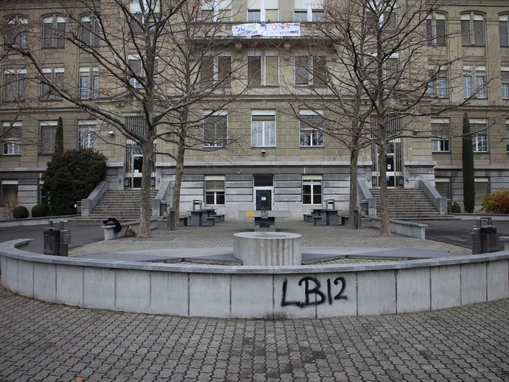
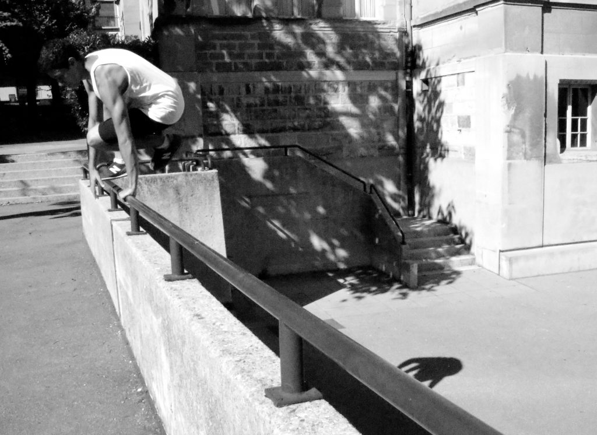
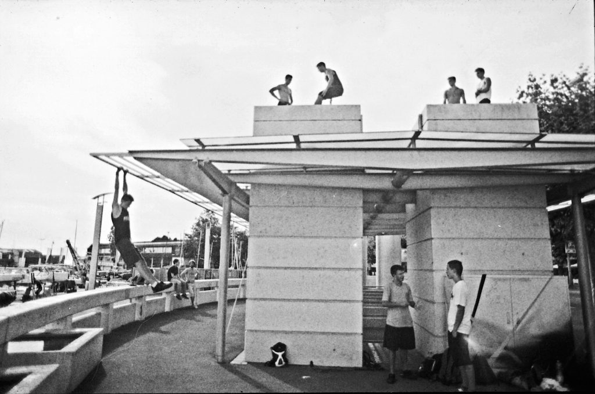

En pratiquant la danse et la chorégraphie, je puisais de l’inspiration dans mon environnement. J’utilisais les sensations que je ressentais, les formes, les couleurs, les textures comme stimuli pour créer du mouvement. En commençant à pratiquer le parkour, la façon dont je percevais l’environnement et le comprenais s’est développée très rapidement et de façon inattendue. En effet, des espaces que je négligeais ou qui n’avaient aucune valeur particulière pour moi sont devenu des endroits de valeur (positive ou négative) qui m’offraient des possibilités de mouvement. De cette constatation, j’ai décidé d’explorer la façon dont le mouvement de danseurs et de traceurs est inspiré par l’environnement, en quoi ce mouvement influence la compréhension de la ville par les danseurs et traceurs, mais également pour les passants qui en sont témoins. J’ai demandé à des danseurs et des traceurs d’investir certains espaces urbains et j’ai photographié leurs différentes réactions a ceux-ci. Ce projet sous forme d’installation photographique et de document explicatif fut présenté en 2016 au Laban Conservatoire for Contemporary Dance. Le but de ce projet est d’encourager les utilisateurs des espaces urbains d’être conscient de la façon dont ils les perçoivent et les comprennent. Il est également question d’encourager la curiosité et l’imagination dans les interactions avec ces espaces. Je vous propose de lire ici la partie théorique de mes recherches, basée sur la construction de la perception et de ces valeurs ajoutées à l’environnement, en lien avec la pratique du parkour.

La recherche s’appuie sur l’idée que les fonctions des structures architecturales influencent grandement le comportement et le mouvement des personnes dans un espace spécifique. Les objets architecturaux communiquent leurs potentielles fonctions (Eco, 1997, p.184). En plus de leur fonction, les objets architecturaux peuvent avoir un sens symbolique. Celui-ci donne une information sur le comportement ou les relations sociales des utilisateurs. Eco donne l’exemple du trône et de la chaise (1997, p.187). En effet, le trône symbolise la royauté, une certaine importance sociale, le pouvoir et la richesse. Or sa fonction, comme celle de la chaise, est de permettre de s’assoir. Leur fonction est la même, mais leurs valeurs symboliques sont très différentes.

A travers la sémiotique, l’architecture donne un cadre ou une structure à la vie des personnes (Rassmussen, 2000, p.9).  La relation entre les objets architecturaux crée une série d’instructions lisible au sujet de l’utilisation préférable de l’espace en question. La cour du Gymnase du Bugnon (lycée) à Lausanne illustre ceci : Les tables et bancs impliquent qu’il s’agit d’un espace de sociabilité ; la fontaine suggère un environnement de détente plutôt que de travail. Les escaliers imposants élèvent le bâtiment dans l’espace et lui donnent une plus grande importance. Les murets bas qui entourent l’espace signifient aux passants qu’il est rattaché à l’école et qu’il est principalement conçu pour les élèves et le personnel.

Le message architectural est implicite et est ressenti de manière inattentive. Il ne requiert donc pas une interprétation active (Eco,1997, p.196). Il s’applique massivement et est pris pour acquis (Eco, 1997, p.197).

 Figure 1: Cour du Gymnase du Bugnon, Lausanne Suisse. Copyright 2015

La lecture et l’interprétation de l’environnement dépend de la perception qu’on a de celui-ci. Le but de la perception est de nous informer sur la façon d’agir la plus appropriée dans une certaine situation (Norberg-Schulz, 1965, p.28). On perçoit un objet à travers une combinaison de confrontations et d’expériences qu’on a eu avec lui. Ainsi, on construit une idée de cet objet qui est personnelle et qui continuera à évoluer grâce au temps et aux expériences futures (1965, p.29-30). La société forme en grande partie la perception de notre environnement. Les personnes s’influencent mutuellement pour s’ajuster et se conformer aux utilisations des objets architecturaux dictés par leur sens fonctionnel et symbolique (1965, p.38). Ces ajustements créent des réactions stéréotypées appelées « schémas » (1965, p.41). Le processus de schématisation est théoriquement un processus en constante évolution, bien qu’ils puissent se rigidifier. Il est possible de s’accrocher à un schéma, l’empêchant d’évoluer (Norberg-Schulz, 1965, p.41). On peut peut-être expliquer ainsi la difficulté qu’ont certaines personnes à accepter des utilisations de l’espace urbain alternatives à celle qui est considérée comme « correcte ». Cette situation est plutôt souvent rencontrée lors de la pratique du parkour. Il arrive même que les traceurs se voient interdire leur pratique à certains endroits comme au célèbre spot de Vauxhall à Londres, où des panneaux No Frerunning furent montés. A notre surprise les réactions des passants furent parfois également négatives lorsque les danseurs investirent certains espaces. Une femme leur a rappelé qu’ils étaient dans un espace publique, en insinuant que le comportement des danseurs n’était pas adapté a ce contexte. En effet, la danse étant bien plus connue du publique que le parkour et plus souvent considérée comme une pratique artistique, nous la pensions plus facilement tolérée dans l’espace publique. Norberg-Schulz décrit ce paradoxe : des personnes différentes auront une expérience à la fois similaire et différente du même endroit (1965, p.30). Similaire à cause de la socialisation et de la schématisation, mais différente à cause de leurs expériences personnelles.

Le corps et ses mouvements ont un rôle important dans la création et l’évolution d’un endroit. Silverman et Sen définissent la corporéité (_embodiment_) comme la relation mutuellement constitutive entre l’espace et le corps (2014, p.3). Low (2014, p.20) ajoute l’idée d’expérience de perception et de modes de présence au monde à cette définition. Il est donc question de conceptualiser l’espace à travers le mouvement, et non plus en le définissant comme un récipient (Low, 2014, p.21). Les limites d’un espace se fluidifient, puisqu’elles ne dépendent plus uniquement de l’architecture, mais du mouvement des personnes qui l’utilisent. L’espace est aussi défini à travers la mémoire des mouvements : connaitre un espace à travers l’utilisation du corps crée un sens d’appartenance corporelle qui peut au fil du temps devenir un rituel stable (Low, 2014, p. 38). En parkour, l’entrainement répétitif d’un même mouvement a un endroit spécifique crée une connexion entre les deux. Le mouvement fait partie de cet espace et peut devenir un point de référence. Il est aussi possible de créer une connexion avec un mouvement qui n’a pas encore été fait : celui-ci devient un challenge. Ces deux cas de figure impliquent une réponse émotionnelle. L’aspect émotionnel du mouvement (peur, fierté, détermination, déception…) sera donc fortement lié à l’espace dans lequel il est exécuté.

La pratique du parkour implique une réinterprétation imaginative des espaces et de l’architecture qui facilite le mouvement au-delà de leur utilisation normative (Angel, 2014, p.179). Une des conséquences de la pratique du parkour est d’éprouver une forme de liberté dans le contexte social, via la renégociation de la relation entre le corps et l’architecture (Lamb 2010, p.103). Il s’agit donc de refuser le chemin proposé par l’architecture, et d’en découvrir de nouveaux. Cela dit, à travers les processus de schématisation et de socialisation, de nouvelles normes comportementales s’établissent entre les traceurs qui développent un répertoire de mouvements commun.

Les traceurs développent donc une perception de l’environnement qui est propre à la pratique de cette discipline que les anglais appellent _parkour vision_. Des opportunités de mouvement apparaissent grâce à la perception des distances, hauteurs et de leur arrangement dans l’espace et les fonctions et sens symboliques des objets architecturaux sont redéfinis. Par exemple, la fonction première d’un mur est de stopper le passage ; c’est une frontière. Or un traceur, selon sa hauteur et sa texture considèrera le mur comme un obstacle franchissable. Donc au lieu de séparer deux espaces distincts, le mur deviendra un accès de l’un a l’autre (Figure 2). Souvent, les endroits conçus pour contrôler et diriger le mouvement des personnes deviennent les terrains préférés des traceurs comme par exemple les escaliers, les rampes d’accès (Angel, 2011, p.106). Ces endroits remplis d’indications et de directions se prêtent parfaitement au travail de réinterprétation qu’autorise le parkour. Cette capacité de percevoir les obstacles évolue constamment en fonction du développement physique et technique du traceur.

 Figure 2: La fonction du mur: de séparation a lien entre les deux différents niveaux. Copyright 2015.

Le parkour implique également une relation tactile avec l’environnement urbain. Le contact physique avec celui-ci et leur relation avec le mouvement qui en découle crée une connexion plus intime avec l’espace utilisé. La connaissance des surfaces, des textures, des hauteurs et des distances est cruciale pour une pratique saine de la discipline et la sensibilité et la connexion nécessaire aux traceurs leur permet de devenir eux-mêmes un élément mobile de l’environnement (Angel, 2011, p112). Les structures architecturales facilitent et deviennent également une partie du mouvement.

Finalement, la recherche d’accès à des espaces non utilisés est également une façon de réinvestir l’espace différemment. En accédant et en bougeant dans ces espaces, ils deviennent habités et une valeur émotionnelle est créée. Un exemple de cela est la pratique sur les toits. Sur le toit du parking d’Ouchy à Lausanne (figure 3), on peut voir un groupe de traceurs entrainer des sauts de précision. L’accès à cet espace se fait grâce au muret de gauche et à la barre sur le toit. Ce genre de développement des espaces inhabités est particulièrement étonnante pour les passants car il sort complètement des schémas habituels de perception et d’utilisation de la ville.

 Figure 3: Entrainement à Ouchy, Lausanne, Suisse. Copyright 2015.

Le parkour remet donc en question la codification des espaces urbains à travers à la fois le rejet de la sémiotique associée à ceux-ci, en les réinvestissant et en y développant de nouveaux liens sociaux, émotionnels et corporels. Il permet le développement des schémas de perception des pratiquants, ainsi que des témoins de leur mouvement. Il me semble important de pouvoir faire évoluer les schémas de perceptions pour permettre que ces espaces urbains, trop souvent utilisés pour contenir le mouvement des personnes, deviennent des terrains de jeux et des espaces de valeur pour toutes les personnes les visitant.

**Bibliographie**

Angel, J. (2014). Game maps: Parkour vision and urban relations. In G. Schiller & S. Rubidge (Eds.), _Choreographic dwellings: Practicing place_ (pp. 178-197). London, England: Palgrave Macmillan.

Angel, J. (2011). _Cin__é_ _parkour: A cinematographic and theoretical contribution to the understanding of the practice of parkour_ (Unpublished dissertation). Brunel university, Uxbridge, England.

Daout, Y. (2016, January 28). [_Parkour et environnement_](/blog/parkour-et-environnement/).

Eco, U. (1997). Function and sign: The semiotics of architecture. In N. Leach (Ed.), _Rethinking architecture: A reader in cultural theory_ (pp. 182-201). London, England: Routeledge.

_L'1consolable,_ [_Fiche-exp__é__rimentation: Pratiques cr__é__atives des espaces_](/archive/parkour-literally/fiche-experimentation-pratiques-creatives-des-espaces/)

Lamb, M. D. (2010). Negating the negation: The practice of parkour in the spectacular city. _Kaleidoscope_, 10, 91-105.

Lamb, M. D. (2014). Self and the city: Parkour, architecture, and the interstices of the “knowable“ city. _Liminalities: A journal of performance studies_, 10.2, 1-20. Retrieved from http://liminalities.net/10-2/parkour.pdf

Low, S. (2014). Placemaking and embodied space. In A. Sen & L. Silverman (Eds.), _Making place: Space and embodiment in the city_ (pp. 19-43). Bloomington, IN: Indiana university press.

Norberg-Schulz, C. (1965). _Intentions in architecture_. Cambridge, MA: The MIT press.

Rasmussen, S. (2000). _Experiencing architecture_. Cambridge, MA: The MIT press.

Sen, A & Silverman, L. (Ed.). (2014). _Making place: Space and embodiment in the city._ Bloomington, IN: Indiana university press.
