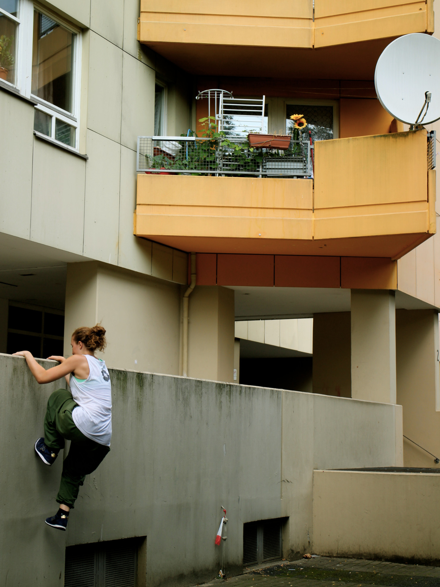
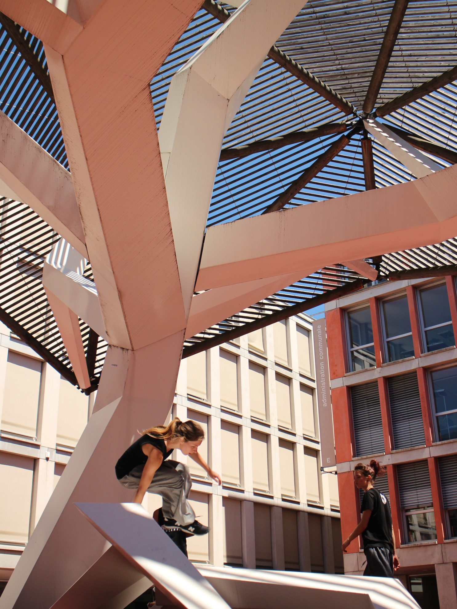
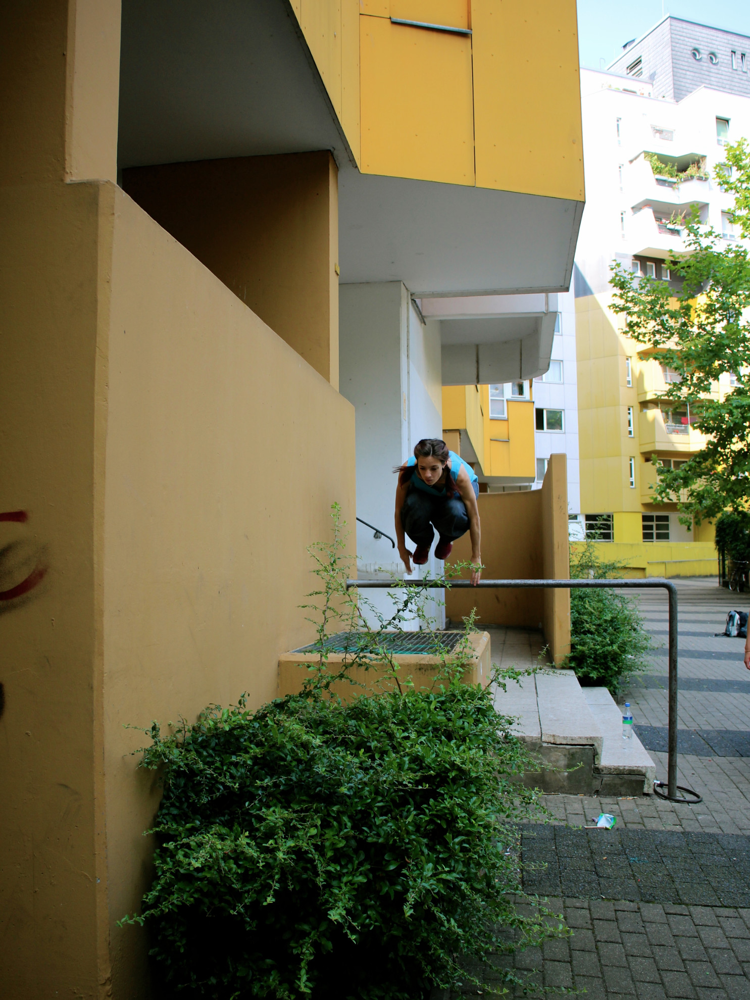

Le parkour est une discipline ouverte à tous types de pratiquant.e.s. L’entrainement est adaptable pour les enfants comme adultes, femmes comme hommes. En effet, il s’agit d’un entrainement qui a pour but une amélioration personnelle physique comme mentale. Mais le parkour, pour un non-initié, est souvent perçu comme un sport extrême, comportant des risques et demandant une condition physique hors du commun. Cette image est intimidante pour les novices, n’osant pas forcément s’exposer à de tels risques, ou ne voulant pas se voir échouer par manque de condition physique. Ceci est particulièrement un obstacle à la pratique féminine, et c'est un constat dans la plupart des régions du monde que les femmes sont quasi-absentes du parkour. Or pour une femme, la pratique du parkour a de réels impacts sur soi, ainsi que sur la discipline et la place de la femme dans la société. Nous verrons ici quels sont les obstacles majeurs à la pratique féminine du parkour, pourquoi il semble nécessaire de faire la promotion du parkour féminin, puis quelles solutions peuvent être mises en place pour faciliter l’initiation des femmes à cette discipline. Je cite ici des exemples d’associations qui travaillent activement à la promotion du parkour féminin, à Londres et à Lausanne car ce sont ceux que j’ai pu rencontrer dans ma pratique personnelle.

## Pourquoi il est nécessaire de développer le parkour féminin

En proposant à certaines femmes de mon entourage de s’essayer à un entrainement de parkour, j’ai pu constater qu’il y a une réelle appréhension de leur part due premièrement à un manque de condition physique. Les réponses comme « je n’ai pas assez de force », « je ne suis vraiment pas sportive », ou « mais il faut être super fort pour faire ce genre de choses » sont extrêmement courantes de la part des femmes (comme des hommes d’ailleurs). Un premier obstacle rendant l’appréhension particulièrement prononcée chez les femmes est l’image des traceurs dans les médias[^1]. En effet, ils montrent des pratiquants extrêmement avancés, principalement des hommes, démontrant leurs capacités physiques et mentales avec une aisance déconcertante. Il est donc difficile pour une femme de s’imaginer pratiquer le parkour. Les femmes ont commencé à pratiquer le parkour en moyenne plus tard que les hommes. Alors que la discipline existe depuis le début des années 90, très peu de femmes la pratiquent depuis plus de 10 ans[^2]. Il est donc difficile de trouver des femmes dans les médias démontrant des capacités similaires à celles des hommes. Les femmes ont non seulement un statut de minorité dans la discipline, mais manquent également de modèles auxquels s’identifier.

Ceci explique en partie le deuxième obstacle à la pratique féminine qu’est la croyance qu’elles ne seront jamais capables de développer la même force physique que les hommes. Il est vrai qu’un corps féminin est statistiquement différent d’un corps d’homme, aux niveaux anatomique et hormonal, et que les femmes pratiquent plus rarement des sports de puissance, de force et de vitesse, ce qui creuse encore l’écart entre les genres. Une grande partie de cette différence n’est pas innée ou naturelle, mais simplement due à des expériences différentes de l’activité physique. Cela n’empêche qu’il sera souvent plus difficile pour une femme de développer les mêmes capacités physiques en termes de puissance dans les jambes ou dans les bras. Un exemple typique de ceci est le « climb-up » qui est un mouvement nécessaire pour se hisser en haut d’un mur. Il demande beaucoup de force dans les bras, mais aussi de coordination et de technique. La force requise sera acquise à travers l’entrainement et un manque de force peut être en partie compensé par une meilleure application de la technique et une bonne coordination. La force est effectivement un aspect important de la pratique, mais elle s’acquiert peu à peu et elle n’est pas la seule qualité qui entre dans la pratique du parkour.

Troisièmement, et peut être l’obstacle le plus répandu et difficile à surmonter, les regards extérieurs sont une source d’appréhension pour beaucoup de pratiquantes (débutantes ou non). Le corps des femmes dans le sport est souvent sexualisé, que ce soit à travers certaines marques de vêtements proposant des tenues plus courtes ou décolletées (et peut être moins bien adapté aux demandes du sport), jusqu’aux commentaires sur les athlètes qui concernent bien plus leur apparence physique que leurs performances. De ce fait, pratiquer un sport dans la rue, sous les yeux de tous, est aussi potentiellement une source d’anxiété. Les traceuses de Glasgow notent qu’à cause du harcèlement de rue, il devient stressant pour les femmes d’être visible dans l’espace public, spécialement en faisant du sport[^3]. Pour les femmes pratiquant déjà la discipline, il est aussi commun d’avoir peur du regard d’autres traceurs ou traceuses plus expérimentés. Il est donc important de prendre en compte le fait que la peur du jugement est extrêmement difficile à surmonter, et est lié à l’idée précédemment expliquée de faiblesse physique ou mentale. Les regards extérieurs, qu’ils viennent de pratiquant/es du parkour ou de passants, sont donc un obstacle non négligeable pour beaucoup de femmes.

Il semble donc nécessaire de faire la promotion du parkour féminin dans le but de faire évoluer la façon dont les femmes font l’expérience des espaces publics. En effet, les femmes pratiquant le parkour créeront des liens affectifs avec certains endroits qui étaient source de peur, ou avaient une mauvaise connotation[^4]. L’entrainement donne une raison d’être visible dans des endroits dans lesquels les femmes n’iraient pas habituellement et de créer des liens positifs avec ceux-ci. C’est une façon pour elles de s’approprier les espaces publiques et de contrôler la façon dont elles les habitent. Pour les regards extérieurs, l’image d’une femme se déplaçant dans la ville de façon subversive et avec confiance est très puissante. Elle peut signifier qu’elles maitrisent leur utilisation de l’espace et donc leur place dans la ville[^5].

La pratique du parkour féminin peut être une façon pour les femmes de ne pas subir les stéréotypes féminins. Puisque la discipline demande des attributs traditionnellement masculins, les femmes la pratiquant peuvent sembler ne plus rentrer dans les conventions sociales dictant que les femmes sont fragiles, émotives et sensibles. Les traceuses développent des caractéristiques qui sont généralement associées aux hommes comme la force, le courage, la détermination… et s’éloignent de certaines caractéristiques stéréotypiquement féminines que sont la fragilité, la douceur, la faible tolérance à la douleur. Cela a pour effet d’émanciper les pratiquantes de certaines idées préconçues sur les femmes. Or ce peut être également perturbant pour la société puisque beaucoup d’attributs définissant les femmes ne sont plus systématiquement applicables aux traceuses. Certaines sont confrontées à des commentaires du type « tu n’es pas une vraie femme ». Il est donc particulièrement intéressant pour les femmes de pratiquer le parkour, ne serait-ce que pour faire évoluer les stéréotypes et les constructions sociales des genres, en particulier le concept de féminité[^6].

Le parkour a des effets positifs sur le corps et l’esprit de tous ses pratiquants. L’entrainement étant à la fois physique et mental, il aide à construire une personne solide, capable de se confronter à divers obstacles. L’augmentation des performances physiques et la confrontation aux risques que peut comporter la discipline donnent aux pratiquantes comme aux pratiquants beaucoup de confiance en soi et de satisfaction. En se focalisant sur leur progrès, les appréhensions mentionnées plus haut sur leur supposé manque de force et les regards extérieurs se dissipent petit à petit. Le parkour permet aux femmes de prendre confiance en leurs capacités physiques et mentales, tout en augmentant leur sens d’estime de soi.

La pratique féminine peut être également très bénéfique pour la communauté du parkour. En effet, les femmes ont une sensibilité différente aux espaces publics et donc auront une interprétation et une façon de bouger différente de celle des hommes. Elles peuvent donc influencer ou ouvrir la pratique de la communauté à plus de possibilités et apporter une diversité dans la façon de voir les espaces et de s’y mouvoir. Il est par exemple intéressant de constater que certaines femmes travaillent plus souvent des enchainements dans les structures de barres, en travaillant non pas en force ou en puissance, mais plutôt avec des subtilités techniques et du « flow ». Il est important ici que les traceurs s’intéressent aux particularités de la pratique féminine. Ainsi, les traceuses peuvent être une source de créativité, et peuvent s’entrainer avec les hommes de façon à s’influencer les uns les autres. Le but n’étant pas de créer un parkour masculin et un parkour féminin, mais plutôt d’amener de la diversité dans la pratique.

## Comment promouvoir le parkour féminin ?

La promotion du parkour féminin passe en premier lieu par la mise à disposition d’un environnement sécurisant. En effet, il est important que les femmes osent se lancer, et venir à un premier entrainement[^7]. Pour cela, il est possible de créer un entrainement pour les débutants, qui a l’avantage de ne pas séparer les femmes des hommes, et de faciliter l’intégration de nombreuses catégories (individus plus âgés, peu sportifs, etc.), pas seulement celle des femmes. Les entrainements pour débutants sont moins intimidants pour toutes les personnes ayant des appréhensions à commencer le parkour et il sera donc beaucoup plus facile de s’essayer à la discipline avec d’autres débutants, plutôt que dans un entrainement « tous niveaux »[^8]. « Tous niveaux » implique que les débutants sont les bienvenus, autant que les traceurs confirmés, mais la peur du jugement mentionnée précédemment devient l’obstacle principal à surmonter. Cependant, cet obstacle se dissipe si l’entrainement est labellisé pour débutants. Même si certains participants progressent et ne sont plus des débutants, cela crée un environnement dans lequel une femme débutante se sentira plus à l’aise. Un inconvénient d’un entrainement pour débutant est qu’il doit être beaucoup plus structuré avec des exercices fixes et déterminés par un coach, qui devient un professeur. Il semble important que les débutants puissent avoir une structure dans leur entrainement, mais aussi qu’ils développent leur sens de créativité et de curiosité vis-à-vis de l’environnement. J’ai personnellement choisi pour commencer à pratiquer le parkour de me rendre à un cours pour débutants en extérieur avec [Parkour Generations](http://parkourgenerations.com/) à Londres. Je me sentais plus en sécurité de penser que l’entrainement était adapté aux débutants, même si certains participants à ce cours avaient déjà de l’expérience. Ces cours étaient en effet très structurés ce qui m’était utile au début, pour apprendre les techniques, mais après quelques mois, je souhaitais plus d’autonomie dans mon entrainement pour pouvoir explorer par moi-même mes capacités et mon environnement.

Une deuxième option serait de créer des entrainements féminins. Dans ce cas-là, les femmes débutantes s’entrainent avec des traceuses de tous niveaux. Un avantage de ce système est que les regards des hommes sont écartés[^9]. De plus, les femmes ont souvent des appréhensions similaires et c’est plus rassurant de recevoir des conseils de traceuses plus expérimentées, qui ont déjà vécu ces peurs et appréhensions. Les entrainements féminins permettent aux débutantes d’apprendre d’autres femmes, qui ont expérimenté certaines difficultés auxquelles les hommes ne sont pas confrontés. Il est aussi important que les débutantes puissent avoir l’exemple de traceuses expérimentées auxquelles elles peuvent s’identifier. Ces entrainements permettent également de donner une visibilité à la pratique féminine, puisque les femmes n’y ont alors pas le statut de minorité, qui risque de les rendre invisibles ou de leur donner un statut d’exception (« cette fille fait du parkour, mais c’est une exception » ; « elle est forte, mais ce n’est pas une fille comme les autres (ou pas vraiment une fille) »). Les réticences à appliquer cette option sont principalement dues à la peur de diviser la communauté et de séparer les femmes des hommes[^10]. En effet cela aurait l’effet inverse de celui recherché, qui est d’apporter de la diversité et de la mixité dans la discipline. C’est pourtant cette option qu’a choisi d’adopter Parkour Lausanne pour encourager les femmes à rejoindre la discipline. Un an et demi après l’ouverture de cet entrainement, la population féminine de l’association a beaucoup grandi. Il y avait alors que trois ou quatre femmes dans l’association (soit moins de 10%), alors qu’elles sont aujourd’hui une vingtaine et représentent un tiers de l’association. Pour beaucoup d’entre elles, l’entrainement féminin était moins intimidant pour débuter, mais une fois à l’aise, presque toutes s’entrainent également aux entrainements mixtes. En effet, les entrainements féminins et mixtes sont identiques dans leur contenu (échauffement collectif, apprentissage des techniques, entrainement personnel) ce qui signifie que les femmes s’entrainent comme les hommes le feraient sans que le cours soit plus facile. Il parait important que les entrainements ne soient pas adaptés au sexe des pratiquants, mais plutôt que chacun puisse progresser à son rythme. L’organisation de session féminines ponctuelles, comme le [International Women’s Parkour Weekend](http://parkourgenerations.com/60803-2/) à Londres est aussi une bonne façon de permettre aux pratiquantes novices et confirmées de différents horizons de se rencontrer et de partager des idées sur l’entrainement, ainsi qu’au sujet de la place des femmes dans le parkour, la promotion de la pratique féminine et ce qu’elle implique pour la communauté du parkour.

Comme dit plus haut, le contenu des entrainements féminins et masculins peut être généralement identique. Il peut tout à fait avoir lieu en extérieur, ainsi qu’être exigeant physiquement et techniquement. Les femmes qui veulent tracer peuvent avoir un intérêt pour des pratiques masculines, cela ne sert donc à rien de vouloir féminiser la pratique ou de les surprotéger. Il faut néanmoins faire attention aux caractéristiques des pratiquantes. Il est nécessaire de les focaliser sur leurs atouts (pour les motiver) sans pour autant négliger leurs points faibles. Les femmes ont tendance à se reposer plus sur leurs os et articulations et moins sur leur musculature que les hommes, étant donné qu’elles ont en moyenne moins de force et d’expérience dans ce genre d’activité physique. Il faut donc sans doute prendre plus de temps pour développer leurs points faibles, et notamment apprendre de bons amortis. Elles sont également plus à risque de genou valgum (genoux qui rentrent vers l’intérieur notamment lors des sauts), ce qui nécessite une attention particulière étant donné les risques de déchirure ligamentaire qui s’y joignent. Généralement, cela se corrige avec le développement de la force et l’apprentissage de bonnes techniques.

Il est également important pour promouvoir la pratique féminine du parkour de la rendre visible, notamment dans les médias. Publier et partager des vidéos de qualité de traceuses contribue à rendre visible les femmes de la discipline, et d’inspirer d’autres femmes à s’y essayer. Il n’est pas nécessaire d’être une traceuse confirmée pour publier des vidéos ou photos. Au contraire, il semble important de montrer la progression des pratiquantes et que toutes les étapes du développement physique et mental des traceuses soient valorisées. De même, pour permettre à toutes de trouver des modèles auxquelles s’identifier, il serait bien de montrer la diversité de morphologies ou de styles vestimentaires, par exemple. À Londres, Parkour Generations a mis en place [She Can Trace](http://shecantrace.com/) dans le but de promouvoir le parkour féminin, et plus largement, apporter du soutien et de la visibilité aux traceuses. She Can Trace encourage les femmes de tous horizons et de tous niveaux à partager leurs progrès grâce a un hashtag (#shecanTRACE) ce qui a pour but d’encourager les femmes à bouger sans avoir peur du jugement ou de l’échec.

Il s’agit aussi de faire attention aux éventuelles attitudes sexistes ou virilistes, qui risquent d’être excluantes non seulement pour les femmes, mais plus généralement pour tous ceux qui ne se reconnaissent pas dans une telle forme de masculinité. Par exemple, pourquoi ne pas faire porter les commentaires sur une traceuse sur ses mouvements (et non sa tenue, son corps, ou sa situation amoureuse) dans le but de mettre en avant ses performances physiques[^11], autant que face à un homme ?

Finalement, donner des responsabilités aux femmes, par exemple pour donner des échauffements et entrainements, coacher les débutant(e)s, ou intégrer le comité des associations ou l’organisation des groupes a également son intérêt. Il convient également d’encourager leur auto-organisation. Non seulement cela contribue à leur motivation, au développement de certaines compétences et à la création d’une communauté féminine, mais cela permet de les intégrer plus largement à la communauté du parkour, et d’éviter des attitudes paternalistes à leur égard...

## Conclusion

Les obstacles à la pratique féminine du parkour et les solutions proposées ici ne sont évidemment pas les seuls valables, mais elles semblent être les plus communes. On peut rappeler brièvement ces solutions pour promouvoir le parkour féminin :

- Créer un environnement de pratique régulier et sécurisant pour permettre une entrée facilitée dans la discipline.
- Ne pas créer des formes de parkour spéciales pour les femmes, mais ne pas non plus négliger les spécificités, besoins et envies de chacun et chacune.
- Il est important de montrer des modèles féminins et de donner des responsabilités aux femmes, mais l’enseignant peut être un homme, en particulier si aucune femme ne peut encore remplir ce rôle.
- Parler de manière directe et personnelle aux intéressées : étant donné que tout le monde a des idées préconçues sur le parkour, il ne suffit pas d’écrire que l’entrainement est ouvert à tous et à toutes. Il faut prendre le temps de décrire les méthodes d’entrainement que l’on utilise, en quoi il n’est pas nécessairement dangereux, ce que le parkour peut leur apporter...
- Mettre en avant la présence féminine dans le parkour via des évènements, des photos, vidéos, etc. Vous pouvez notamment trouver d’excellents exemples dans [cette playlist](https://www.youtube.com/watch?v=U22S6cblSpo&list=PLT3NQy7U-aF3mEZDTzLDUYoW6-Lpqcoay).

Il ne reste plus qu’à encourager tout traceur, groupe ou association à faire les premiers pas pour encourager la pratique féminine. Un engagement même minimal dans ce sens peut avoir des effets positifs immédiats, et notre discipline en a grand besoin.

**Léonie Brodmann**

## Notes

[^1]: Angel Julie, « [Turning up and taking part](http://www.see-do.com/participation/) »
[^2]: Beecroft Brianne, « [5 ways to support female athletes](https://parkouredu.org/5-ways-to-support-female-parkour-athletes/) »
[^3]: Fiona B, « [Who’s city? Our city!](https://glasgowparkourgirls.wordpress.com/2013/09/11/whose-city-our-city/) »
[^4]: Ibid.
[^5]: Ibid.
[^6]: Angel Julie, « [Manhood parkour, a quick response to parkour, masculinity and the city, by Jeffrey L. Kidder](http://julieangel.com/quickresponse/) », 2013.
[^7]: Angel Julie, « [Turning up and taking part](http://www.see-do.com/participation/) »
[^8]: Ibid.
[^9]: Fiona B, « [Why no boys? (sometimes)](https://glasgowparkourgirls.wordpress.com/2014/01/11/why-no-boys/) »
[^10]: Ibid.
[^11]: Henry Max, « [6 things parkour girls wish guys would stop doing](https://maxhenryparkour.wordpress.com/2014/11/11/6-things-parkour-girls-wish-guys-would-stop-doing/) »