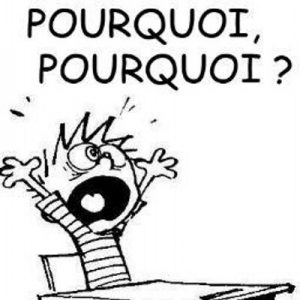
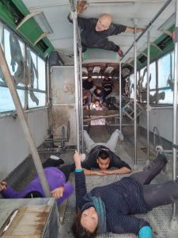
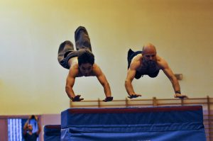

### **Introduction**

Lorsqu'on m'a proposé d'écrire un article pour Urban Culture et pour la FPK, j'ai été bien chaud jusqu'à ce que vienne le moment de prendre la plume: qu'allais-je donc bien pouvoir écrire? Il me semblait que tous les sujets intéressants avaient déjà été choisis. Et si c'était pour rédiger des banalités dites et redites, autant m'abstenir. Je me suis donc abstenu - dans un premier temps. L'idée m'est ensuite venue d'utiliser un joker. J'ai donc fait appel à l'une de mes sœurs et à ma mère, toutes deux parfaites incultes en la matière, et leur ai demandé quelle était la première question qui leur venait à l'esprit lorsqu'on leur parlait du parkour. La réponse ne s'est pas faite attendre, elles ont répondu toutes deux dans un unisson quasi-symphonique, l'une "_à quoi ça sert?_", et l'autre "_quel est l'intérêt_".

\[caption id="attachment\_649" align="aligncenter" width="192"\] Mais pourquoi ??!\[/caption\]

Hum. Passés le terrible choc et la profonde désillusion liée à une telle incompréhension de la part de ma propre famille, je me suis dit que je tenais peut-être une idée à creuser. Parce qu'au fond c'est vrai, il me semble avoir déjà entendu des _individus lambda de la population piétonne de base_ laisser échapper leur pensée devant nos exercices: "_**Mais pourquoi ils font ça?** Ils ne sont pas heureux dans la vie ou quoi?_".

### **Pour rien**

Alors premièrement, il n'y a aucun rapport, oui je suis heureux, et oui je n'en ai pas moins envie de pratiquer le parkour. Ça y est j'suis vénère là. Et ensuite, ce n'est pas sans me rappeler une conversation que j'ai eue lors d'un entraînement, à l'époque bénie où je pratiquais l'athlétisme. Un pote me disait: "_J'aime pas le foot. Courir derrière un ballon, franchement je vois pas comment ça pourrait me faire kiffer_." J'étais bien d'accord avec lui, le foot ça sert vraiment à rien. Mais à la réflexion, de quel droit est-ce qu'on pouvait se permettre de juger les footeux sur ce critère, alors que nous, on courrait dans le vent, après rien du tout? D'où la conclusion: on fait ça parce qu'on en a envie, nous sommes des parnassiens [^1\]](#refgo1) modernes et sportifs dont le comportement est inutile, et on vous emm... Pardon, je vous aime bien quand même mais cette question n'a aucun sens. Débat stérile, autant s'arrêter là.

Qu'entends-je? Ca ne vous convient pas? Bon. Soit, je suis complaisant et magnanime, je vais donc m'appliquer à trouver des motifs pour justifier un peu mieux cette étrange pratique.

### **Pour être utile**

Eh bien tout d'abord, la vocation première du parkour est d'être utile. Bien qu'elles datent du début des années 1900, les influences de l'hébertisme (ou méthode naturelle) sont encore vivaces, et la devise "_Etre fort pour être utile_"[^2\]](#refgo1) est et restera d'actualité. Un traceur sera en théorie toujours prêt s'il doit fuir un danger ou porter secours à quelqu'un. "_Et si un méchant veut te tirer dessus avec un fusil à pompe, tu penses vraiment que ça te sera utile?_". Hum. Commencez pas à me chercher, ça va mal finir. "_C'est une technique d'escroc pour fuir les flics facilement ton truc!_" Quoi??! Qu'est-ce que tu viens de dire toi?!... Ok. Le parkour est une discipline jeune, on DOIT s'attendre à une certaine incompréhension de la part des non initiés, et réagir calmement. Réagissons donc avec patience et pédagogie. Prenons un exemple, celui des arts martiaux. Est-ce que les combattants, sous prétexte qu'ils en sont capables, vont se battre dès la moindre contrariété? Non, parce qu'une philosophie de vie leur est transmise au même titre que les entraînements physiques et techniques. "_Un grand pouvoir implique de grandes responsabilités_" a dit un grand homme [^3\]](#refgo1). C'est exactement la même chose en parkour. On ne se servira de nos capacités (acquises à force d'entraînement) que lorsque ce sera utile, et en aucun cas pour des actes de vandalisme.

Bien sûr, dans notre société il y a peu de chances que toute cette formation nous soit utile. David Belle lui-même, le fondateur de la discipline, se trouvait frustré à ce niveau. Tout allait trop bien, aucune guerre ne se profilant à l'horizon, il se sentait parfaitement inutile. Mais il s'est motivé malgré tout en réalisant que le jour où quelque chose tournerait mal, il serait prêt et serait enfin considéré comme un héros [^4\]](#refgo1). A ce jour aucune catastrophe ne lui a permis de se placer aux côtés des Spiderman, Superman, et autres Mégagigahyperman, mais il a transmis ces connaissances à des personnes qui, sans aller jusqu'à espérer un désastre, seront peut-être un jour remerciées pour leurs actions utiles, utilisables et enfin utilisées [^5\]](#refgo1).

\[caption id="attachment\_651" align="aligncenter" width="300"\] Les pompiers sont forts pour être utiles, ils se calquent sur l'image que les traceurs pensent donner. Photo des pompiers australiens.\[/caption\]

### **Pour être en forme physiquement et mentalement**

Ensuite, et bien que les débats fassent encore rage quant-à la classification de la discipline dans la case des sports ou non (le sport impliquant en général une compétition, rejetée par la majorité des traceurs), il n'empêche qu'elle reste physique et est un bon moyen de faire fondre toute la graisse laborieusement amassée pendant les fêtes de Noël. On passera sur l'aspect extrêmement complet de cette pratique, puisque tout le monde est d'accord là dessus. ... Quoique... non. On peut toujours effleurer ce point rapidement: les bras, les jambes, et tout ce qui se trouve entre les quatre est sollicité; et ce dans tous les régimes musculaires: concentrique comme excentrique et pliométrique, voire stato-dynamique ou isométrique; en explosivité, force, endurance de force et endurance. La souplesse est bien sûr également travaillée. Et au delà de la performance purement physique, la proprioception, c'est-à-dire la perception de l'ensemble de son corps dans l'espace, est primordiale: sans chercher forcément les sommets des immeubles, un saut sur une fine barrière de métal devra être parfaitement contrôlé si on souhaite éviter la blessure. Et il faut le dire, se blesser en parkour - ou simplement effectuer des mouvements brutaux - est une honte telle que la plupart des traceurs réfléchissent à deux fois avant de tenter un mouvement non maîtrisé. La maxime "_être et durer_" empruntée aux militaires [^6\]](#refgo1) a la vie dure, et on ne s'en plaint pas.

Le mental aussi est travaillé, sous ses deux formes. La première, lorsqu'on commence un exercice, on le finit. Que notre corps crie miséricorde et nos mains pleurent des larmes de sang n'y change rien. Et la seconde, on apprend à connaître ses limites, modulées selon sa forme physique et morale de l'instant. Si mentalement et physiquement un mouvement est à notre portée, il n'y a aucune raison de s'en priver; sinon, il est hors de question de le tenter. Le maître a dit: "_fais le ou ne le fais pas, mais n'essaie pas_" [^7\]](#refgo1). Deux options s'offrent alors: utiliser son imagination pour trouver une manière de passer l'obstacle autrement, ou travailler pour repousser ses limites.

Et puis bon, je ne devrais peut-être pas en parler mais l'endorphine et l'adrénaline sont quand même des alternatives bon marché (le prix d'une paire de chaussures kalenji premier prix) et valorisantes aux drogues conventionnelles - si tant est qu'il y ait une convention pour les drogues, ce dont je doute, finalement.

### **Pour se faire plaisir**

Ai-je mentionné le plaisir? Non??! Honte à moi, je rattrape de ce pas cette erreur impardonnable. Le plaisir, c'est le troisième point incontournable motivant notre pratique. Un entraînement rigoureux n'est pas forcément très agréable au début. On marche à 4 pattes, on s'arrache les mains, on fait des pompes, on se fatigue et lorsqu'on passe à la pratique, c'est pour répéter des sauts de trottoir en trottoir. Mais comme toute base, ce n'est pas optionnel; et lorsqu'on commence à maîtriser, on peut se payer le luxe de passer à l'étape supérieure - sans bien sûr jamais abandonner ce travail de répétitions rébarbatives, qui finissent étonnamment par procurer un certain plaisir. Et l'étape supérieure est une sensation de liberté, où les bases sont effectuées de façon tellement naturelle qu'on peut se permettre de laisser libre cours à son imagination, donner carte blanche à son esprit qui s'empressera de signaler des mouvements intéressants à chaque coin de rue. On ne se contente plus de franchir les obstacles, on se joue des obstacles.

\[caption id="attachment\_273" align="aligncenter" width="225"\] Avec l'entraînement, une nouvelle dimension s'ouvre !\[/caption\]

L'entraînement permet d'enlever les œillères, et d'ainsi métamorphoser le carcan rigide des barrières, des murets, des escaliers ou des arbres en un terrain de jeux aux potentialités infinies. Pour reprendre l'expression d'un traceur dijonnais, c'est comme passer de la 2D à la 3D [^8\]](#refgo1): une nouvelle dimension s'ouvre ! Quel que soit son niveau, on peut ainsi créer quelque chose d'inédit, "ouvrir" un passage ou un saut pas forcément difficile, mais que personne n'aura vu auparavant ! On cherche également à augmenter progressivement les distances, la difficulté technique, la fluidité; ou on peut aller encore plus loin dans le délire, en se mettant en situation "réelle" et en s'imposant des impératifs de temps sur un parcours, en l'effectuant la nuit, fatigué ou en ayant faim (attention, n'oubliez pas que je parle de l'étape "supérieure", ceci ne concerne pas les débutants). Autant de façons de varier les plaisirs et de pimenter délicieusement la vie du traceur!

### **Pour faire des rencontres**

Et enfin il faut le dire, le petit bonus qui fait toute la différence (si elle n'a pas encore faite), c'est la communauté que nous formons. Le parkour est encore jeune, la communauté reste relativement réduite, plutôt soudée et très ouverte. Les membres des associations qui cadrent le mouvement sont bénévoles, les fondateurs de la fédération eux même font leur travail par pure passion, et la plupart des acteurs principaux et secondaires de la discipline n'ont jamais touché un rond pour leur travail pourtant acharné.

\[caption id="attachment\_228" align="aligncenter" width="300"\] Le parkour, un vecteur de rencontres explosives !\[/caption\]

La mixité sociale, si elle n'est pas particulièrement recherchée, est respectée naturellement : on croise des jeunes, des vieux, des pauvres, des riches, des intellectuels, des manuels, des ultra-sportifs, des gens qui partent de rien, et de plus en plus de filles. N'importe quel traceur peut donner des conseils, en recevoir d'un autre, inviter des étrangers, s'inviter et/ou s'entraîner chez un autre (sous réserve de disponibilité bien sûr), sans avoir à justifier d'un quelconque niveau. Un débutant ne sera en principe jamais jugé, et au contraire accueilli comme un frère dans cette communauté.

### **Conclusion**

Voilà mon avis, ce ne sera qu'un tissu de banalités pour tout traceur un minimum impliqué, mais il me semble suffire à justifier la marche à 4 pattes dans la neige que je suis sur le point de m'imposer... Parce que vraiment, lorsque vous commencez une discipline, est-ce que vous vous attendez à ce qu'elle soit potentiellement capable de vous sauver la vie, de vous faire travailler le corps et l'esprit d'un même mouvement, de vous procurer du plaisir sous des formes à chaque fois différentes, et de vous fournir sinon une famille, du moins des amis de tous horizons ?

Et puis pour ceux qui trouveraient encore ça simplement "bizarre", sans vouloir trop m'avancer il me semble que quelqu'un a dit que "les fous ouvrent les voies qu'empruntent ensuite les sages"... [^9\]](#refgo1)

[^1\]](#refback1) Parnasse : Le Parnasse est un mouvement poétique de la seconde moitié du XIXème siècle dont les membres revendiquaient le droit de ne se battre pour aucune cause particulière. Ce sont les premiers à n'avoir pas eu peur d'assumer "l'inutilité" de leur art: c'est « l'art pour l'art » de T. Gautier. [^2\]](#refback1) Georges Hébert, militaire fondateur de la méthode naturelle (ou hébertisme), rejetait toute spécialisation trop poussée, inutile selon lui en situation réelle. Sa devise, « Etre fort pour être utile » a fortement impacté David Belle. [^3\]](#refback1) L'oncle de Peter Parker dans Spiderman, le film. [^4\]](#refback1) D'accord, j'extrapole peut-être un peu trop. Voici donc la citation livrée telle quelle à la page 39 des éditions InterVista du livre Parkour de David Belle: "J'avais l'impression que j'étais né dans une époque où il ne se passait rien et donc que je n'allais pas connaître toutes les aventures qu'avaient pu connaître mon grand-père pendant la seconde guerre mondiale ou celles de mon père au Vietnam. Je baignais depuis l'enfance dans toutes ces histoire de pompiers, de soldats, de héros, d'exploits en tout genre et forcément, ça me travaillait." [^5\]](#refback1) Utile, utilisable et utilisé: La clé de l'efficacité du conseil en management des ressources humaines. [^6\]](#refback1) « Etre et durer » : Devise du 3ème Régiment Parachutiste d'Infanterie de Marine, présent dans chaque conflit international majeur. [^7\]](#refback1) Yoda à Luke dans Star Wars : Episode 5 - L’empire contre-attaque. [^8\]](#refback1) Lucas Morlon, DPC, reportage Naturbis - "Parkour" urbain - France 3 Bourgogne Franche-Comté. [^9\]](#refback1) Devise du magazine que vous tenez entre vos mains, empruntée à Carlo Dossi. Et pour les plus bornés, je tiens à faire remarquer que l'ouverture d'esprit n'a rien à voir avec une fracture du crâne...
