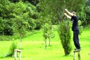
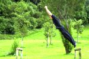
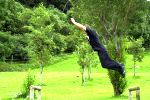
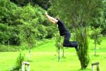
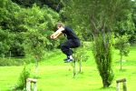
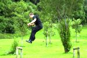

**Table des matières**

1. Définition
2. Video
3. Technique
4. Conseils

Le saut de précision peut être défini ainsi : saut technique, la plupart du temps à pieds joints, dont la réception se fait sur une petite surface (muret par exemple) et, généralement associé à un saut de détente.

Vidéo montrant des sauts de précision éxecutés par le groupe TeamTraceur (Blane, DC...) \[Lien mort\]

#### Technique

On va commencer par décrire un peu les sauts de précision à départ arrêté ou précédés d'une course (les plus basiques).

**Atterrissage pieds joints**

Le saut de départ doit se faire en utilisant tout le corps. Les bras ont une grande utilité pour un saut, et encore plus sur un départ arrêté. Il faut alors prendre plus ou moins de hauteur en fonction des sauts. Un saut sur une barrière demande plus de hauteur par exemple. Ca permet d'avoir moins de vitesse horizontale, et donc moins de risque de glissade. Les sauts avec plus de hauteur sont aussi moins rapides et permettent d'avoir le temps de mieux gérer la réception. Certaines personnes sont plus à l'aise en sautant sans ramener les genoux vers le haut, c'est à chacun de trouver la technique qui lui convient le mieux. On peut quand même remarquer qu'en levant les genoux, la réception est plus contrôlable pour les raisons de vitesse horizontale etc... La réception doit se faire de préférence sur la pointe des pieds. Le but est d'amortir un maximum pour stabiliser et éviter de glisser ou perdre l'équilibre. Un mauvais amorti entraîne des mouvements brusques et donc peut être des glissades. Aussi un bon saut de précision peut demander une plus grande amplitude dans le mouvement à la réception que pour un saut de fond. Une bonne méthode est de s'entraîner à faire le moins de bruit possible.

**Atterrissage avec une seule jambe (l'autre ne touche pas le mur)**

Les atterrissages pieds joints freinent la course. On peut donc être tenté de se réceptionner sur une seule jambe pour augmenter la fluidité. Il faut cependant faire attention à certains points :

Une seule jambe à la réception, c'est beaucoup moins de contrôle et beaucoup plus de risques. Atterrir pour rebondir après s'appelle de la plyométrie. C'est un exercice d'entraînement qui malgré les apparences nécessitent une grande puissance musculaire pour ne pas détruire les articulations sur le long terme. Il faut donc faire très attention en effectuant des sauts de précision répétés vers le bas, et encore plus quand c'est une seule jambe qui s'occupe d'effectuer tout l'effort.

Un saut de précision n'est pas forcément précédé directement d'une course d'élan, on peut s'en servir après un saut de chat, un lâché, une position saut de bras, etc...

**Décomposition en images**

1. Première étape être bien stabilisé avant de partir (de plus mettre les  bras un peu en avant permet d'avoir un peu plus d'élan pour partir)
2. Ensuite, il faut penser à prendre de l'élan avec les bras: on arme le saut
3. On continue à armer le saut, en se mettant légèrement en déséquilibre de cette façon, en mettant les bras un peu plus en arrière,pour ensuite les faire pivoter rapidement pour commencer le saut (il faudrai faire la même photo avec un schéma expliquan qu'il faut relever les bras avec une fleche circulaire un peu)
4. Même si ça peut paraître bizarre, on prend vraiment cette position lors d'un saut, après être en déséquilibre, on a relevé les bras pour donner un élan, on va maintenant passer à la phase d'extension maximale qui amorce le saut
5. Voila, on a sauté, on le sent pas vraiment, mais on se tend vraiment à ce point si le saut est bien executé! Il faut alors penser à monter les genoux, afin de prendre de la distance et de la hauteur, histoire d'arriver plutôt de hauteur sur la réception
6. On est dans la phase de montage de genoux, juste après la phase d'extension maximale.On prend de la hauteur et un peu de distance, sans s'en rendre compte vraiment
7. Voici l'étape primordiale lors du saut de précision, le passage juste avant la descente(préparation à la réception), passage très rapide temporellement
8. Point culminant du saut, les genoux sont groupés, nous allons amorcer la descente
9. Phase de redescente, il faut relever un peu les pieds, pour bien atterir sur la plante des pieds, on arrive plutôt de haut(il faut pour cela bien lever les genoux). Mettre les bras un peu en arrière pour être équilibré et arriver sur le saut plutôt léger et bien stable
10. Dernière phase de la descente, bien s'assurer de ses chevilles (bien dans l'axe) se préparer à amortir
11. Premier contact avec l'atterrissage, contact avec la plante des pieds, il faut arriver bien droit, un peu penché en arrière pour se préparer à bien amortir et donc sous le coup du léger choc, atterir-amortir-stabiliser sans problèmes
12. Amorti bien gainé, ne pas trop se pencher en avant pour ne pas "tomber" en avant, ni trop en arrière, pour ne pas repartir en arrière (même si avec du vide ce serait la meilleure solution, car un rattrapage avec les bras est alors possible)
13. Stabilisation, penser à encore une fois utiliser les bras comme balancier
14. On peut alors remonter, ou faire autre chose (partir dans une autre direction, sauter en contre-bas, etc.)  Merci à TonY-ChaN pour ce tutoriel illustré

**Conseils**

- On a tendance à croire que l'angle de 45° est l'angle optimal pour aller le plus loin possible... c'est faux. Le corps n'est pas une sphère solide mais un corps déformable. La meilleure façon de sauter est assez intuitive dans la plupart des cas.
- Sur les barrières, il vaut mieux éviter de se réceptionner sur l'intérieur du pied. En général le mouvement est beaucoup moins précis, on amortit moins et on glisse plus facilement.
- Il peut être intéressant de s'entraîner à ne jamais tomber d'un obstacle après un saut de précision. Par exemple : si on perd l'équilibre et qu'on rate la réception, il faut trouver une solution pour rester sur le mur ou la barrière avec les bras (pas forcément évident, mais peut être intéressant).
- Il est important de savoir se réceptionner quand le saut est trop court etc... Généralement on pose une jambe sur le mur et une jambe contre, mais cette technique est assez dangereuse. Le mieux est de tester les cas possibles dans toutes les conditions pour se faire une meilleure idée.
- D'une autre façon, il ne faut pas oublier de s'entraîner à repartir le plus rapidement possible après un saut de précision. On a souvent l'habitude de se réceptionner en bougeant le moins possible sur le mur à l'arrivée. Même si cette méthode permet de bien entraîner son contrôle et sa précision, en situation réelle il faut aller le plus vite possible. On en revient à entraîner un mouvement qui n'est pas utile dans la plupart des situations.
- Pour faire une analogie : les avions de chasse, contrairement aux avions de ligne, sont tout le temps dans un état instable (des calculateurs réctifient en permanence la position). Ca leur permet de changer très rapidement de direction. On peut de la même façon penser qu'arriver d'une façon stable sur le mur peut ralentir la reprise du mouvement.
- On peut s'entraîner à atterrir sur des formes très différentes. Par exemple : un mur en oblique, un rebord de 15 cm qui dépasse d'un mur, etc...
