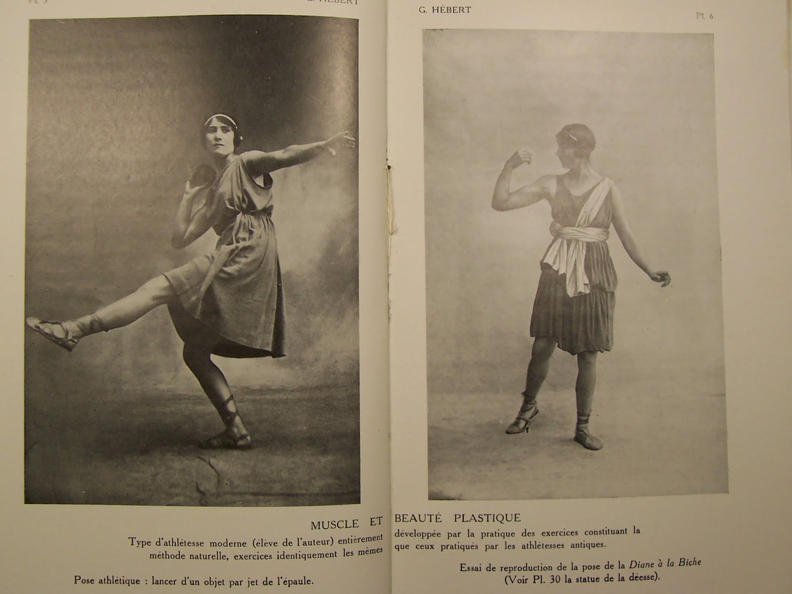

L'article *Parkour Fails and Hébertisme: Laughing at the New Man*^[Smith, M. (2023). Parkour Fails and Hébertisme: Laughing at the New Man. _Contemporary French and Francophone Studies_, _27_(1), 74–82.] est un de meilleurs exemples de surinterprétation en sciences sociales. Disons le tout de suite, cet article est catastrophique. Prenons cette catastrophe avec légèreté et rigolons un coup. Au passage, peut-être apprendrons-nous quelque chose sur le parkour et sur la méthodologie en sciences sociales.

La thèse de l'auteur est simple: par sa filiation à l'Hébertisme, le parkour est une discipline autoritariste, fasciste même. Les *fails*, ces vidéos où un traceur rate son saut, sont ainsi des occasions de subvertir l'idéologie fasciste par le rire. Le parkour est fasciste ! Si c'est vrai, c'est grave. Est-ce vrai ?

# Le Parkour, vaguement
Commençons par sa description du parkour, ou plutôt de ce que le parkour est devenu:

>"Ce qui pouvait autrefois sembler être une approche transgressive de l'espace urbain est en train de s'installer dans la vie d'un sport extrême comme les autres, avec des aires d'entrainement rembourrées, des protocoles de sécurité, et un format de compétition standardisé."

Ce qu'il décrit est le processus que traverse une discipline en cours d'institutionnalisation et de sportification. Loin de moi l'idée d'affirmer que le parkour ne subit pas un tel processus de domestication. Mais ce paragraphe suggère déjà ce qui va se révéler est un profond problème de son analyse: sa connaissance de ce dont il parle est extrêmement distante. Au-delà du sentiment de clarté et d'évidence qui s'impose à nous, demandons-nous ce que signifient certains des mots qu'il a choisi.

- Sport extrême. Qu'est-ce qu'un sport extrême ? Il n'en donne pas de définition. Mais, si l'on se fie à ce paragraphe, un sport extrême "comme les autres" dispose d'aires d'entrainement rembourrées. Bizarre ça, non ? On associe assez rarement le qualificatif "sport extrême" avec le rembourrage, les matelas et les "protocoles de sécurité". Parmi ce qu'on peut considérer comme des paradigmes des sports extrêmes, on trouve par exemple l'escalade *free solo* ou le base-jump. Où se trouvent les aires d'entrainement rembourrées ? Je ne défend pas l'expression sport extrême, qui relève de l'argument marketing. En tant que catégorie, elle n'éclaire rien du tout, et ce paragraphe en témoigne.
- Protocole de sécurité. Qu'est-ce qu'un protocole de sécurité, au juste ? Quels seraient des exemples de protocoles de sécurité mis en place dans le parkour contemporain ? Ils existent sans doute, peut-être, mais l'auteur n'en donne pas le moindre exemple. Et puis, est-ce nouveau ? Est-ce que les pratiquants de la première génération ne faisaient rien pour assurer leur propre sécurité ?

Au final, est-ce que sa description ne correspond tout simplement pas à l'idée d'un sport, tout court ? Aire d'entrainement rembourrée, protocoles de sécurité, format de compétition standardisé. Est-ce inapplicable à la gymnastique ? La gymnastique est-elle un sport extrême comme les autres ? Bref, on commence à percevoir que le discours est creux, qu'il n'est pas étayé théoriquement et ne repose pas sur des exemples empiriques concrets. Un pur effet de surface, un vague sentiment de clarté.
# L'hébertisme, ce fascisme
Examinons maintenant la présentation qui nous est faite de l'hébertisme:

>"un régime d'entraînement apprécié des eugénistes français et adopté par [le régime de] Vichy dans le cadre du programme national d'exercice physique."

Pour Smith, le fait que le régime de Vichy se soit approprié l'hébertisme permet de le qualifier de fascisme. Les historiens de l'hébertisme en P.L.S. Et pour cause, l'auteur ne cite pas l'historiographie de l'hébertisme. Le seul ouvrage historique cité^[Tumblety, J. (2012). _Remaking the male body: masculinity and the uses of physical culture in interwar and Vichy France_. Oxford University Press.] montre qu'Hébert était critique du "bricolage" que représentait à ses yeux l'éducation physique vichyiste et était resté à distance du régime. L'hébertisme et la méthode naturelle ont précédé le régime de Vichy, et lui ont survécu. On peut trouver des proximités idéologiques sur certains points, par exemple la rhétorique de la virilité. Mais comme on le verra par la suite, l'hébertisme n'est de loin pas épuisé par l'utilisation qui en a été faite par Vichy. Après tout, George Hébert a développé sa méthode sur plus de cinq décennies. Mais quand le sous-titre de notre source historique est "Masculinité et usages de la culture physique dans la France de l'entre-deux-guerres et de Vichy", on peut s'attendre à un très léger zoom sur la masculinité sous Vichy. Quand c'est notre seule source historique, cela s'appelle un biais.

Prenez l'affirmation selon laquelle George Hébert promet "de restaurer les hommes blancs Européens à leur suprématie athlétique" (sans jamais citer Hébert). Quid des femmes ? Dès 1913, Hébert expérimentait avec l'éducation physique des filles au Collège d'athlètes de Reims. A partir de 1918, la Palestra, dirigée par Yvonne Hébert, propose une éducation pour les jeunes filles allant bien au-delà de la méthode naturelle^[Philippe-Méden, P. (2021). Une communauté héberto-naturiste féminine : la Palestra. _Corps_, _19_(1), 51–64.]. Selon l'historien Pierre Philippe-Méden, cette initiative éducative recueillait le soutien des féministes. Est-ce que tout cela était au service de la virilité et de la suprématie de l'homme blanc ?

Maintenant, on peut sans doute faire le choix de coller l'étiquette "hébertisme" spécifiquement sur l'idéologie de l'éducation physique vichyiste. Ca prête à confusion, c'est pas très honnête intellectuellement, mais pourquoi pas. Appelons ça l'*héberto-fascisme*. Il faudrait alors démontrer que c'est cette version de l'hébertisme en particulier qui inspire les pratiquants du parkour, et pas cette autre version qui dépasse la vision vichyste. En cela, la logique de l'auteur est à rapprocher de la contagion magique. L'hébertisme a été utilisé par le régime de Vichy, et le parkour trouve ses "racines problématiques dans l'Hébertisme". Par jeu de vases communicants, le fascisme contamine tout. La présentation et la critique de l'hébertisme faite par Smith est confuse, et on ne sait en fait pas ce qui relève de l'idéologie de Vichy et de l'hébertisme, ce qui est propre à l'hébertisme et ce qui relève de l'appropriation de l'hébertisme par le régime. Ce faisant, il échoue à faire une critique intellectuellement honnête de l'hébertisme, et échoue à démontrer qu'hébertisme et fascisme sont consubstantiels.

# Les traceurs parlent comme des fachos
Examinons maintenant le lien supposé entre l'héberto-fascisme et le parkour.

>"[Les traceurs] utilisent fréquemment un langage qui fait écho au culte fasciste de l''Homme Nouveau'."
>"Si les traceurs n'adhèrent pas aux idéologies d'extrême-droite, nombre d'entre eux reproduisent les discours sur la masculinité en crise et le déclin démographique qui ont attiré les fascistes français vers l'hébertisme."

Rien, absolument rien, n'est étayé empiriquement. Comment sait-il que les traceurs n'adhèrent pas à des idéologies d'extrême-droite ? Nada. Est-ce qu'on a un exemple de discours hébertiste sur le déclin démographique ? Nope. Quel traceur parle de crise de la masculinité ? Circulez, y'a rien à voir. Si les traceurs font "fréquemment" usage d'une telle rhétorique, les exemples devraient pourtant être légions, et parmi ces exemples, on devrait en trouver certains qui soient très solides. Seules deux citations sont données. La première est de seconde main, et provient de Atkinson (2009)^[Atkinson, M. (2009). Parkour, Anarcho-Environmentalism, and Poiesis. _Journal of Sport & Social Issues_, 169–194.] :

>“Nous vivons comme des gloutons mous [*gluttonous slobs*], alors le corps le devient. L'objectif de la plupart des gens dans la vie est d'avoir plus de tout, de rouler dans un SUV et d'obtenir de la merde de la manière la plus facile possible. Ce n'est pas le fond de la nature humaine."

Pour Smith, c'est un écho des discours de Vichy sur la décadence, et du sursaut de discipline qui est appelé à s'y opposer. Certes, ce traceur fait état de ce qu'il perçoit comme une forme de déclin amené par la modernité (motorisation, consumérisme, malbouffe). Certes, il y a un appel à une nature humaine. Et oui, la perspective d'un affaiblissement corporel appelle implicitement à une reprise en main du corps. Mais c'est là un discours somme toute assez répandu de réaction à la modernité, appelant à une forme de vie plus authentique. Mais est-ce immédiatement un discours fasciste identique à celui du régime de Vichy ? Non, c'est une surinterprétation. Notez que la phrase a été prononcée avant 2009, et qu'on ne sait rien de la prévalence de ce type de discours en 2009, ni si il est toujours "fréquemment" utilisé aujourd'hui, ni qui exactement tiens ce type de discours (âge ? profession ? niveau d'études ? revenu ? ethnicité ? pays d'origine ?) C'est important, parce que Smith fait comme si l'hébertisme avait une influence durable et profonde sur le parkour. C'était *peut-être* le cas en 2009, mais était-ce toujours le cas en 2023 ? Notez également que cette citation ne contient pas une seule allusion à un "déclin démographique", et que considérer qu'il s'agit là d'un propos concernant une "crise de la masculinité" relève de la gageure.

Deuxième et dernière citation, tirée du site web de Parkour Paris:

>"L’entrainement au Parkour permet au corps humain de réaliser des performances physiques que l’on ne soupçonne pas"

Pour Smith, "une telle promesse, lue avec la rhétorique de l'Homme Nouveau en tête, a des connotations eugénistes." Oui, c'est là qu'après avoir exécuté toutes ces cabrioles de haute voltige, Smith se prend un *faceplant*. On peut se marrer, il ne s'est pas blessé ! Cascade réalisée par un professionnel, à ne pas reproduire chez soi. Vous voyez les enfants, ça, ça s'appelle de la surinterprétation, et vraiment faut pas faire ça. Cette phrase est pourtant tellement anodine qu'on pourrait y substituer n'importe quoi:

- "La méditation de pleine conscience permet au corps humain de réaliser des performances physiques que l’on ne soupçonne pas"
- "boire [insérer nom de boisson énergisante] permet au corps humain de réaliser des performances physiques que l’on ne soupçonne pas"
- "avoir un mindset de winner permet au corps humain de réaliser des performances physiques que l’on ne soupçonne pas"

Bref, armé de fantasmes, on peut faire de n'importe quelle pub sportive, de n'importe quelle réclame pour club de fitness un avatar de l'eugénisme et du régime de Vichy. Et après tout, pourquoi pas. Je ne rentre même pas ici dans la question de l'"homme nouveau", idée qu'on trouve sous des formes certes diverses dans l'idéologie soviétique... et même chez Frantz Fanon^[Fanon, F. (2010). _Les damnés de la terre_. La Découverte.]. Je me permet d'abréger sur la rhétorique du "retour à la nature" (la nature urbaine ?) et du "pouvoir masculin" qui ne sont pas mieux étayés. Ce n'est pas qu'il n'y a rien à dire sur ces sujets, mais plutôt qu'il faut aller les lire ailleurs.
# Rire de celui qui rit de ceux qui se font mal
Venons finalement à la thèse de l'auteur. Le parkour, c'est une mise en scène de l'homme nouveau fasciste. Les *fails* de parkour "montrent des hommes supposément héroïques échouer". Ce faisant les *fails* subvertissent, ou du moins questionnent, problématisent l'image de l'homme nouveau, et spécifiquement:

- L'autoritarisme et la discipline
- Le pouvoir masculin

C'est ça qui rend les *fails* de parkour si drôles. C'est un peu comme les *fails* d'un universitaire, qui sont à mourir de rire parce qu'ils subvertissent son autorité. Un peu comme on se marre en voyant un bébé marcher en vacillant, en sachant très bien ce qui va se passer, en anticipant, en ne sachant juste pas à quel moment, et bam le *faceplant* ! Ouf, il ne s'est pas fait mal. Mort de rire. Tout comme on rigole en voyant un chat se préparer à sauter, on perçoit bien son hésitation, ses mouvements de la tête, d'avant en arrière, pour apprécier la distance, et puis il se love, et enfin saute, et manque pathétiquement sa cible, sans même l'effleurer, semble figé en l'air, à l'acmé de sa trajectoire, le corps en extension complète et puis vient la chute à pic. Enfin vous voyez bien qu'on s'est éloignés du sujet, que cela n'a plus aucun rapport ni avec le fascisme, ni avec l'autoritarisme, ni avec le parkour, ni avec la masculinité, et pourtant je jure, main sur le cœur, qu'il m'est déjà arrivé de rigoler en voyant le *fail* d'un bébé et d'un chat. Voilà comment on désamorce une surinteprétation. Est-ce que ce serait pareil si... ? Si c'était un animal ? Si c'était une femme ? Si c'était un bébé, qui n'a ni pouvoir, ni discipline, ni aptitude physique ? Alors peut-être qu'il y a quelque chose de profondément spécifique aux *fails* de parkour, qu'ils ont une phénoménologie particulière, un je ne sais quoi propre à "ce que ça fait que de voir" un *fail* de parkour, une certaine qualité de l'expérience. Mais ça ne m'est pas apparent. Ou peut-être qu'à cause du contexte spécifique, celui de la masculinité et de l'idéal de l'homme nouveau, les *fails* de parkour sont particulièrement populaires, plus que ceux avec des bébés, des motos ou des marsupiaux. Mais cela ne m'est pas apparent non plus.

Smith affirme que les fails de parkour remettent en question certaines théories du rire. Car traditionnellement, on considère que le burlesque s'arrête à la vue de la souffrance: ça n'est plus drôle. Mais dans les fails de parkour il y a "des dents arrachées, des os brisés et du sang sur la chaussée" et ça, c'est à mourir de rire. Enfin, personnellement c'est bien une limite pour moi. Mais c'est sans doute parce que je suis un fasciste, alors que les vrais antifascistes c'est ceux qui rigolent des gens qui se brisent les os. Smith fait une analogie à *Jackass*, mais il est assez clair que les protagonistes de Jackass se soumettent intentionnellement à la blessure et à la douleur. Ils en rient souvent eux-mêmes, ou alors sont accompagnés de leurs camarades qui rient et nous invitent à rire. Les traceurs, eux, se soumettent intentionnellement au *risque*, mais les os brisés restent non intentionnels. Chez moi, il semble que cela fait une différence. Pour Smith (reprenant à son compte le commentaire d'un autre auteur à propos de Jackass):

>"les fails de parkour, dans leur pure maladresse, servent 'de pied de nez à la culture en cotton des grands magasins, de la gestion des risques, des règles de sécurité et de l'alimentation saine'. Nous pouvons ajouter : la discipline ascétique de l'homme nouveau."

Je trouve à mourir de rire comme cette citation renvoie presque terme à terme à celle du traceur tirée de l'article de Atkinson, celui qui critiquait le consumérisme, la passivité, la mollesse, la facilité. Malicieusement, on pourrait dire que tout ce qui les distingue est que l'une rejette l'alimentation saine, l'autre rejette la gloutonnerie. On n'est plus à une contradiction près. Mais ce qui est fascinant c'est à quel point Smith ne semble faire aucun effort pour comprendre de quoi il parle. Il estime par exemple que le parkour et l'hébertisme sont "la valorisation de la sécurité", les plaçant du côté de la culture de la surprotection. Et pourtant ce n'est pas absurde de dire que les traceurs critiquent cette même culture, utilisant le parkour pour remettre du risque dans leur vie. La relation entre risque et sécurité est complexe, on pourrait même hasarder que c'est parce qu'ils prennent des risques que les traceurs tiennent un discours sur la sécurité. On pourrait faire la même remarque concernant l'ascétisme: s'infliger de la douleur, à la *Jackass*, ne relève pas d'une attitude ascétique ? Peut-être que ce n'est pas la même forme d'ascétisme, peut-être que l'ascétisme est également complexe et mériterait une analyse plutôt que d'être un terme balancé comme ça, à la fin de l'article, en une seule occurrence.

Il faudrait dire encore beaucoup de choses, tellement cet article est médiocre. Qu'en est-il des femmes, des traceuses ? Que sont-elles ? Que représentent-elles ? Qu'est-ce qui se passe lorsqu'elles veulent découvrir les potentialités du corps humain ? Est-ce là l'eugénisme de l'homme nouveau ? des fascistes en puissance ? le pouvoir masculin en acte ? Et que dire lorsqu'elles échouent, lorsqu'elles tombent, lorsqu'elles se blessent ? Les traceuses sont certes minoritaires; mais pour Smith elles n'existent pas. Dommage, parce qu'on l'a vu, tenter de trouver des contre-exemples est une bonne méthode pour diminuer le risque de placage théorique et de surinterprétation.

Ce qui est assez caractéristique des surinterprétations en sciences sociales, c'est qu'elles peuvent faire sens, elles peuvent avoir une apparence de clarté. Il s'agit bien d'*une* interprétation. Ce n'est pas littéralement *impossible* de voir un fail de parkour comme une subversion du pouvoir masculin. Voici *Masculinité(s)* (2024), mon oeuvre d'art, qui consiste en une mosaïque de 200 vidéos en boucle de mecs qui montrent leur biceps, tentent un saut de précision, glissent et se prennent une barre dans les couilles. Je ne vous en veux pas si vous interprétez mon oeuvre comme questionnant la masculinité, et même si vous considérez qu'elle a quelque chose de qualitativement distinct du chat qui rate un saut. Mais la surinterprétation ou interprétation abusive, c'est cette tendance à donner un surplus de sens, à se considérer comme étant en mesure de dire la réalité, de dire ce que les choses veulent dire, alors que c'est juste nous qui le disons. C'est, comme ici, le faire en se dispensant d'un travail empirique rigoureux. C'est, en fait, imaginer que la réalité n'est pas à décrire ou à expliquer, mais qu'elle est comme un texte dont "nous n’aurions pas la clef et dont nous aurions à donner une 'interprétation'"^[Bazin, J. (1998). Questions de sens. _Enquête. Archives de la revue Enquête_, _6_, Article 6.]. Toute interprétation est risquée, mais ce que nous propose ici Macs Smith relève du sport extrême.