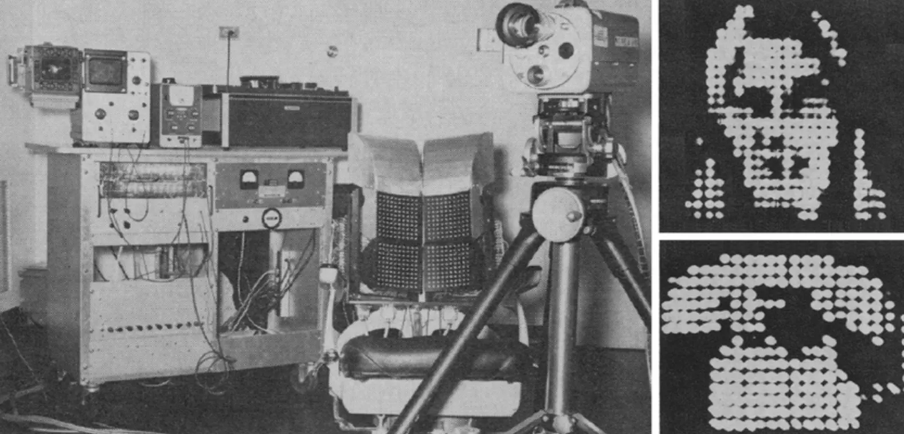

Dans une [discussion](https://youtu.be/hVQIrVPkEM8?si=IBy4d3tlXrPPUsjA&t=1521) récente avec le philosophe Peter Godfrey-Smith, Alex O'Connor mentionne la question de la localisation du Soi (appelons ça égolocalisation). Il *semble* que nous nous localisons à l'intérieur de notre crâne, probablement parce que nos yeux et oreilles y sont situées. Dans ce cas, que se passe-t-il si l'on passe du temps avec un casque de réalité virtuelle relié à une caméra placée sur la ceinture ? Aucun des deux ne sait si l'expérience a déjà été réalisée. Mais Godfrey-Smith mentionne les expériences de substitution sensorielle tactile-visuelle (TVSS), où des stimuli visuels sont convertis en stimuli tactiles sur la peau. Les sujets de ces expériences ont-ils une différente expérience de la localisation du Soi ? Difficile d'y répondre en pensant à haute voix et dans le courant d'une discussion. J'ai essayé de trouver la réponse dans la littérature, tout en clarifiant une petite confusion au sujet de la TVSS.
# TVSS
La TVSS est une technologie étonnante qui mériterait d'être mieux connue du grand public. On attribue les premières expériences au chercheur américain Paul Bach-y-Rita, à la fin des années '60. Le mécanisme est relativement simple: l'entrée d'une caméra est convertie en "image" tactile via une matrice de centaines de vibrateurs posés sur la peau, par exemple dans le dos du sujet. Avec un peu d'apprentissage et pour autant que la caméra soit manipulable par le sujet, la TVSS permet de *voir* avec la peau. Les sujets affirment avoir des expériences visuelles. Ils disent voir les images dans l'espace, là où sont les objets, et non sur la peau. Il devient ainsi possible de manipuler des objets ou de guider la locomotion en évitant des obstacles. Une fois que la TVSS est maîtrisée pour une localisation des stimulateurs, il est possible de les placer ailleurs sur la peau et l'adaptation se fait très rapidement. Il en va de même pour le membre qui manipule la caméra. Dans les expériences de Bach-y-Rita, la caméra était ainsi montée sur la tête ou portée à la main, et passer la caméra d'une main à l'autre ne changeait pas la qualité de l'expérience perceptuelle.

Commençons par clarifier une chose. Lorsque Godfrey-Smith parle de la TVSS, il *semble* partir du principe qu'il s'agit d'un cas intéressant parce que ce sont les récepteurs de la peau et non des yeux qui sont activés. Un aveugle voyant avec la peau a-t-il un sens du Soi différent de nous qui voyons avec nos yeux ? En fait, il confond sensation et perception. Les récepteurs de la TVSS ne sont *pas* localisés sur la peau. Le récepteur, c'est la caméra, qui est souvent placée sur la tête afin de préserver une grande partie du système perceptuel d'une personne voyante. Au système corps-tête-yeux, on substitue un système corps-tête-caméra-peau. Ce qui semble importer, donc, c'est la localisation de la caméra, et non des stimulateurs. D'ailleurs leur intuition pour le cas de la caméra et du casque VR est plus proche de cela: que le casque VR soit regardé avec les yeux n'a pas d'importance, c'est la localisation de la caméra qui importe.

Cette clarification étant faite, que se passe-t-il dans les cas où la caméra n'est pas montée sur la tête ? Je n'ai pas trouvé de données concernant un changement d'égolocalisation^[Peut-être par simple ignorance de ma part: les données existent peut-être quelque part. Ou peut-être que les expériences de TVSS sont trop courtes pour avoir un effet notable, ou que les chercheurs ne se sont pas intéressés à l'égolocalisation, etc.]. La question reste donc ouverte. En fait, tout bien réfléchi, on se rend compte qu'il n'y a pas nécessairement besoin de faire intervenir une technologie de substitution sensorielle pour personnes aveugles. On devrait plus simplement se demander si des aveugles de naissance localisent le Soi également dans la tête.
# Localise-t-on le Soi derrière les yeux ?
Revenons donc à la question centrale de l'égolocalisation. Il est vrai que l'on a tendance à se situer dans notre boîte crânienne. Il y a des données qui suggèrent que c'est le cas même pour des aveugles de naissance^[Bertossa, F., Besa, M., Ferrari, R., & Ferri, F. (2008). Point Zero: A Phenomenological Inquiry into the Subjective Physical Location of Consciousness. _Perceptual and Motor Skills_, _107_, 323–335.]. Mais on omet de considérer le rôle de l'expérience auditive. Puisqu'elle reste centrée sur la tête, elle pourrait suffire à l'égolocalisation. L'hypothèse selon laquelle la l'égolocalisation est établie dans la tête parce que c'est là que sont nos (principales) entrées sensorielles est sauve.

Mais il y a des données qui suggèrent que ce n'est pas aussi simple que cela. Ainsi, lorsqu'on demande à des individus de pointer vers eux-mêmes, les résultats sont divisés entre la tête et le torse^[Alsmith, A. J. T., & Longo, M. R. (2014). Where exactly am I? Self-location judgements distribute between head and torso. _Consciousness and Cognition_, _24_, 70–74.]. Il est également possible qu'il y ait une certaine forme de fluidité, notamment en cours d'action. Lorsque je manipule des objets avec les mains, "seules mes mains sont accentuées et tout mon corps traîne derrière elles comme une queue de comète"^[Merleau-Ponty, M. (2021). _Phénoménologie de la perception_. Gallimard.].
On a de nombreuses preuves de la capacité du Soi à se dilater: avec l'expertise d'un jeux-vidéo, on se fonde avec l'avatar. Notre expérience est "là-bas", pas à la surface du clavier ou de la manette. Un aveugle perçoit l'environnement au bout de la canne, pas contre sa main; on sent les lames des ciseaux contre le papier, pas la poignée contre nos doigts; on perçoit la texture de la nourriture contre nos dents, pas la force de notre mâchoire. Une main en caoutchouc peut devenir la nôtre^[Botvinick, M., & Cohen, J. (1998). Rubber hands ‘feel’ touch that eyes see. _Nature_, _391_(6669), 756–756.], au point où la localisation de notre main dérive de notre vraie main à celle en caoutchouc.
Tout cela montre une certaine flexibilité, le Soi s'étendant dans les objets, mais ne démontre pas qu'il y a une dérive de l'égolocalisation centrale. 
Une expérience analogue à la main en caoutchouc a été réalisée pour créer une expérience hors du corps^[Ehrsson, H. H. (2007). The Experimental Induction of Out-of-Body Experiences. _Science_, _317_(5841), 1048–1048.]. Avec un casque VR et une caméra dirigée dans son propre dos (ainsi qu'une stimulation tactile), on se voit de l'extérieur, et présumément cela revient à localiser le Soi hors de son corps. De la même manière, on peut induire une illusion où le corps d'autrui ou un mannequin semble être notre propre corps^[Petkova, V. I., & Ehrsson, H. H. (2008). If I Were You: Perceptual Illusion of Body Swapping. _PLOS ONE_, _3_(12), e3832.]. Dans ce cas, on dirait bien qu'il y a une dérive de l'égolocalisation centrale. Mais il y a substitution d'un corps à un autre, et non d'une partie du corps à une autre. Les caméras et casques sont placés sur la tête, et l'illusion serait probablement (?) brisée si la caméra était placée sur la ceinture du mannequin.

Que tirer de tout cela ? Premièrement, l'expérience spécifique dont parlent O'Connor et Godfrey-Smith ne semble pas avoir été faite. Ou si c'est le cas, elle n'est pas facile à trouver dans la littérature, peu citée et/ou très récente.
Deuxièmement, il y a des raisons de penser qu'elle pourrait fonctionner: déplacer le point d'observation avec une caméra et un casque VR semble induire une dérive de l'égolocalisation, comme dans les cas d'expérience hors du corps. De manière générale, les frontières du Soi sont assez flexibles.
Mais finalement, il n'y aucune certitude qu'elle fonctionnerait effectivement, ni sous quelles conditions elle fonctionnerait. Si on localise parfois le Soi dans le torse, c'est que l'hypothèse du lien étroit entre entrées sensorielles et égolocalisation est peut-être erronée. Le fait que les aveugles de naissance localisent le Soi dans la tête pointe dans deux directions: peut-être que cela affaiblit également l'hypothèse de départ, ou au contraire que l'hypothèse est correcte mais qu'il faut tenir compte de l'importance des oreilles et non seulement des yeux.
Mon intuition, c'est qu'elle devrait fonctionner, mais peut-être seulement si certaines conditions sont réunies (temps de pratique élevé, récepteur audio placé également dans la ceinture, etc.) Il n'y a bien sûr qu'un seul moyen d'être certain, c'est de faire l'expérience (ou si elle a déjà été faite, de la porter à ma connaissance).
