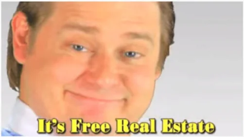

Lorsque la Fédération Internationale de Gymnastique (FIG) s'est approprié le parkour en 2017, certains ont demandé quel était le tort. Est-ce quelqu'un sera vraiment lésé ? Après tout, "*je* pourrai toujours faire du parkour". Et puis, qui a le droit de dire ce que le parkour doit être ou ne pas être ? Qu'est-ce qui fait qu'un traceur peut se sentir propriétaire de sa discipline ? Même si le terme était à peu près inutilisé en 2017, l'enjeu central est celui de l'*appropriation culturelle*^[Une des seules occurences se trouve dans Puddle, D., & Wheaton, B. (2023). The Attempted Grobalization of Parkour by the Fédération Internationale de Gymnastique. _The International Journal of the History of Sport_, _40_(6–7), 556–581.]. Mobiliser ce concept de manière adéquate permet de répondre aux interrogations légitimes des agnostiques et d'affaiblir la rhétorique des défenseurs de l'appropriation, ce que je me propose de faire ici. Dans le même temps, c'est l'occasion de mobiliser un exemple concret pour mieux comprendre ce concept disputé.

# Appropriation culturelle
L'appropriation culturelle est l'utilisation ou l'appropriation de produits culturels par des outsiders de cette culture. Les cas paradigmatiques se font généralement sur un fond de racisme, de colonialisme ou de lutte des classes qui est largement absent de la situation qui nous intéresse. Cela explique sans doute pourquoi on rechigne un peu à employer ce concept pour le cas du parkour. Mon propos n'est pas qu'il s'agit d'un cas paradigmatique d'appropriation culturelle, ni de hiérarchiser la gravité des appropriations, simplement de montrer que le concept s'applique au cas du parkour.
Certains ajoutent à la définition un différentiel de pouvoir: l'utilisation par un groupe dominant de produits d'un groupe dominé. Mais cette précision n'est pas nécessaire si on fait un usage neutre du concept^[Matthes, E. H. (2016). Cultural Appropriation Without Cultural Essentialism? _Social Theory and Practice_, _42_(2), 343–366.]. Dans ce cas, l'appropriation culturelle n'est pas un préjudice en soi, et cette précision n'est nécessaire que pour déterminer s'il y a une situation inéquitable source de préjudice. Je vais privilégier l'utilisation neutre du concept. Mais les deux versions fonctionnent, car il est assez facile de démontrer la forte inégalité institutionnelle entre le parkour et la gymnastique.
Ce qui mérite plus d'attention est la délimitation entre insiders et outsiders. Si mobiliser le concept est seulement valide dans les cas où l'appropriation est faite par des outsiders, alors il faudrait pouvoir démontrer que les coupables sont bien des outsiders culturels. Autrement dit, il faut montrer que la gymnastique utilise un produit culturel, le parkour, qui lui est effectivement extérieur. Ensuite, on pourra s'attacher à montrer en quoi cette appropriation est particulièrement inéquitable ou préjudiciable.
# Membre, non membre
Distinguer les frontières d'un groupe culturel pose deux problèmes: un problème empirique et un problème moral^[Matthes, E. H. (2023). The Ethics of Cultural Heritage. In E. N. Zalta & U. Nodelman (Eds.), _The Stanford Encyclopedia of Philosophy_ (Fall 2023). Metaphysics Research Lab, Stanford University.].

- Le problème empirique réside dans le fait que les groupes ne sont pas homogènes, et leurs frontières sont floues, fluides, contestées. Confronté à ce flux apparent, où donc placer des frontières ? Ca a toujours été un sujet au sein du parkour. Une solution est de se référer aux "fondateurs". Si il y a des pratiquants parfaitement authentiques, de insiders chimiquement purs, ce doit être ceux qui ont fondé la discipline. Mais même ce groupe de fondateurs est hétérogène et contesté: certains sont plus fondateurs que d'autres. Par ailleurs, le parkour a largement échappé aux mains des fondateurs: il a été approprié par une communauté plus large.
- Le problème moral est que tracer les frontières d'un groupe risque toujours d'une part d'exclure certains membres, et d'autre part de créer une vision stéréotypée du groupe. Si les "vrais" pratiquants sont ceux qui peuvent faire certaines prouesses physiques, on marginalise les pratiquants plus âgés ou plus jeunes. Dans le même temps, on crée une vision monolithique de ce que devrait être le parkour, qui n'est pas fidèle à ce que ou pourrait être la pratique.

Il n'y pas de solution entièrement satisfaisante et définitive à ces problèmes. Mais dans le cas qui nous occupe, il y a des institutions clairement définies, ce qui permet de répondre aux objections empiriques et morales. La frontière est facile à déterminer, parce que la gymnastique n'a rien à voir avec le parkour. Dans la plupart des pays, il n'y avait jamais eu de lien entre les disciplines avant que la FIG ne prenne la décision de l'appropriation. La FIG est une institution d'outsiders. L'objectif statutaire de la FIG est la gouvernance de la gymnastique au niveau international. La FIG a bien tenté d'inventer [une filiation commune](../le-parkour-n-a-pas-de-lien-avec-la-gymnastique/), dans une tentative d'effacer l'appropriation en niant être un outsider. Mais cette rhétorique est complètement vide: le parkour n'est évidemment pas un produit culturel de la FIG.

Les difficultés réémergent au niveau des procédures de "consultation" et de cooptation. Certains pratiquants ont été consultés, et certains ont été cooptés dans diverses commissions et comités, avec une participation plus ou moins étendue dans les processus de décision. Même les "fondateurs" étaient divisés, puisque certains comme Charles Perrière ont pris le parti de la FIG. Peut-on dans ce cas continuer à dire qu'il y a appropriation par des outsiders ? Peut-on parler d'appropriation culturelle ?
Oui, tout simplement parce que qu'importe la manière dont on trace la frontière entre insiders et outsiders, la FIG est une institution externe au parkour. Mobiliser le concept d'appropriation culturelle au niveau institutionnel ne requiert pas d'avoir une réponse tranchée à toutes les questions au niveau des pratiques individuelles. Est-ce qu'un débutant qui apprend le parkour dans un club de gymnastique fait de l'appropriation culturelle, ou est-ce qu'il devient un membre de la communauté du parkour en faisant sienne cette pratique ? Il n'est pas nécessaire d'avoir une réponse à cette question, parce que les enjeux sont ailleurs.

Je rejoins là-dessus une solution proposée par Erich Matthes^[Matthes, E. H. (2016). Cultural Appropriation Without Cultural Essentialism? _Social Theory and Practice_, _42_(2), 343–366.]. Il note qu'un des principaux préjudices de l'appropriation culturelle consiste à essentialiser la culture. Or, tracer les frontières entre *insider* et *outsiders* sans aboutir à une essentialisation similaire est un problème sans solution évidente. Ceux qui contestent une appropriation en mobilisant l'idée d'une frontière entre les groupes risquent de causer le même type de préjudice que l'appropriation elle-même. Sa solution, donc, est de ne pas trancher les cas individuels, et de se concentrer sur les processus systémiques.
Insider et outsiders, la question est de moindre importance. Ce qui importe, c'est de voir qu'une institution sportive d'ampleur internationale peut décider du jour au lendemain de s'approprier une discipline, sans aucune possibilité de contestation. Même si des insiders ont participé à l'appropriation, il reste que les processus étaient obscurs, non démocratiques, que la possibilité de rejeter l'appropriation n'a jamais été une option, que la majorité des parties prenantes étaient exclues des décisions. Lorsqu'elles ont pu participer à des consultations, et ont eu la possibilité de contester, cela n'a eu aucun effet, puisqu'il n'a jamais été question de prendre en compte leur avis. Il faut bien voir aussi comment ces processus sont non représentatifs: en Suisse, les trois responsables successifs du parkour au sein de la fédération de gymnastique proviennent de la même organisation: *Target Freerunning*. Une bien étrange "coïncidence".

On a peut-être tout de même envie de garder la perspective plus individualiste pour pouvoir pointer où se situent les préjudices: qui est lésé par l'appropriation culturelle ? Le parkour est "notre" produit culturel. C'est "nous" qui l'avons créé, développé, étendu, transmis, popularisé, maintenu en existence. Une option est donc de dire qu'il s'agit de "notre" propriété culturelle, et que les traceurs ont un droit collectif *a minima* de décider de l'avenir du parkour, et surtout qu'aucune organisation externe ne peut venir les dérober de ce droit. Une autre option est le modèle des *stakeholders*, mettant de côté la question de la propriété et mettant au centre les personnes et institutions affectées par la gouvernance. L'appropriation par la gymnastique vient jusqu'à mettre en danger la possibilité pour les traceurs de maintenir leurs propres institutions pour gérer ce produit culturel qu'est le parkour. Puisqu'ils sont directement affectés, ils auraient dû pouvoir participer aux décisions, mais cela n'a pas été le cas.

Il est clair qu'il y a des individus qui sont directement affectés et potentiellement lésés par l'appropriation. Mais le focus ne devrait pas rester à cette échelle individuelle. Si le système sportif était structurellement plus équitable et démocratique, ne facilitait pas la domination de grandes organisations sur les plus petites, les préjudices de l'appropriation seraient amoindris, pour ne pas dire supprimés. Intéressons nous maintenant à ces préjudices.
# Quels préjucide(s) ?
Certains cas d'appropriation culturelle sont offensants, portant atteinte à ce qui relève du religieux, du spirituel ou du sacré pour un groupe culturel. Mon attachement au parkour n'est plus à démontrer, mais je ne considère pas qu'il y a une offense de ce type. S'il y a un préjudice, c'est d'un autre type.
L'exploitation est le principal préjudice auquel on pense lorsqu'on parle d'appropriation culturelle. Le concept est généralement mobilisé dans des contextes liés au racisme et au colonialisme. L'exploitation culturelle est dans ce cas un prolongement de l'exploitation coloniales des ressources naturelles.
Toutes proportions gardées, des logiques similaires au colonialisme s'appliquent. Faute d'une fédération internationale reconnue par le CIO, le parkour est une *Terra nullius* culturelle, la terre de personne, donc la terre du premier qui aura le pouvoir de se l'approprier. C'était assez explicite dans les discours de responsables de la FIG en 2017: les traceurs ne "sont pas organisés"^[André Gueisbuhler, secrétaire général de la FIG, dans une interview à Vestnik Kavkaza, 04.05.2017], donc la FIG vient les organiser. Je montre ailleurs qu'il y a un problème général consistant à refuser de voir [comment les sports "alternatifs" sont organisés](../les-sports-alternatifs-sont-toujours-organises/). Quoi qu'il en soit, on ne reconnait pas au parkour une autonomie ou une égalité aux institutions de la gymnastique. 

En Suisse, c'est assez clair également. La FSG, la plus grande association sportive du pays, a largement tenté de contourner les organisations de parkour. Lorsque celles-ci ont envoyé [une lettre à la FSG](https://parkourlausanne.ch/2018/11/28/lettre-ouverte-a-la-federation-suisse-de-gymnastique-stv-fsg/) demandant de voter contre l'appropriation du parkour, aucune réponse n'a été donnée. Après avoir décidé de s'approprier le parkour contre l'avis explicite des traceurs, la FSG les a invités pour leur exposer ses plans, sans convier l'association suisse de parkour (SPKA). Il n'y a pas d'exemple plus clair de tentative de contourner les institutions que les traceurs ont développé. C'est aussi la démonstration que la FSG ne reconnait pas SPKA comme un partenaire sur un pied d'égalité. La FSG a régulièrement adopté une position paternaliste, tentant de nous convaincre que nous serions incapables de [développer une formation J+S](https://www.jugendundsport.ch/fr/parkour-fr) et que nous devrions donc leur laisser cette responsabilité. Bref, la situation remplit les critères d'absence de réciprocité, de permission et de compensation^[Rogers 2006, cité dans Matthes, E. H. (2023). The Ethics of Cultural Heritage. In E. N. Zalta & U. Nodelman (Eds.), _The Stanford Encyclopedia of Philosophy_ (Fall 2023). Metaphysics Research Lab, Stanford University.] qui qualifient une exploitation abusive. Cela suffit à porter à ébullition mon sens moral, mais je ne sais pas comment argumenter pour celleux qui ne trouvent pas ça indigne.
Les institutions de la gymnastique ont été complètement incapables d'inventer quelque chose qui ressemble au parkour. Sans le travail acharné de milliers de pratiquant.e.s pour créer, développer, transmettre le parkour et en faire un produit culturel attrayant, jamais la gymnastique ne s'y serait intéressé. Ces individus ont fait gratuitement le travail de R&D que les institutions poussiéreuses de la gymnastique sont incapables de faire.
Certains considéreront malgré cela que l'exploitation est mutuellement bénéfique, ouvrant de nouvelles opportunités économiques. La question de l'exploitation d'un point de vue économique est notoirement difficile à trancher pour toutes les appropriations. Est-ce que la gymnastique prive le parkour ou les traceurs de certaines ressources et opportunités ? Ce qu'on peut dire brièvement, c'est qu'il y a *a minima* un risque, et que s'il s'avère y avoir des bénéfices, ce n'est pas clair qu'ils seront à l'avantage de tous. Je traite de cette question [ailleurs](../appropriation-culturelle-et-prejudice-economique/).
Tournons-nous vers un préjudice qui est plus facile à démontrer: la méreprésentation.
# Méreprésentation
Une source assez claire de préjudice est la méreprésentation. On peut nuire à une culture en la représentant n'importe comment. Les traceurs ont toujours lutté contre ce qu'ils considéraient être de mauvaises représentations du parkour, provenant parfois des traceurs eux-mêmes. Comme le fait remarquer James Young, ce préjudice peut donc être causé par un insider autant qu'un outsider^[Young, J. O. (2008). _Cultural Appropriation and the Arts_. Wiley-Blackwell.]. Dans ce cas, en quoi est-ce que l'appropriation par la gym serait particulièrement préjudiciable ? Que nous inflige-t-elle que nous ne nous infligeons pas déjà nous-mêmes ? Les considérations précédentes s'appliquent: mettons de côté la question insider/outsider et focalisons-nous sur les problèmes systémiques.

Les méreprésentations consistent à véhiculer des préjugés ou des stéréotypes, à présenter une partie de la culture comme représentative du tout, ou à la présenter dans un contexte qui pervertit son sens^[Matthes, E. H. (2023). The Ethics of Cultural Heritage. In E. N. Zalta & U. Nodelman (Eds.), _The Stanford Encyclopedia of Philosophy_ (Fall 2023). Metaphysics Research Lab, Stanford University.].
De manière immédiate, la gymnastique s'est focalisée sur les aspects compétitifs du parkour. C'est la partie la plus médiatisée des activités de la FIG. De plus, que ce soit pour ses compétitions comme pour ses activités de "développement", c'est l'artificialisation de la pratique qui est mise en avant^[p.ex. https://www.gymnastics.sport/site/news/displaynews.php?urlNews=4066220]. Le parkour, ça se pratique sur des obstacles artificiels.
En rester là serait un jugement injuste, puisque la FIG délègue une partie du travail à ses membres nationaux. Mais en Suisse, la FSG ne semble pas faire un meilleur travail. Elle réduit de manière assez évidente le parkour à ses dimensions compétitives, allant jusqu'à identifier le "but" des pratiquants aux deux modalités compétitives que la FSG utilise dans ses compétitions:

>"Le but des pratiquants consiste soit à atteindre un but aussi vite que possible en utilisant des techniques variées (parkour speed) soit à faire la preuve de leur savoir technique avec style et créativité (parkour freestyle)" (brochure Parkour de la FSG)

Qu'on soit adepte ou non de compétitions, c'est assez évident que c'est une caricature du parkour. Plus de "être fort pour être utile", de "être et durer", d'exploration et d'appropriation ludique de l'espace urbain, d'idée que le parkour serait une méthode d'entrainement avec des objectifs utilitaires. C'est une vision uniquement sportive de la pratique, une vision en deux dimensions intrinsèquement pauvre. Mais aussi une vision qui appauvrit l'espace de ce que peuvent être les pratiques corporelles, en se plaçant dans le moule de la monoculture sportive. *There is no alternative*. Le parkour, c'est soit de la course de haies avec des obstacles plus variés, soit de la gymnastique freestyle.
J'ai déjà mentionné que la gymnastique réinventé la généalogie du parkour, en créant de toutes pièces [une filiation entre la gymnastique et le parkour](../le-parkour-n-a-pas-de-lien-avec-la-gymnastique/). Cette filiation a été réutilisée par la FSG, qui a tenter d'expliquer aux pratiquants du parkour l'histoire de leur propre discipline. Quoi de plus représentatif d'une appropriation culturelle que d'expliquer à un groupe sa propre culture. Les traceurs actuels ne sont pas dupes. Mais le public non pratiquant n'a pas les moyens de juger.
En Belgique, pourtant un des rares cas où les pratiquants ont pu participer aux processus décisionnels de la fédération de gym, les traceurs ont dû [abandonner le nom de leur discipline](../parkour-et-gymnastique-une-relation-heureuse/). On leur a imposé d'adopter l'étiquette *freerunning* alors qu'ils préfèrent parler de parkour. Afin de préserver son identité de fédération de gymnastique, le parkour n'a pas pu développer une identité propre au sein de la fédération. Navré pour les optimistes, mais il n'y a aucun exemple documenté où les traceurs ne se voient pas dépossédés de la possibilité de représenter leur pratique dans leurs propres termes. La gymnastique produit des méreprésentations qui nuisent à la culture du parkour, et dépossède les pratiquants de la possibilité de gérer ces représentations, de se représenter.

# Injustice épistémique
Dans un article passionnant, Erich Matthes montre que les appropriations culturelles peuvent produire des préjudices même sans méreprésentations^[Matthes, E. H. (2016). Cultural Appropriation Without Cultural Essentialism? _Social Theory and Practice_, _42_(2), 343–366.]. Il y a des situations dans lesquelles des groupes ou personnes obtiennent d'injustes déficits ou excès de crédibilité^[C'est le sujet de la justice épistémique, dévelopé notamment par Fricker, M. (2007). _Epistemic Injustice: Power and the Ethics of Knowing_. Oxford University Press.]. C'est le cas lorsqu'on fait moins confiance à une femme juste parce qu'elle est une femme, ou qu'on n'écoute pas une personne qui ne s'exprime pas avec un language soutenu.
Ainsi, un groupe culturel dominant peut avoir un excès de crédibilité. Lorsqu'il s'exprime, on l'écoute attentivement et on lui fait confiance. S'il s'exprime au sujet d'un groupe marginal, le risque de propager des préjugés et stéréotypes est renforcé par cet excès de crédibilité. Les membres du groupe marginal pourront protester, personne ne les écoutera. Mais le fait est que même si ce qui est dit est exact, la situation peut conduire à affaiblir la crédibilité du groupe marginal. L'excès de crédibilité d'un groupe peut conduire au jugement que les membres d'un autre groupe ne sont pas crédibles concernant leur propre culture^[Matthes montre qu'un excès de crédibilité peut aussi porter préjudice, lorsqu'on prête une attention indue à quelqu'un. Par exemple, on peut placer sur un individu le fardeau de parler au nom de tous les membres de son groupe, et bondir sur le moindre dérapage pour attaquer le reste du groupe.].

Dans le cas qui nous occupe, il semble bien y avoir des inégalités de crédibilité de ce type. Récemment, j'ai remarqué une tendance [institutionnelle](../lettre-ouverte-au-fonds-du-sport-vaudois/) et [médiatique](../reportage-rts-14-09-24-lettre-ouverte/) à prendre la perspective de la FSG pour argent comptant, comme si cette appropriation était définitivement actée. Pour prendre un autre exemple, un représentant de Swiss Olympic m'a affirmé que le fait que la FIG allait amener le parkour aux Jeux Olympiques jouait en défaveur de la reconnaissance de SPKA... alors même que la FIG dit explicitement que ce n'est pas son objectif^[https://www.insidethegames.biz/articles/1137125/morinari-watanabe-parkour-olympics-fise] ! Les institutions de parkour indépendantes ont un tel déficit de crédibilité qu'on préfère supposer que la FIG a les moyens et la volonté de développer le parkour même dans une direction qu'elle rejette explicitement^[Notons également que la gymnastique garde un tel crédit, malgré des scandales récurrents qui devraient suffir à nous questionner: est-ce que ce sont vraiment les meilleures institutions pour développer de nouvelles disciplines ? "Un quart des gymnastes a subi des violences physiques" titrait 24Heures, au sujet de la FSG... (https://www.24heures.ch/un-quart-des-gymnastes-a-subi-des-violences-physiques-195996008315).]. Le système sportif est ainsi fait qu'il suffit apparemment à certaines organisations de mettre le nom d'une discipline sur leur site web, et d'organiser quelques compétitions, pour que cette pratique soit vue comme leur propriété. Pour les autres, il faut montrer patte blanche.

L'enjeu, donc, c'est qu'une appropriation culturelle peut "conditionner de manière inappropriée les conceptions sociétales de l'expertise"^[Matthes, E. H. (2016). Cultural Appropriation Without Cultural Essentialism? _Social Theory and Practice_, _42_(2), 343–366.]. Qui est expert du parkour ? Des jeunes qui jouent dans la rue, ou la plus grande et vénérable association sportive de Suisse ? Lorsque la FSG dit avoir une expertise dans le domaine du parkour, on lui fait confiance. Pourtant, la gymnastique ne connait rien au parkour. Ils n'ont aucune expertise en la matière. Les boites mails des associations de parkour sont remplies de demandes de clubs de gymnastique à la recherche de moniteurs de parkour. Etrange non ? SPKA s'est battue pour avoir la responsabilité de la formation J+S Parkour. Que se serait-il passé si nous avions cédé le terrain ? Ce n'est pas seulement la représentation légitime de la pratique qui est en jeu, mais le contenu même de ce qui est transmis aux futures générations de pratiquants.

Si la gymnastique obtient la reconnaissance d'institutions comme le CIO ou Swiss Olympic pour le parkour, l'organisation monopolistique du sport fait que dans la plupart des cas il n'y aura pas la possibilité pour les traceurs de faire reconnaitre leurs propres institutions. Les traceurs perdront *de facto* les institutions qui leur permettent de parler en leur nom, se verront dépossédés de la représentation de leur propre discipline. Il n'y aura pas, par exemple, de Fédération de Parkour participant au Parlement du sport sur un pied d'égalité avec les autres disciplines sportives. Une réduction au silence institutionnalisée.

En bref, les traceurs risquent de perdre le statut d'experts de leur propre discipline, à l'avantage d'institutions qui pourtant n'y connaissent rien, et qui propagent une version pauvre, caricaturale, morcelée et décontextualisée du parkour. Les pratiquants y perdent, la culture du parkour y perd. Mais le public y perd plus généralement: si on aime la diversité et la richesse culturelle, on devrait souhaiter que la culture soit correctement représentée, et ne pas se contenter de stéréotypes^[Matthes, E. H. (2016). Cultural Appropriation Without Cultural Essentialism? _Social Theory and Practice_, _42_(2), 343–366.]. Concrètement, cela revient à ceci: lorsqu'on veut découvrir un pays qui nous est étranger, on se sent lésé si on découvre qu'on nous sert des boniments conçus pour attirer les touristes au lieu de nous présenter fidèlement la culture locale. Il en va de même pour les pratiques corporelles.
# Conclusion
Je pense que c'est assez clair que le rapport de la gymnastique au parkour, au niveau international comme en Suisse, est un rapport d'appropriation culturelle. De plus, je pense que cette appropriation est préjudiciable. Elle a les caractéristiques d'une exploitation injuste, avec des méreprésentations et injustices épistémiques.
Pour dire cela, il n'y a pas besoin de tracer une frontière nette entre insiders et outsiders. L'enjeu, ce n'est pas centralement l'appropriation par des actes individuels, mais les déficits de crédibilité et les inégalités systémiques des institutions sportives. Je montre ailleurs que [le système olympique favorise les appropriations culturelles](../le-sport-favorise-structurellement-les-appropriations-culturelles/) tout en amplifiant les préjudices de ces appropriations.
Finalement, si on valorise vraiment la culture, on devrait prendre au sérieux le fait qu'une culture qu'on ne connait pas soit *bien représentée*. On devrait être préoccupés par le fait qu'il y a une monoculture sportive qui écrase la diversité des pratiques corporelles. Et malgré tout cela, les appropriations culturelles ne sont [pas un problème éthique ou de gouvernance reconnus](../l-ethique-sportive-ignore-l-appropriation-culturelle/) dans le domaine sportif. Reconnaitre le problème serait pourtant l'amorce d'une solution.

