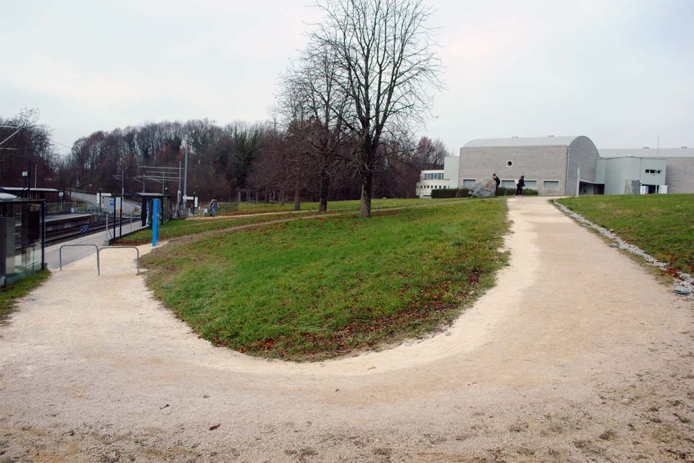
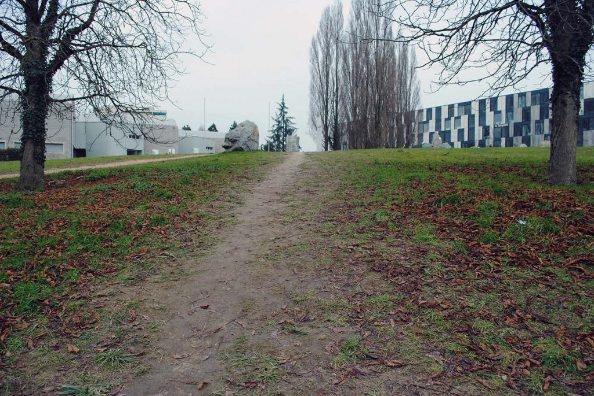
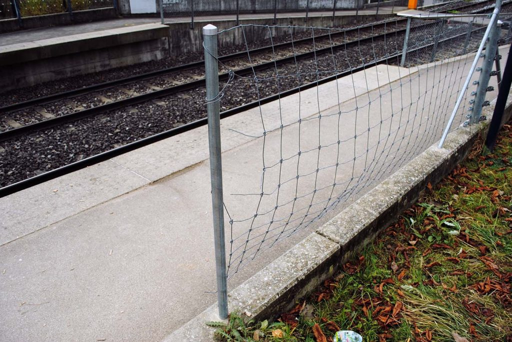
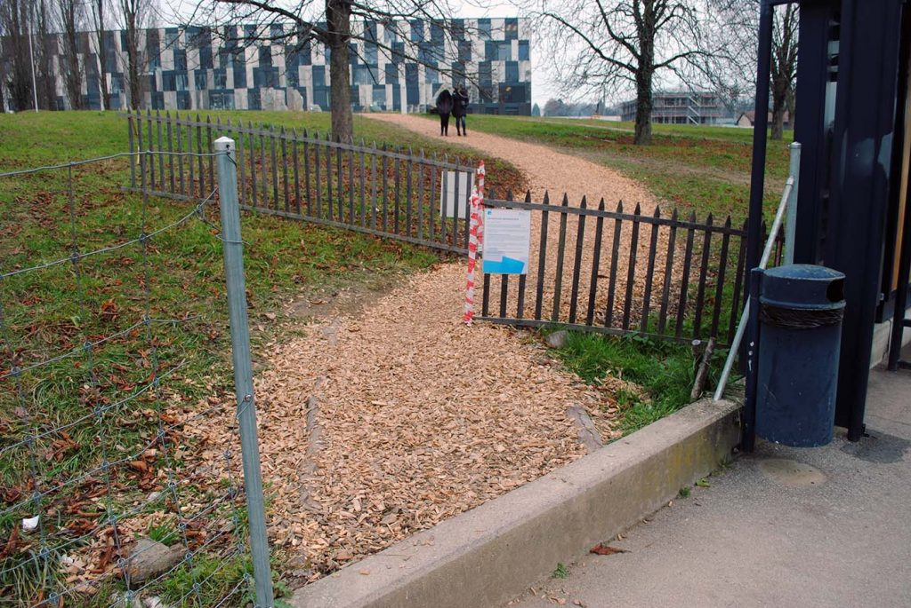
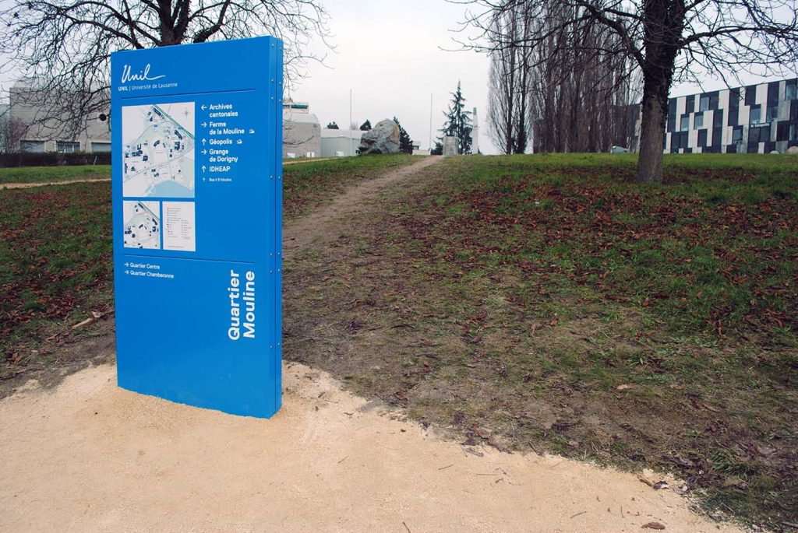
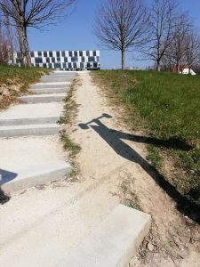

Dans cet article, j’utiliserai un cas concret de gestion de l’espace, afin de montrer en quoi l’espace est l’enjeu de luttes : gestion, mise en ordre, stabilisation ou contestation de cet ordre, renégociation, détournement, adaptation...

En sortant du métro pour se rendre à l’Université de Lausanne, on peut se retrouver face à un chemin faisant une jolie boucle en apparence inutile.

Evidemment, les utilisateurs ont pris l’habitude d’aller au plus court, traçant des raccourcis dans l’herbe, qui ont fini par être presque aussi marqués que le chemin officiel. Ces trajectoires alternatives en viennent ainsi à se stabiliser, devenant préférentielles. Les utilisateurs suivent ainsi un tracé de moins d’un mètre de large.

Au début de l’automne 2016, un grillage a été posé tout le long de la station pour obliger les utilisateurs à prendre le contournement. Une tentative pour imposer un certain ordre et déstabiliser l’usage « illégitime » qui était fait de cet espace. Selon le service des bâtiments de l’UNIL, il s’agit d’éviter que l’herbe soit abîmée et de faciliter l’entretien des espaces verts.

Le grillage a été très rapidement découpé, de manière sommaire, probablement suite à un désaccord entre l’université et les Transports Lausannois (TL). Un des raccourcis a été temporairement aménagé, avec des copeaux et deux barrières.

Un panneau métallique est placé devant un des raccourcis. Peut-être n’est-ce pas volontaire, mais de fait son emplacement masque le raccourci et conduit le flux de piétons sur la boucle « légitime ». Le raccourci, devenu moins visible, est retiré des « affordances », de l’ensemble des actions offertes ou suggérées par l’environnement. Le fait de passer tout droit n’est plus une action « disponible ». Il devient plus évident de suivre le chemin officiel, le raccourci n’étant parfois même plus perçu.

Cela dit, le chemin n’est pas complètement invisible, et le panneau n’est pas compliqué à contourner. L’ironie, d’ailleurs, c’est que le panneau indique d’aller tout droit. Un nouveau raccourci s’est donc progressivement stabilisé, simplement décalé sur les côtés du panneau, la trajectoire est à nouveau bien visible, parcourue par de nombreux piétons.

Puisqu’une période d’observation « sur le terrain » a été annoncée avant de reprendre les travaux, on aurait pu s’attendre à ce que l’on prenne acte des chemins qui sont _de facto_ les plus employés. Il n’y a pas besoin d’observer longtemps : les chemins préférentiels sont inscrits matériellement dans l’espace, tracés au fil du temps par le piétinement de l’herbe. Il aurait été facile de les légitimer, de les officialiser et de les inscrire dans la durée, avec du gravier ou du béton. Mais en décembre de cette année, la station a été grillagée à nouveau. La terre des chemins alternatifs a été retournée pour éviter le passage et faire repousser l’herbe. Le choix a été fait de supprimer les chemins _de facto_, et de forcer les utilisateurs à emprunter un chemin officiel, _de jure_. La tentative est un échec relatif, puisque le raccourci central est aujourd’hui plus marqué que jamais.

On voit donc ici des institutions (l’université et les TL) qui ont le pouvoir d’organiser un espace, y imposer un certain ordre et encadrer le mouvement qui s’y produit. C’est ce que l’on peut appeler des « stratégies », au sens de Michel de Certeau[^1]. Chacune tente avec ses moyens de définir et stabiliser des trajectoires préférentielles, à l’aide de moyens matériels et symboliques : chemins, grillages, barrières, panneaux fléchés, mise en visibilité ou au contraire invisibilisation de certains éléments de l’environnement. Des prises à l’action sont ainsi ajoutées ou retirée[^2]. Face à cela, il y a les utilisateurs, « braconniers », se trouvant sur des terres qui ne leur appartiennent pas, confrontés à ces stratégies qui ne sont pas les leurs. Ce n’est pas pour autant qu’il suivent toujours docilement le schéma qui leur est imposé : bien au contraire, ils élaborent des « tactiques », passant parfois juste à côté des trajectoires légitimes, avec un petit décalage qui suffit à rendre les stratégies des institutions caduques, ou du moins à leur imposer la nécessité d’une adaptation.

La référence à l’anarchisme ne peut pas être évitée ici : tandis que le pouvoir craint un « désordre » anarchique, qui l’empêche de gérer l’espace de manière normative, en tant qu’utilisateur on fait au contraire le constat d’un anarchisme différent : « l’ordre, sans le pouvoir »[^3]. Quelques personnes coupent certes à travers l’herbe, mais il n’y a pas de multitude de trajectoire aléatoires. La quasi-totalité des piétons empruntent la même, et un ordre émerge, se stabilisant de lui-même et finissant, on l’a vu, par être matériellement inscrit dans l’espace.

L’exemple est intéressant de par sa temporalité : il s’est déroulé, et se déroule encore, sous nos yeux. Ailleurs, ces processus sont rendus invisibles parce qu’ils sont terminés, les trajectoires ayant finit par se stabiliser (éventuellement dans le béton). Même si l’on admet que ces processus ne sont jamais terminés « pour toujours », il reste que leur temporalité est trop longue pour être appréhendés aussi simplement que dans le cas montré ci-dessus. L’exemple permet donc de voir le processus constant de renégociation de l’espace, avec des retournements de situation, des stabilisations soudainement interrompues, puis reprises ou abandonnées, etc. Différentes logiques s’affrontent, que l’on peut résumer ici en une opposition top-down VS bottom-up ; _de jure_ VS _de facto_ ; stratégie VS tactique ; _design_ VS _user-experience_ ; ordre imposé VS ordre émergent...

La solution stratégique des gestionnaires ne s’est pas stabilisée. Les utilisateurs prennent un raccourci, et vont continuer à s’adapter, empruntant de nouvelles trajectoires, (dé)stabilisant d’autres chemins. Qu’on le veuille ou non, les utilisateurs n’en font qu’à leur tête. Aucun décideur ayant une visée normative ne peut prendre en compte toutes les possibilités, les réactions, les déviances, etc. Dans ce jeu entre chat et souris, on peut alors se poser la question de ce qui devient nécessaire pour imposer la visée normative. Dans le cas qui nous occupe il s’agit pour l’instant d’un grillage. Dans d’autres situations, la mise en ordre de l’espace repose sur des normes intériorisées et partagées, un panneau « interdit », des fils barbelés, un mur, une loi, des amendes, la présence policière, les armes, la violence.

Mise à jour du 27.03.19:

Au final, ils se sont décidés à bétonner le "raccourci" (voir ci-dessous à gauche). Peut-être par dépit, ayant constaté que leurs "stratégies" n'avaient pas éliminé les "tactiques" ? D'où l'importance pour l'urbanisme d'aller voir sur place comment les espaces sont utilisés, plutôt que de se concentrer sur des plans bien jolis en vue du ciel, qui produiront des espaces peu fonctionnels. De plus, les détournements continuent, puisque l'on voit que les travaux ont fait émerger un nouveau passage officieux. Et même du côté d'un des chemins officiels, une bonne partie des passant.e.s ne prennent pas les escaliers, aux marches irrégulières (photo de droite). Peut-être que le chemin est tout simplement trop étroit pour le nombre de personnes qui sortent du métro en même temps.

[^3]: Attribué à Pierre-Joseph Proudon, mais probablement jamais dit _verbatim_.
[^1]:Certeau M. (2010), L’invention du quotidien : _1. Arts de faire_, Paris, Gallimard.
[^2]:Bessy, C., & Chateauraynaud, F. (1995). Experts et faussaires : _Pour une sociologie de la perception,_ Paris, Métailié.
