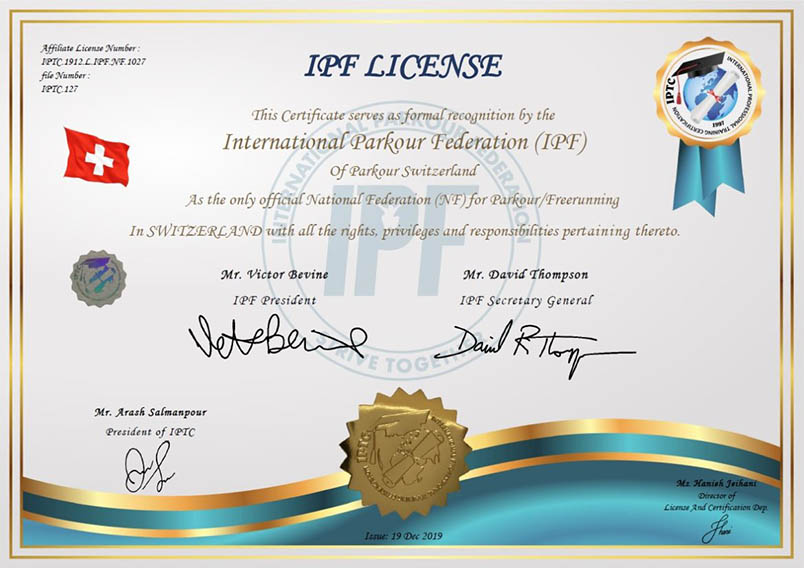
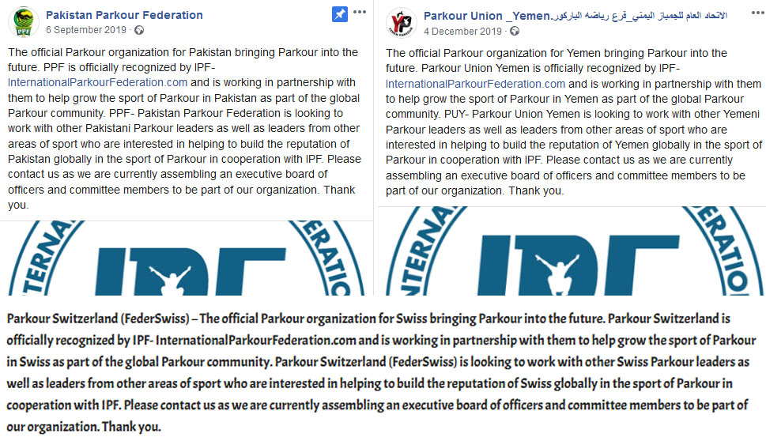
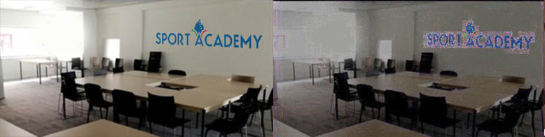
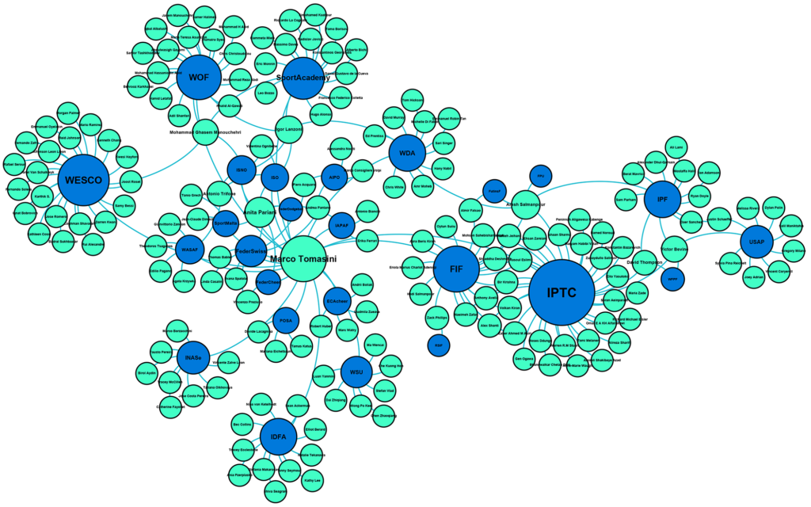
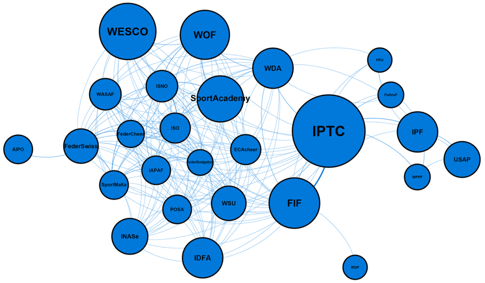

Récemment, on m'a signalé que IPF liste parmi ses partenaires FederSwiss, une organisation suisse de handisport. Mieux, IPF a émis une licence reconnaissant FederSwiss comme l’organe national de gouvernance pour le Parkour en Suisse^[[http://www.federswiss.org/](http://www.federswiss.org/)]. J'ai immédiatement trouvé cela étrange : pourquoi pas une organisation spécifique à la discipline, qu’elle soit déjà active ou créée dans ce but ? De plus, je n’avais jamais entendu parler de FederSwiss. Quelles sont ses activités ? s’est-elle déjà rapprochée de pratiquants du parkour dans la région ? La prochaine partie sera dédiée spécifiquement à FederSwiss, mais ce qui m’intéresse ici c’est le réseau d’organisations et d’individus dont font partie IPF et FederSwiss. En effet, les deux organisations sont très fières de leur réseau, et comme je le montrerai, il y a beaucoup d’éléments suspects.

## Qu'est-ce que IPTC ?

Certificat émis par IPF et IPTC, adressé à FederSwiss

Sur la licence donnée par IPF figure le logo de International Professional Training Certification (IPTC)^[[http://iptcertification.com/](http://iptcertification.com/)]. Pour explorer un réseau, il faut bien commencer quelque part, et on est un peu obligés de commencer un peu arbitrairement, par le milieu. Commençons donc par là. L’organisation organise des cours à la suite desquels elle délivre des certificats censés être « valides au niveau international »^[[http://iptcertification.com/about-us/](http://iptcertification.com/about-us/) 27.04.2020]. IPTC est une entreprise américaine enregistrée au nom de Arash Salmanpour, mais on peut se demander dans quelle mesure David Thompson et Victor Bevine sont impliqués dans cette organisation, étant donné leur omniprésence sur le site de IPTC. Quoi qu’il en soit, IPTC est chargé de délivrer les certificats pour WFPF^[[https://www.facebook.com/worldfpf/photos/pcb.10157191063396609/10157191063241609/?type=3&theater](https://www.facebook.com/worldfpf/photos/pcb.10157191063396609/10157191063241609/?type=3&theater) 01.05.2020]. \[Màj 16.05.2020: le jour de la publication de cet article, M. Salmanpour a été [nommé secrétaire général de IPF\].](https://internationalparkourfederation.com/2020/05/mehdi-arash-salman-pour-appointed-as-deputy-secretary-general-of-ipf-international-parkour-federation/)

Il y a quelques problèmes avec IPTC, à commencer par les personnes qui représentent l’organisation. Vérification faite, au moins une personne qui apparait sur la page « management board » n’était pas au courant de la position qu’elle était censée occuper dans cette organisation. Il est relativement difficile de vérifier pour chaque individu, étant donné qu’il faut pouvoir les contacter d’une manière indépendante de IPTC, et donc trouver leur contact par un biais différent. Je ne peux donc pas affirmer s’il s’agit là d’une erreur, d’un cas isolé, ou d’un problème plus large ; en tout cas les informations ne sont pas fiables. De plus, certains noms apparaissent régulièrement au sein de la liste des partenaires de IPTC : M. Salmanpour lui-même siège dans au moins 6 organisations (World Dodgeball, Asia Freerunning Parkour Union, Federation International Football Skating…). Cela met en question l’indépendance de ces organisations et risque d’être la source de conflits d’intérêts. Peut-être qu’il s’agit là de quelque chose de tout à fait habituel dans les organisations sportives internationales, avec des managers professionnels qui siègent simultanément dans plusieurs organisations. Mais ce qui intrigue ici, c’est l’amplitude du phénomène : j’ai pu trouver le nom de Marco Tomasini dans plus de 19 organisations ! Selon le site de IPTC, M. Tomasini est responsable de son département International Sport Organisation (ISO). Mais bien que cela n’apparaisse pas sur le site, il a également été nommé vice-président de IPTC^[[https://www.instagram.com/p/B1WlbCOJBBl/](https://www.instagram.com/p/B1WlbCOJBBl/) 01.05.2020].

Différents partenaires et membres de IPF ont publié un message identique.

Là ne s’arrête pas son emprise : M. Tomasini est derrière cinq des partenaires listés par IPF : IPTC, International Sport Network Organization (ISNO), Malta Sport for All, FederSwiss, Italian Air Power Athletics Federation (IAPAF). Ces trois dernières ont reçu le même jour un certificat identique provenant de IPF, accompagnées du même message, annonçant être l’organisation nationale officielle pour le parkour et se terminant par une invitation à rejoindre leur comité en cours de construction^[“The official Parkour organization for \[country\] bringing Parkour into the future. \[name\] is officially recognized by IPF- InternationalParkourFederation.com and is working in partnership with them to help grow the sport of Parkour in \[country\] as part of the global Parkour community. \[name\] is looking to work with other \[country\] Parkour leaders as well as leaders from other areas of sport who are interested in helping to build the reputation of \[country\] globally in the sport of Parkour in cooperation with IPF. Please contact us as we are currently assembling an executive board of officers and committee members to be part of our organization. Thank you.”]. Au moins quatre des fédérations membres de IPF ont également publié le même message, ce qui à nouveau invite à douter que toutes ces organisations soient indépendantes. Le moins qu’on puisse dire, c’est qu’il est presque certain que les mêmes personnes se trouvent derrière la création et/ou l’administration de toutes ces organisations.

A gauche, "Sport Academy Headquarters - Bruxelles" selon leur site; à droite le véritable bâtiment, 113 avenue Henri Jaspar, Bruxelle (Google Street View).

Ne nous arrêtons pas en si bon chemin. Car certaines de ces organisations ressemblent à de simples façades. Ainsi, Marco Tomasini figure également sur le site de SportAcademy Europe, sous le nom de « Dr. Marco Tomasini ». Or, sur son site personnel, Marco Tomasini indique qu’il a obtenu un MBA, mais ne mentionne nulle part un doctorat^[[http://www.marcotomasini.it/](http://www.marcotomasini.it/), 09.05.2020]. Jusqu’à preuve du contraire, cette présentation est donc fausse, ou selon une perspective charitable : une erreur. Mais ma charité n’est pas illimitée. Une photo des bureaux de SportAcademy a été retouchée pour y ajouter le logo. Et l’on peut aisément se rendre virtuellement à l’adresse qui nous est donnée (avenue Henri Jaspar 113, Bruxelle), grâce à Google Street View, pour vérifier ce qu’il en est du siège de SportAcademy. Evidemment, le bâtiment est différent de celui indiqué sur la photo. D’autres organisations sont du même acabit : contenus des sites web copié-collés, pas ou peu d’activité, enregistrement aux mêmes adresses, membres semblent ne pas exister, etc.

Avec un logiciel de détection de photomontages, il est évident que le logo n'est pas peint sur le mur.

Revenons à deux organisations déjà mentionnées plus haut : ISO et ISNO. Leurs logos sont similaires, le design de leurs sites est identique, les comités sont constitués pour l’essentiel des mêmes personnes. On y trouve notamment Valentina Ognibene et Antonio Trifone. Il se trouve que ces deux personnes ont de nombreuses entreprises enregistrées en Suisse à leur nom. P.ex. Ora Green Media Invest Alex II SA, Platinum Luxury&Business SAGL ou A&B Origine SA. Ces entreprises ne semblent généralement pas disposer d’un site web. De plus, un bon nombre d’entre elles sont enregistrées aux mêmes adresses, probablement des cases postales. A priori, aucun lien avec ce qui nous intéresse… sauf qu’au moins 4 d’entre elles sont enregistrées à la même adresse que ISO… et FederSwiss. Je ne sais pas quelle conclusion en tirer exactement. Mais Antonio Trifone est avocat, et une de ses entreprises (KeyM) offre des services de « management temporaire ». Peut-être que le lien entre ces différentes personnes et organisations réside là : il y a parmi eux des spécialistes de la création d’entreprises, qui ont contribué à fonder ces organisations et ont alors pris place dans les comités d’administration. Et en effet, une partie au moins de ces organisations ressemblent à des sociétés écrans ou à des sociétés « étagères ». Elles n’ont pas nécessairement d’activité actuellement, mais peut-être seront-elles activées plus tard, et à ce moment-là elles auront déjà tout une existence passée derrière elles. Ou peut-être qu’elles ne seront jamais activées, et ne servent qu’à grossir le réseau de celles d’entre elles qui sont déjà actives.

Jusqu’à maintenant, on est resté essentiellement dans le domaine sportif. Mais il y a encore un élément dont on n’a pas parlé. Sur le site de l’ISO comme sur celui de SportAcademy figurent non seulement des sports, mais également des médecines non conventionnelles, appelées ici « bio-naturelles ». Etrange activité, pour une organisation sportive internationale, que d’organiser des cours de médecines alternatives. ISO a également comme partenaire l’Associazione italiana professionale operatori discipline bio naturali (AIPO), qui regroupe des professionnels des disciplines bio-naturelles^[[https://internationalsportorganization.wordpress.com/](https://internationalsportorganization.wordpress.com/) 02.05.20]. Et bien que cela ne devrait plus guère nous étonner, on peut noter que l’AIPO et FederSwiss ont des membres du comité en commun.

Les organisations proches de IPTC ainsi que les individus membres de leurs comités d'administration. Un certain Marco Tomasini apparait comme personnage central.

Résumons et tentons de voir plus clair. On a commencé avec IPTC, une organisation qui vend des cours et certificats dans des dizaines de disciplines, dont les certificats pour les coachs WFPF. Les organisations qui entourent IPTC forment un réseau fortement interdépendant. Quelques individus siègent dans les administrations de nombre d’entre elles, et les organisations se renvoient fréquemment les unes aux autres afin d’augmenter leur légitimité. Certaines (mais pas toutes) donnent des informations erronées ou semblent inactives. Il est possible que des professionnels de la création et du management temporaire d’entreprises soient impliqués, et que ces organisations soient de simples façades ou des organisations dormantes qui serviront dans le futur.

La plupart des sports impliqués sont en voie d’institutionnalisation : parkour, poledance, e-sports, dodgeball, sports d’obstacles, danse sportive… On dirait une sorte de réseau alternatif d’organisations qui se reconnaissent entre elles, en attendant d’être incorporées au système olympique. Cela ne se réduit donc pas au parkour ; l’appropriation du parkour par IPF/WFPF n’est qu’une partie du puzzle. Et cela ne se réduit d’ailleurs pas au sport non plus, puisque des organisations de médecines alternatives sont également impliquées.

L'interdépendance du réseau IPTC. Deux organisations sont en relation dès qu'un individu ou plus est membre des deux organisations.

En conclusion, on peut faire quelques hypothèses (mutuellement non exclusives).

1. IPTC vend des cours et certificats, et cela se fait plus facilement dans des domaines peu institutionnalisés. On peut d’ailleurs observer que contrairement au système olympique, ce réseau est relativement peu centré sur l’Europe. Dans une perspective charitable, on dirait qu’il s’agit là d’offrir des services dans des domaines et régions qui sont généralement mises de côté. Dans une perspective plus cynique, on dirait qu’il s’agit plutôt de profiter de disciplines et régions qui n’ont pas encore d’institutions stables. Je laisse au lecteur le soin d’en juger, mais ce qui est certain, c’est que la présence des médecines alternatives n’est pas un bon signe : on en connait les dérives prédatrices.
2. Ce réseau peut servir également à construire la légitimité et crédibilité d’IPTC ainsi que de leurs certificats. Pour augmenter leur valeur et leur attrait. En effet, afin de pouvoir revendiquer que les certificats sont valables au niveau international, IPTC doit s’entourer d’organismes qui affirment reconnaitre ces certificats. Elle doit également s’appuyer sur des organisations spécialistes des différentes disciplines en question.
3. Le réseau a également l’avantage de construire la légitimité de différentes organisations sportives. Plusieurs d’entre elles gravitent en effet non loin du système olympique, que ce soit le parkour, la danse sportive^[La danse sportive s’est appropriée le breakdance, juste à temps pour intégrer les Jeux Olympiques de la Jeunesse de Buenos Aires…] ou le dodgeball, actuellement membre observateur de GAISF. La multiplication des références circulaires entre elles crée une belle façade de partenariats, qui donne du poids et un vernis officiel à ces organisations.
4. Il est également possible qu’un tel réseau serve à d’autres fonctions, comme construire le CV des managers, ou tout simplement de l’offuscation pour cacher l’inactivité de certaines organisations. Mais puisque le réseau implique divers acteurs individuels et institutionnels, il y a probablement divers intérêts et motivations, potentiellement en conflit. Bien qu’il y ait certainement des convergences d’intérêts qui donnent cette allure si étrange à ce réseau, rien ne montre qu’il s’agit d’un bloc monolithique inventé de toute pièce par un petit groupe d’individus.

Nous sommes partis d’une organisation controversée au sein du milieu du parkour, mais une fois le puzzle assemblé, il semble que le parkour n’en est qu’une petite pièce. Cependant, au terme de cette enquête, on peut revenir brièvement à notre point de départ. Ce qu’on peut affirmer, c’est que IPF s’affiche comme étant entourée d’un certain nombre de membres et de partenaires. Ceci lui permet d’augmenter sa légitimité, de se présenter comme étant une organisation active et reconnue par d’autres. Or, parmi ses partenaires, on peut relever que plus de la moitié sont interdépendants. De plus, on peut avoir des doutes concernant certains de ses membres : plusieurs semblent être interdépendants, et il y a évidemment le cas de USAP, qui n’est pas clairement séparable de IPF/WFPF. Les problèmes que j’ai relevés vont donc bien au-delà du parkour. Mais les traceurs devraient se sentir concernés. Et si toute cette histoire n’est pas une stratégie volontairement instituée par IPF/WFPF, ils devraient donner un bon coup de balais dans leur réseau avant de pouvoir s’affirmer comme une organisation internationale crédible.

Si vous m’avez suivi jusqu’ici, que vous avez toujours des doutes ou que vous trouvez que je suis resté en surface, continuez votre lecture avec ma [troisième partie](/le-cas-de-federswiss-iii), où j’explore en détails le réseau de FederSwiss, afin de montrer que leurs revendications reposent sur un château de sable.

Si vous souhaitez vous pouvez directement explorer ma base de données. (Etant donné la quantité de données, il est possible qu'une ou deux erreurs se soient glissées. Merci de me les signaler !)  
Base de donnée excel: [https://drive.google.com/open?id=1vT-0y1Zx0NUIfNkw83jvYrLnM8QQVqtf](https://drive.google.com/open?id=1vT-0y1Zx0NUIfNkw83jvYrLnM8QQVqtf)  
Visualiser le réseau avec Gephi: [https://drive.google.com/open?id=1eZPV35kkFhn8QP4YCzstpMrhk\_hE1UoN](https://drive.google.com/open?id=1eZPV35kkFhn8QP4YCzstpMrhk_hE1UoN)

