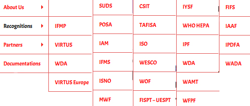
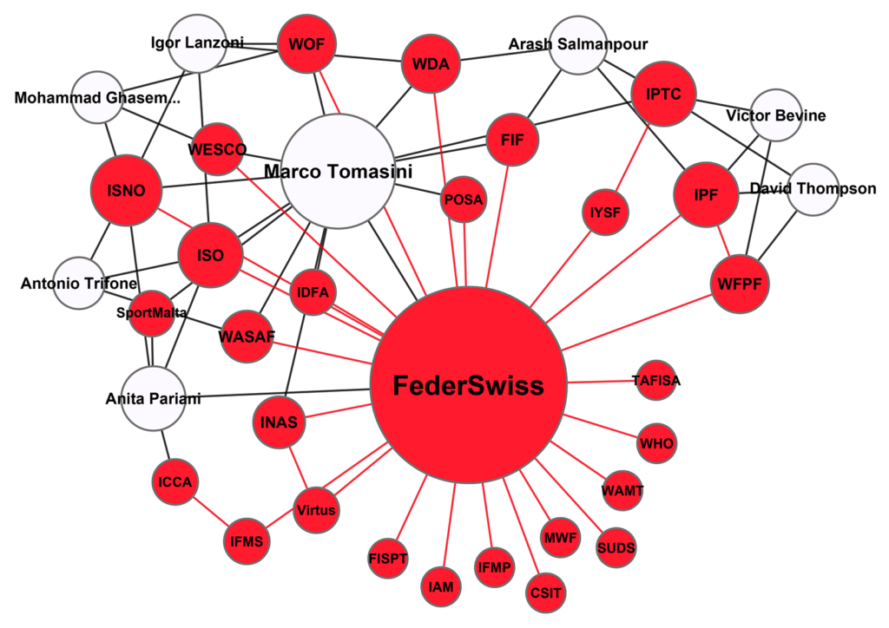

En analysant les cas de IPF et IPTC, j'ai montré plein de détails étranges. Mais pris isolément, ces détails ne suggèrent pas grand chose, ce sont peut-être des erreurs, des imprécisions, l'excès de zèle d'un individu isolé. C'est pris ensemble que ces éléments peuvent faire office de preuve. Ce que je suggère de faire ici, c'est de décortiquer le cas d'une organisation en particulier, FederSwiss. La somme des problèmes que je vais révéler ci-dessous devrait vous convaincre, si ce n'est pas encore le cas, qu'il y a bien quelque chose d'étrange qui se trame derrière IPF, IPTC et toutes les organisations dont ils s'entourent.

## FederSwiss, une organisation de parkour ?

Prenons donc le cas de FederSwiss, qui figure parmi les partenaires de IPF. Il s’agit d’une organisation enregistrée en Suisse en 2016, nommée « Federazione Svizzera Sport Paralimpici (FSSP) » jusqu’en 2019. En général, le mouvement olympique protège jalousement sa propriété intellectuelle, et le fait qu’il existe déjà une organisation paralympique officielle en Suisse pourrait expliquer le changement de nom.

Quelle est la relation exacte entre IPF et FederSwiss ? Sur le site de FederSwiss, on tombe rapidement sur une licence émise par IPF^[http://www.federswiss.org/2020/01/07/ipf-recognition/], déclarant que FederSwiss est la seule Fédération Nationale pour le parkour et le freerunning en Suisse^[A noter qu’il y a une contradiction: IPF a choisi sur son site de ne pas afficher FederSwiss parmi les fédérations nationales.] afin d’"amener le parkour dans le futur". Le certificat est signé par Victor Bevine, David Thompson et Arash Salmanpour. Le texte qui accompagne ce certificat est un copié-collé d’un texte que l’on peut retrouver chez d’autres partenaires de IPF. Première bizarrerie donc : une fédération de handisport est choisie pour représenter le parkour au niveau national, plutôt qu’une organisation spécifique active dans cette discipline.

Pour éclaircir la situation, on peut commencer par vérifier si l’organisation est active. Pour l’essentiel, les comptes Instagram, Twitter et Facebook liés à FederSwiss ne font que repartager du contenu créé ailleurs. Les pages fb de FederSwiss et SportMalta partagent d’ailleurs du contenu identique. Si l’on remonte à 2017, on peut trouver quelques photos d’une athlète arborant le logo de FederSwiss. L’organisation existe donc bel et bien au-delà de son site web, mais semble récemment très peu active.

Voyons maintenant le contenu du site lui-même. Le site est entièrement en anglais, alors qu’on aurait pu s’attendre à ce qu’il utilise des langues nationales. On retrouve des textes identiques à ceux présents sur le site de l’organisation Malta Sport For all, dont des fautes d’orthographe^[Comparer par exemple [https://sportmalta.wordpress.com/cynological-sports/](https://sportmalta.wordpress.com/cynological-sports/) et [http://www.federswiss.org/cynological-sports/](http://www.federswiss.org/cynological-sports/)]. Seul deux des membres du comité ont une photo, les autres sont simplement nommés. Les statuts de l’organisation ne sont pas disponibles. Certaines pages sont vides (p.ex. « Education and Certification »), d’autres donnent accès à du contenu non pertinent (le texte sur la page « Antidoping » concerne une autre organisation, INAS).

En fait, l’essentiel du contenu du site concerne 1) les disciplines pratiquées au sein de FederSwiss et 2) les organisations qui « reconnaissent » FederSwiss.

1) Les sportis listés sont pour l’essentiel des sports « mineurs » ou du moins non reconnus par le mouvement olympique. Ceci inclut le dodgeball, le parkour, les « o-sports », les sports cynologiques (canins), le pole-dance, les e-sports, le yoga, l’airsoft, le matchpoker. Il ne me semble pas que ce soient des pratiques spécialement représentatives des handisport, et cette liste n’a pas _a priori_ de lien étroit avec les buts affichés de FederSwiss. Le lien le plus évident entre elles est que ce sont des disciplines qui sont en marge du système olympique, et sont potentiellement en quête de reconnaissance par les institutions sportives traditionnelles. Cette liste de disciplines recoupe de manière très proche la liste des départements de IPTC^[http://iptcertification.com/about-us/management-board/].

2) FederSwiss se targue d’être reconnu par une énorme liste d’organisations. Cela devrait suffire à éveiller le soupçon : la plupart des organisations ne font pas de la reconnaissance par autrui le point central du contenu de leur site. De plus, seule une minorité de ces organisations concernent le handisport, la plupart n’ont aucun lien évident avec les buts de FederSwiss. Finalement, on peut facilement montrer qu’il y a peu d’indépendance entre certaines de ces organisations. Prenons les une par une.

FederSwiss est "reconnue" par une (trop) longue liste d'organisations.

## "FederSwiss est reconnu par..."

Un premier groupe est celui des organisations concernant le handisport et sport pour tous :

<table><tbody><tr><td>
<strong>Organisation</strong>
</td><td>
<strong>Commentaire</strong>
</td></tr><tr><td>
INAS/Virtus Europe
</td><td>
Marco Tomasini est ou était un membre du comité de INAS, qui est l’ancien nom de Virtus.
</td></tr><tr><td>
Virtus
</td><td>
Voir ci-dessus.
</td></tr><tr><td>
SUDS Sport Union for athletes with Down Syndrome
</td><td>
Ràs
</td></tr><tr><td>
FISPT-UESPT Union européene du sport pour tous
</td><td>
La FISPT (Fédération Internationale du Sport pour Tous) figure dans la liste des organisations reconnues par le CIO, mais le site web n’existe plus.
</td></tr><tr><td>
Tafisa The Association For International Sport for All
</td><td>
Ràs
</td></tr><tr><td>
WHO HEPA World Health Organisation Health Enhancing Physical Activity
</td><td>
Il s’agit simplement d’un réseau d’organisations liés à l’activité physique et à la santé, les conditions pour être membre ne sont pas restrictives.
</td></tr></tbody></table>

Certaines de ces organisations partagent de membres du comité, mais de manière générale il semble que ce sont des organisations actives. De plus, leur activité dans le handisport est pertinente au vu des buts FederSwiss, il n’y a donc rien d’étrange à ce que leur nom apparaisse ici.

On peut ensuite identifier un second groupe d’organisations, qui concerne les sports de majorette :

<table><tbody><tr><td>
<strong>Organisation</strong>
</td><td>
<strong>Commentaire</strong>
</td></tr><tr><td>
IAM International Association of Majorette Sport
</td><td>
Aucune information disponible sur le comité, pas de statuts.
</td></tr><tr><td>
MWF Majorettes Sport World Federation
</td><td>
La Suisse n’apparait pas dans la liste des membres.
</td></tr><tr><td>
IFMS International Federation Majorettes Sports
</td><td>
Anita Pariani apparait comme représentante pour l’Italie, et Tomasini pour la Suisse
</td></tr><tr><td>
WAMT World Association of Majorette-sport and Twirling
</td><td>
Ràs
</td></tr></tbody></table>

A première vue, ce sont des organisations actives. Il est un peu surprenant de voir figurer autant d’organisations pour le même sport, étant donné que ces organisations sont relativement non pertinentes pour FederSwiss. Les liens entre elles ne sont pas clairs, mais a priori il s’agit de fédérations internationales plus ou moins concurrentes.

Ensuite vient un groupe d’organisations où Marco Tomasini est ominprésent :

<table><tbody><tr><td>
<strong>Organisation</strong>
</td><td>
<strong>Commentaire</strong>
</td></tr><tr><td>
POSA Pole Sports &amp; Arts World Federation
</td><td>
Les membres de cette organisation semblent inexistants (impossible de trouver de l’information indépendante). Une lettre de POSA suggère que Marco Tomasini est le chef de leur comité de «&nbsp;parapole&nbsp;». (<a href="https://iapaf.files.wordpress.com/2018/09/welcome-letter-waapa-members.pdf">https://iapaf.files.wordpress.com/2018/09/welcome-letter-waapa-members.pdf</a>)
</td></tr><tr><td>
IDFA International Pole Dance Fitness Association
</td><td>
Tomasini est le président de la section européenne.
</td></tr><tr><td>
ISNO International Sport Network Organisation
</td><td>
Tomasini est dans le comité. Même webdesign et logo quasi identique à l’ISO (ci-dessous).
</td></tr><tr><td>
ISO International Sport Organisation
</td><td>
Tomasini est dans le comité. L’organisation est à la même adresse que FederSwiss, mais ne figure pas au registre du commerce.
</td></tr><tr><td>
WOF World o-sport
</td><td>
Marco Tomasini affirme être vice-président sur sa page facebook. Dans tous les cas, Igor Lanzoni est affiché comme vice-président sur le site.
</td></tr><tr><td>
WESCO World e-sport consortium
</td><td>
Marco Tomasini et Mohammed Manouchehri sont dans le comité.
</td></tr><tr><td>
WDAWorld Dodgeball
</td><td>
Arash Salmanpour,Tomasini et Lanzoni sont dans le comité.
</td></tr><tr><td>
FIF Federation International Football Skating
</td><td>
Salmanpour et Tomasini sont dans le comité.
</td></tr><tr><td>
IAAF (?)
</td><td>
Normalement IAAF est l’abréviation de la fédération internationale d’athlétisme. Mais le lien mène en fait à WASAF, organisation où Marco Tomasini figure au comité.
</td></tr></tbody></table>

On peut donc difficilement affirmer qu’il s’agit ici d’organisations indépendantes, étant donné que Marco Tomasini siège dans toutes.

Le dernier groupe est plus hétéroclite :

<table><tbody><tr><td>
<strong>Organisation</strong>
</td><td>
<strong>Commentaire</strong>
</td></tr><tr><td>
IYSF International Yoga Sports Federation
</td><td>
FederSwiss n’est pas listé dans les membres. Par ailleurs, ces membres ne semblent pas avoir d’existence indépendante de l’IYSF, tous les emails renvoyant à celle-ci. L’IYSF apparait également très liée à IPTC.
</td></tr><tr><td>
IFMP International Federation of Matchpoker

&nbsp;
</td><td>
Ràs
</td></tr><tr><td>
UE transparency registry
</td><td>
On peut enregistrer n’importe quelle organisation online rapidement.
</td></tr><tr><td>
CSIT Confédération Sportive Internationale Travailliste et Amateur
</td><td>
Ràs
</td></tr><tr><td>
WADA (&nbsp;?)
</td><td>
Il s’agit usuellement de l’abréviation anglophone pour l’Agence Mondiale Antidopage. Mais ici, elle renvoie à une organisation russe nommée World Art &amp; Dance Alliance.
</td></tr></tbody></table>

Et finalement, on retrouve évidemment IPF et WFPF, mentionnées séparément comme si ces organisations étaient indépendantes.

Le réseau FederSwiss. En rouge, les liens institutionnels ("reconnu par", "affilié à"...); en noir, les liens individuels ("membre du comité de"...).

En résumé : FederSwiss se targue d’être reconnue par différentes organisations. Mais ce qui se cache derrière le terme « reconnaissance » n’est pas clair et diffère de cas en cas. FederSwiss est « reconnue » à des titres divers selon les organisations (membre d’un réseau, représentante nationale pour différentes disciplines sans lien entre elles, etc.) et les conditions d’appartenance à ces organisations et réseaux sont plus ou moins permissives. De plus, on devrait s’attendre à ce que les seules reconnaissances pertinentes soient celles venant soit d’organisations spécifiques au handisport, soit d’organisations faitières ayant une forte légitimité (CIO, GAISF, etc.). Finalement, ces organisations ne sont manifestement pas indépendantes. On peut donc affirmer que FederSwiss se crée une façade en gonflant son réseau, mais qu’il n’y a visiblement pas grand-chose derrière.

Or, j’ai pris FederSwiss comme un cas à analyser spécifiquement. Mais en fait, une partie au moins de ces organisations peuvent être analysées de la même manière. Les liens entre elles sont relativement symétriques, au point où le système devient circulaire. Lorsque FederSwiss affirme être reconnu par IPF, IPF peut l’ajouter à la liste de ses partenaires. Chacun y gagne, cette construction de façade étant mutuelle. Petit à petit un château de sable se construit, qui bien que fragile est de plus en plus difficile à démêler. Lorsque chacune de ces organisations revendiquent des liens avec les autres, des collaborateurs et activités communes, etc. il devient presque impossible de vérifier les informations de manière indépendante : on est pris dans un réseau, on peut analyser le réseau, mais on peut difficilement trouver un appui en dehors de celui-ci. Tout ce qu’il reste, c’est de dénoncer la circularité et le manque d’indépendance des organisations. Le cas est assez similaire aux références circulaires qui appuient certaines fakes news, phénomène parfois qualifié de citogenèse^[https://xkcd.com/978/].

Puisqu’il s’agissait ici de prendre un cas d’étude, je ne vais pas répéter ici mes conclusions et hypothèses que j’ai faites précédemment. Mais ce qu’on peut noter, c’est qu’un château de sable tel que celui-ci peut en fait devenir solide. Si suffisamment d’organisations en reconnaissent une autre, elle gagne en légitimité. Et à un moment donné, il se pourrait qu’elle soit considérée comme suffisamment légitime pour être reconnue par des institutions telles que le CIO ou GAISF : son destin est alors à peu près scellé. Ceci est valide pour les organisations, comme pour le CV des personnes qui y travaillent. Mais c’est également le cas pour les certificats : un diplôme vaut par les institutions qui le reconnaissent comme valide. Un simple vernis de légitimité peut devenir un appui solide lorsque suffisamment d’acteurs importants lui accordent de l’importance.

Si vous souhaitez vous pouvez directement explorer ma base de données. (Etant donné la quantité de données, il est possible qu'une ou deux erreurs se soient glissées. Merci de me les signaler !)  
Base de donnée excel: [https://drive.google.com/open?id=1vT-0y1Zx0NUIfNkw83jvYrLnM8QQVqtf](https://drive.google.com/open?id=1vT-0y1Zx0NUIfNkw83jvYrLnM8QQVqtf)  
Visualiser le réseau avec Gephi: [https://drive.google.com/open?id=1eZPV35kkFhn8QP4YCzstpMrhk\_hE1UoN](https://drive.google.com/open?id=1eZPV35kkFhn8QP4YCzstpMrhk_hE1UoN)

