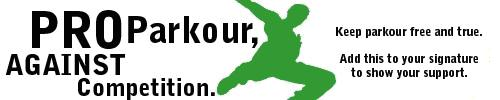

Les traceurs se comparent constamment les uns aux autres, tout en cherchant à euphémiser ou à masquer cette guerre des uns contre tous. Ou du moins, c’est quelque chose que j’ai entendu dire à plusieurs reprises ces dernières années. Il ne s’agit pas ici de critiquer encore une fois l’organisation de compétitions de parkour, mais de s’intéresser à ce phénomène de « dénégation » de la compétition[^1]. Les traceurs font-ils de la compétition sportive tout en niant que celle-ci existe ?

## Pro parkour, against compétition

Lorsque j’ai commencé le parkour, en 2011, les pratiquant.e.s autour de moi comprenaient la discipline comme étant intrinsèquement non compétitive. Lorsqu’ils étaient sommés de créer une vitrine pour le parkour et d’en donner une définition, celle-ci commençait fréquemment par « le parkour est une _discipline non-compétitive_ qui consiste à… ». Les discours anti compétitifs étaient relativement répandus, si l’on peut en juger à partir de ce qui se disait sur les forums à l’époque : souvenez-vous des bannières « pro parkour, against compétition ». Depuis cette époque, l’idée que le parkour puisse être un sport compétitif a fait son chemin. Les rares compétitions étaient organisées par des entreprises externes au petit monde du parkour, mais il existe aujourd’hui des compétitions qui se targuent d’être créées par et pour les pratiquants. On pourrait évidemment nuancer cela en montrant que les traceurs ne sont pas un groupe uniforme, et que ce sont souvent des entrepreneurs (notamment les propriétaires de salles de parkour) qui organisent ces compétitions. Mais quoi qu’il en soit, la compétition semble aujourd’hui mieux acceptée et ne donne plus l’impression d’être seulement imposée de l’extérieur.

Tous les pratiquants ne sont pas devenus des compétiteurs, loin de là. Mais la définition non-compétitive de la pratique est devenue difficilement tenable : il faut admettre qu’il y a bien des compétitions de parkour. On peut bien jouer la dispute verbale en affirmant que les compétitions de parkour, ce n’est pas _vraiment_ du parkour. En fait, la plupart des pratiquants accepteraient sans doute que participer à une compétition comme _Chase-tag_ et faire du parkour avec leurs potes, ce n’est effectivement pas la même chose. Il reste que le discours non-compétitif ne semble plus faire partie du discours-vitrine, et doit être défendu avec toutes ses nuances, plutôt que soutenu avec évidence comme cela se faisait régulièrement il y a une dizaine d’années.

## Discours vitrine et dénégation

Dans un tel contexte, c’est soudain comme si un voile avait été levé. Tout ce discours contre la compétition, n’était-ce pas qu’un cache-misère ? Derrière l’idée d’une communauté soudée, qui ne juge pas autrui, qui refuse la compétition contre autrui, pour favoriser la progression pour soi, par rapport à soi, la réalité est sans doute moins reluisante. Ces beaux discours n’étaient qu’une forme de dénégation : on masquait la compétition, pour que la compétition puisse se faire de manière cachée, euphémisée. Voici par exemple ce que m’a dit un autre traceur dans une conversation personnelle :

> « Donc même à la plus banale des sessions y'a des rapports, pas de dominance mais les gens se jugent en permanence en se disant "ok je suis plus fort que lui et lui et lui". »

Il y a du juste dans cette conception de la dénégation. Il y a, je pense, la volonté de préserver une certaine pureté du parkour en niant les affrontements. Le cas le plus évident est donné par les participants à des compétitions eux-mêmes, qui ont fréquemment nié que les compétitions étaient compétitives : elles n’en auraient que le nom, mais se passent dans la bonne humeur, entre potes, nul n’y participe dans le but de gagner, les participants n’ont pas d’envie de meurtre et l’homme n’y est pas un loup pour l’homme. Cette vision enchantée est en partie due au fait que les premières compétitions étaient relativement informelles, se faisaient en groupe de pairs (on a des liens d’affinité avec tous les participants, et même avec les juges et arbitres) et que leurs enjeux étaient faibles. Cela a probablement déjà changé, et changera encore d’ici que le parkour se trouve aux Jeux olympiques. Mais c’est également un exemple parfait de dénégation : pour que la compétition se passe, et soit acceptée (notamment aux yeux des non-participants), il faut nier qu’il s’agit réellement d’une compétition. D’ailleurs, pour promouvoir l’idée selon laquelle les compétitions de parkour sont « bonnes pour la santé des enfants », l’organisation WFPF affirme que « le sens original du mot ‘compétition’ est ‘lutter ensemble’ »[^2]. Je ne connais pas de meilleur exemple de dénégation.

## Les limites du concept de dénégation

Il faut cependant être sur ses gardes lorsque l’on manipule ce concept de dénégation. Les cas ci-dessus sont clairs, puisqu’il s’agit de participants à des compétitions, affirmant qu’elles ne sont pas compétitives. Mais d’autres cas sont moins homogènes : ceux qui nient la compétition et ceux qui la pratiquent ne sont pas nécessairement les mêmes personnes. Autrement dit, il existe des pratiquants, des espace-temps et des contextes de pratique plus ou moins compétitifs. Mettons que j’affirme que le parkour est non-compétitif : je ne veux pas dire par là qu’il n’y a jamais eu de compétition de parkour, portant le nom « parkour », ou ayant comme participants des traceurs. Je peux vouloir faire ici deux choses.

- Soit je veux faire un usage descriptif, et dans ce cas ce que j’affirme c’est que _ma propre pratique_ n’est pas compétitive. Admettons que je ne vous mens pas : suis-je inconsciemment compétitif ? Fais-je ici de la dénégation ? Est-ce que toute personne qui nie la compétition fait de la dénégation ? Ce serait faire un usage irréfutable, quasi tautologique de ce concept[^3].
- Soit je veux faire un usage performatif ou normatif, et dans ce cas il s’agit peut-être de formuler un idéal, en tension avec la réalité. Certes, les traceurs se comparent les uns aux autres, mais ce n’est pas ce vers quoi ils devraient tendre.

Dans ce second cas, on peut parler de dénégation, mais sans l’accompagner de la vision cynique de la guerre des uns contre tous. Dévoiler ce type de dénégation, ce n’est pas tant dévoiler la dureté des relations sociales, mais montrer comment par le langage des pratiquants participent au maintien d’une certaine culture non-compétitive. Autrement dit, pour maintenir à distance la réalité sociale de la guerre, les pratiquants ne se contentent pas de se mentir à eux-mêmes et aux autres pour la masquer : ils l’empêchent d’advenir. Le mot ici est trop fort, puisque ce n’est pas nécessairement un projet explicite et qu’ils peuvent échouer (dans quel cas, on peut effectivement devenir cynique).

En fait, adopter une version cynique de la dénégation, c’est faire une mauvaise lecture de Bourdieu, qui est à l’origine du concept. En analysant l’économie du don, Bourdieu montre qu’on peut facilement tomber (et Derrida comme les économistes orthodoxes y plongent tête la première) dans le piège suivant : puisque tout don s’accompagne d’un contre-don auquel on peut s’attendre, ne s’agit-il pas d’un simple échange donnant-donnant ? Et dans ce cas, ne doit-on pas considérer qu’en fait, le don est impossible ?

C’est ici que le concept de dénégation fait son entrée : l’économie du don est possible parce que l’économie économique (donnant-donnant) est déniée, elle est mise à l’écart autant que faire se peut. La dénégation, ce n’est pas le mensonge, mais le travail nécessaire à la mise à l’écart de tout ce qui ferait que le don n’est pas un véritable don. Pour le dire vite, il y a par exemple une temporalité spécifique du contre-don, on ne rend pas tout de suite, ce qui permet de le vivre comme générosité. Et comme le dit Bourdieu:

> « Il faut que le refoulement et la dénégation que j’ai décrits soient collectivement encouragés et soutenus et qu’ils soient préparés par une éducation portant, au fond, à refuser le calcul. »
> 
> _Anthropologie économique: cours au Collège de France (1992-1993)_, 2021, p. 47

La disposition à être généreux est socialement encouragée, et procure des avantages. Mais ces avantages ne détruisent pas pour autant la générosité. On peut faire appel à Wittgenstein : suivre une règle, ce n’est pas (nécessairement) avoir cette règle en tête, calculer son comportement de manière à obéir à cette règle. De la même manière, si l’on peut décrire la générosité comme procurant divers avantages, cela ne fait pas des acteurs de simples maximisateurs d’utilité adoptant de manière cynique un comportement d’apparence « généreuse » uniquement parce qu’ils ont calculé les avantages que cela leur procurerait.

Pour le dire encore une fois, ce n’est pas que derrière la dénégation du don comme échange donnant-donnant on pourra retrouver le calcul égoïste et intéressé des économistes orthodoxes. La dénégation est ce qui fait que le calcul est gardé à l’écart. Parler de dénégation de la compétition ne doit pas conduire automatiquement à soupçonner de manière cynique que tous les acteurs font de la compétition tout en mentant à ce propos. On ne peut pas faire comme si le fait que la compétition soit méconnue, niée, cachée, tenue à distance, découragée, etc. était un fait sans importance, une simple illusion sous laquelle se cacherait la _vraie_ réalité sociale.

## Des concepts confus

Comment éviter de voir de la compétition partout, sans pour autant avoir la naïveté de penser que le parkour est un endroit magique où seules des relations enchantées ont lieu ? C’est rendu difficile par les différentes confusions linguistiques qui entourent le concept de compétition. Ainsi, le terme compétition désigne une relation entre différentes personnes, mais certains n’hésitent pas à parler de « compétition contre soi-même ». Cela donne l'impression qu’il s’agit là de « faire ce que je fais avec autrui, mais sauf que autrui c'est moi ». Il est difficile de dire plus explicitement en quoi l’expression est confuse, mais le cas me semble analogue aux nombreux exemples traités par Wittgenstein, comme celui des « pensées inconscientes ». Une pensée inconsciente c’est simplement une pensée consciente (jusque là tout est clair) mais...inconsciente et donc, en fait, pas une pensée du tout ! La compétition contre soi-même, c’est comme la compétition contre les autres mais sans les autres ; et donc pas une compétition du tout. Etant donné que des auteurs comme le philosophe Michel Bouet[^4] envisagent de parler de compétition contre une montagne dans le cas de l’alpinisme, on comprend qu’on se trouve sur un terrain miné.

Les traceurs sont en compétition contre eux-mêmes et contre leur environnement, si on arrive à comprendre ça, soit, mais cela ne répond pas tellement à notre question. De même, pour le fait que les traceurs se « comparent » mutuellement ou « se jugent en permanence » pour reprendre les termes du traceur cité plus haut. Si on estime que cela suffit à montrer une continuité directe entre la pratique des traceurs et ce qui se fait dans une compétition de la Fédération Internationale de Gymnastique, on a rien compris.

## Comparaison et compétition

Essayons déjà de se débarrasser de l’illusion de la synonymie entre comparaison et compétition. Pour ce faire, je trouve la notion d’_interdépendance_, utilisée en psychologie sociale, relativement éclairante. Le cas où l’on parlerait le plus volontiers de compétition est celui de l’interdépendance _négative_ : dans cette situation, la réussite des uns réduit la réussite des autres. Etre le premier à réussir un saut, c’est une situation d’interdépendance négative, car si je réussis, je dérobe à tous les autres la possibilité d’être le premier. C’est évidemment le cas dans toutes les compétitions sportives à proprement parler, où une hiérarchie des participants est effectuée et où, à moins d’un ex aequo, il ne peut y avoir qu’un seul vainqueur. Mais il me semble qu’en parkour, on ne se trouve pas systématiquement dans une telle situation. Au contraire, il y a parfois de l’interdépendance _positive,_ où la réussite des uns permet la réussite des autres. Autrement dit, lorsque les pratiquants se comparent les uns aux autres, ce peut être bénéfique pour tout le groupe. Un élève peut se comparer fréquemment à son enseignant, mais affirmer qu’il y a alors compétition c’est, me semble-t-il priver le mot de son sens. Il peut y avoir également _indépendance_, comme lorsque des pratiquants s’entraînent chacun dans leur coin sans vraiment se préoccuper de ce que font les autres. On voit que cette conception de la compétition a des affinités avec celle utilisée en économie, où il y a compétition (interdépendance négative) pour des « ressources » limitées. Dans un jeu à somme nulle, plus je gagne, plus l’autre perd. Les compétitions sportives formelles fonctionnent ainsi. Mais il n’est pas clair que c’est le cas pour une session de parkour. Cela demanderait un travail ethnographique fin pour observer dans quelles situations il y a interdépendance négative, positive, ou indépendance.

## L’institutionnalisation de la compétition

Ensuite, il faut tenir compte du degré d’institutionnalisation de la compétition. Il n’y a pas vraiment de continuité entre la simple comparaison interpersonnelle et la compétition sportive comme évènement circonscrit dans le temps, avec des règles et des objectifs spécifiques, une quantification de la performance, une hiérarchie clairement établie, etc. Les traceurs savent certainement plus ou moins qui est fort ou faible dans le groupe. Mais il serait intéressant de voir s’ils appliquent tous les mêmes standards pour former leur hiérarchie personnelle. La performance est rarement mesurée et comparée de manière objective, quantitative. On entend parfois des pratiquants affirmer qu’ils ont fait « un saut de 14 pied de long », mais il s’agit là de leurs pieds. Malheur à celui qui a des grands pieds. Certains pratiquants sont (volontairement ou non) des « spécialistes », d’autres sont plus polyvalents et le parkour offre des niches variées à occuper (sauter loin, amortir parfaitement, être précis, avoir de l’imagination, etc.). Les défis que se fixent les traceurs (p.ex. « essayer de grimper cette façade) sont flexibles, et fréquemment adaptés (« essayer de grimper _sans utiliser la main gauche_, parce que trop facile pour moi »). On peut dire que cela fait partie de la dénégation de la compétition. Pour éviter les situations d’interdépendance négative, il y a toujours une marge de manœuvre pour renégocier les challenges individuellement ou collectivement, explicitement ou implicitement. Les pratiquants ne se retrouvent pas en compétition, parce qu’ils ne font pas exactement la même chose.

Finalement, la compétition « entre potes » a la particularité de laisser entre les mains des participants le pouvoir légitime de sanction, le pouvoir de juger, d'arbitrer, de décider des critères de réussite et d'échec, des sanctions et récompenses. La majeure partie de ce travail se fait chemin faisant, comme lorsque l’on redéfinit les contraintes d’un défi en se rendant compte qu’il est trop facile ou trop dur (pour soi-même ou pour le collectif). Ce n’est pas le cas des compétitions institutionnalisées, où les règles sont écrites à l’avance, où les juges et arbitres ne sont pas eux-mêmes des athlètes, où les critères de réussite et d’échec ne sont pas constamment redéfinis en cours d’activité et en fonction de ce qui est en train de se passer.

Je mentionnerai également la question de l’intentionnalité collective, sans pouvoir la développer, faute de réponse concluante de ma part. En compétition formelle, il y a une intentionnalité collective compétitive. Chacun sait que c’est une compétition, et qu’il est opposé aux autres, et sait que les autres le savent aussi, etc. Federer sait qu’il est engagé dans une compétition, et que son adversaire est Nadal, et vice-versa. Pour le dire simplement, il s’agit là d’une activité collective. Que se passe-t-il lorsqu’un traceur en particulier est animé par le désir de surpasser un autre, sans que la relation soit mutuelle ? Lorsque l’élève souhaite dépasser le maître, sans l’avouer au maître, qui lui est là pour faire son travail de maître, peut-on vraiment parler de situation de compétition ? Cette intentionnalité collective compétitive manque dans la plupart des situations qu’on appelle « faire du parkour », et il s’agit d’une différence qui doit être prise en compte.

## Conclusion

Tout cela ne veut pas dire qu’il n’y a pas des pratiquants plus forts que les autres, que les traceurs seraient aveugles à ceci, ou encore qu’il n’existe aucun profit à être reconnu comme le plus fort. Ni que le parkour n’a pas une culture instaurant une hiérarchie informelle, récompensant certains comportement ou performances, etc. Mais le concept de compétition est mal armé pour en rendre compte et introduit des confusions. Essayer de clarifier le concept de compétition est la première étape pour éviter de tomber dans le piège de la guerre des uns contre tous comme dans celui de la communauté idyllique. Il faut ensuite être attentif au degré d’institutionnalisation des compétitions, et éviter d’homogénéiser les pratiques et les pratiquants. La réponse à notre question sera nécessairement décevante. Le parkour est-il compétitif ? Oui, parfois, pour certain.e.s et dans certains contextes, et cela dépends de ce que l’on entends par compétition. Mais cela n’autorise nullement à adopter par défaut la vision cynique faisant voir du conflit partout.

[^1]:: Le concept de “dénégation” vient de Pierre Bourdieu. Le sociologue Olivier Aubel l’a appliqué à la compétition en escalade libre. On peut lire un de ces textes ici: [http://www.escalade-alsace.com/EA2000/article/olivier.html](http://www.escalade-alsace.com/EA2000/article/olivier.html).

[^2]: « The original meaning of the word ‘compétition’ is ‘to strive together. » [https://wfpf.com/how-healthy-is-the-parkour-freerunning-lifestyle-for-kids/](https://wfpf.com/how-healthy-is-the-parkour-freerunning-lifestyle-for-kids/)

[^3]: C’est ce que le grimpeur Antoine le Menestrel reproche (sans le nommer) au sociologue Olivier Aubel : « On nous disait que la compétition existait déjà, qu’il fallait s’y résoudre et que ma vision poétique de l’escalade était une éthique de substitution à la réalité. Certains nous faisaient croire que l’escalade libre n’était que compétition. Encore aujourd’hui, il existe un sociologue qui prétend que je fais de la dénégation. » [http://fanatic-climbing.com/reflexion-antoine-le-menestrel-et-la-place-de-la-compétition-en-escalade-french-only/](http://fanatic-climbing.com/reflexion-antoine-le-menestrel-et-la-place-de-la-compétition-en-escalade-french-only/)

[^4]: Michel Bouet, Signification du sport, Paris, Editions Universitaires, 1968. Je cite de mémoire, n’ayant pas l’ouvrage à disposition.
