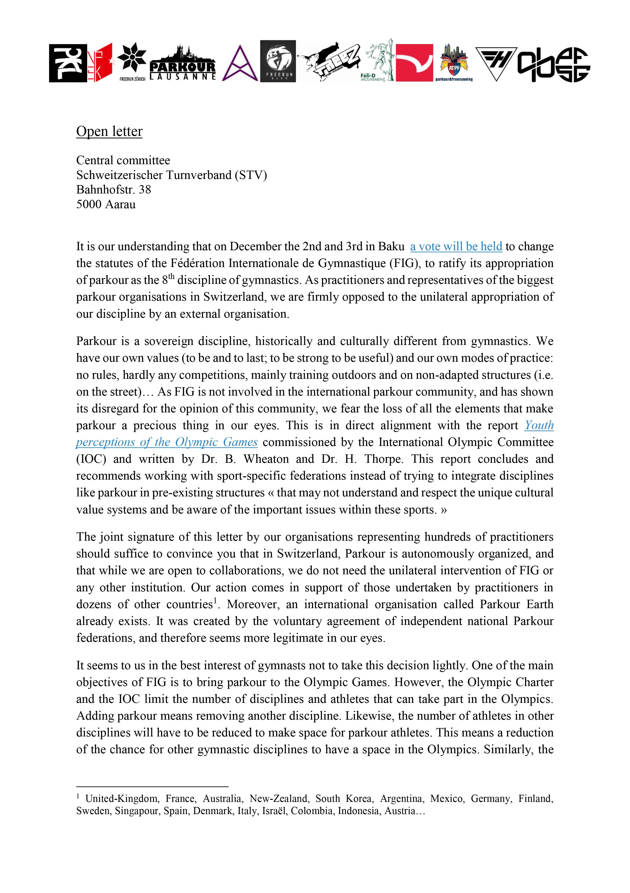
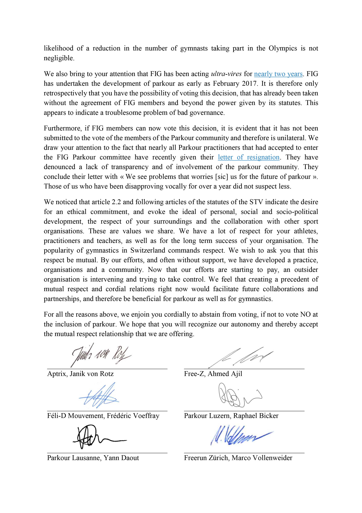
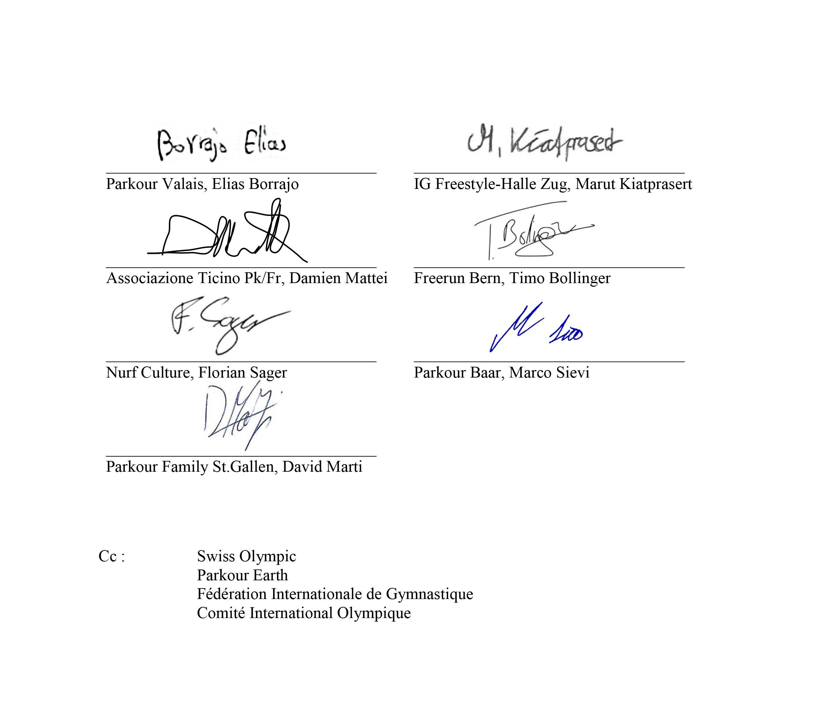

Aux dernières nouvelles, et après une cordiale relance, la Fédération Suisse de Gymnastique n'a pas daigné répondre à notre formelle invitation à collaborer. Nous sommes surpris pas cette flagrante manifestation de dédain et ce mépris total pour l'autonomie d'une autre discipline. Cela n'augure rien de bon pour nos futures relations.

  
Pour en savoir plus:

Nous rejoignons en cela les prises de positions récentes de traceurs en [Australie](https://www.facebook.com/AustralianParkourAssociation/posts/10156057407397684?__xts__[0]=68.ARBMj1gxFhH0HrWXdVgnqbpNRBsIEAp8HcUvWOUxzPfLROMtt5HvAKrf6duAMIdSopQxSUmyCrB_vnnewJk7-XAshttps://www.facebook.com/AustralianParkourAssociation/posts/10156057407397684), [Royaume-Uni](https://parkour.uk/parkour-uk-issues-an-open-letter-to-british-gymnastics-re-the-wilful-and-continued-encroachment-misappropriation-and-attempt-to-usurp-parkour-by-the-federation-internationale-de-gymnastique-fig/), [France](http://www.fedeparkour.fr/news/la-fpk-et-l-add-rejettent-la-decision-de-la-fig-d-integrer-le-parkour?fbclid=IwAR1vNur6GIUQ-aNaxxSDKQyTCbEy4uYdiq2_sgYsX3sq6_NZGj71McEvfeo), [Espagne](http://umparkour.com/web/carta-a-la-rfeg), [Etats-Unis](https://www.uspk.org/news/uspk-issues-an-open-letter-to-usa-g-and-usoc/), [Pologne](https://www.facebook.com/federacjaparkour/posts/1149011058606609), [Nouvelle-Zélande](http://nzparkour.co.nz/parkour-nz-ask-gymnastics-nz-to-vote-no-at-upcoming-fig-congress/), de même que celle de [Parkour Earth](https://parkour.earth/parkour-earth-issues-an-open-letter-to-member-national-gymnastics-federations-of-the-fig/). Nous rejoignons également toutes les personnes qui ont dénoncé les actions de la FIG ces deux dernières années.

Dans les médias:  
[https://www.insidethegames.biz/articles/1073188/liam-morgan-international-gymnastics-federation-guilty-of-stealing-ownership-of-parkour-to-appease-the-ioc](https://www.insidethegames.biz/articles/1073188/liam-morgan-international-gymnastics-federation-guilty-of-stealing-ownership-of-parkour-to-appease-the-ioc)  
[https://www.bbc.com/sport/gymnastics/46466458](https://www.bbc.com/sport/gymnastics/46466458)  
[https://www.theguardian.com/sport/blog/2018/dec/05/parkour-fight-soul-gymnastics](https://www.theguardian.com/sport/blog/2018/dec/05/parkour-fight-soul-gymnastics)  
[https://apnews.com/472c1174de364602bcf47deceb9737ac](https://apnews.com/472c1174de364602bcf47deceb9737ac)  
[https://www.npr.org/2018/12/21/679211823/parkour-resists-hostile-takeover-by-international-gymnastics](https://www.npr.org/2018/12/21/679211823/parkour-resists-hostile-takeover-by-international-gymnastics)

#weareNOTgymnastics
