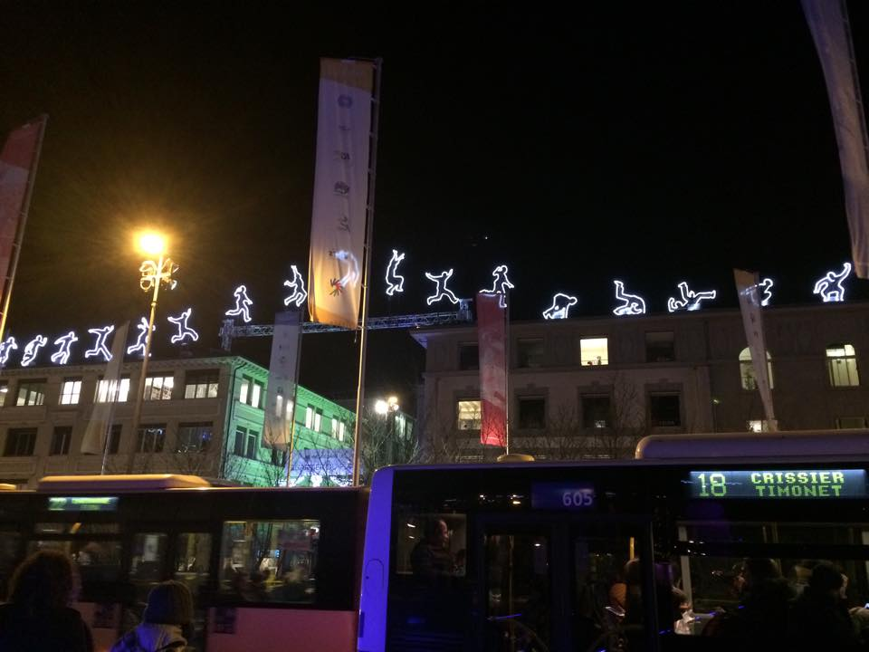
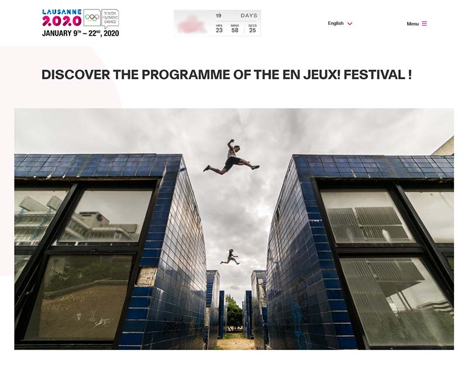

Dans cet article, je veux m’intéresser à la mise en spectacle du parkour par des acteurs qui ne sont pas eux-mêmes des pratiquants. Certes, on connait bien la mise en spectacle par les pratiquant.e.s eux-mêmes. Cette mise en spectacle a toujours posé des questions, notamment parce qu’il y a une tension entre les aspects viraux qui font que le parkour se diffuse (penser à l’image donnée du parkour dans les films qui l’ont diffusé dans le monde) et des aspects plus terre à terre qui font que le parkour peut être enseigné et pratiqué en sécurité, est toléré par les habitants, est considéré comme une activité légitime, etc.

Cependant, à mon avis le problème prend une ampleur différente et pose de nouvelles questions dès lors qu’il s’agit d’une mise en spectacle par des acteurs externes. Tandis que les traceurs.euses doivent se débrouiller avec l’image qu’ils donnent eux-mêmes de la discipline, des acteurs externes ont une responsabilité relativement faible, peuvent aisément se désolidariser de la discipline le cas échant, et ne sont jamais confrontés à la question de la transmission et de l’enseignement de la discipline. En un sens, ils peuvent donc modeler une image spectaculaire, profiter des éventuelles retombées positives sans pour autant avoir à assumer les aspects négatifs. Dans sa thèse^[ Angel Julie, _Ciné Parkour: A cinematic and theoretical contribution to the understanding of the practice of parkour_, Thesis, Brunel University School of Arts PhD Theses, 201], Julie Angel mentionne le cas de l’entreprise Shell, dont les abords du siège à Londres sont devenus un spot de parkour. L’entreprise interdit la pratique sur ce spot, alors qu’elle a utilisé le parkour pour sa publicité notamment en invitant Sébastien Foucan à participer à une performance dans ce lieu. C’est à des situations de ce type auxquelles je veux m’intéresser ici.

## Trois exemples d’utilisation spectaculaire du parkour

Je propose de discuter trois cas provenant de la ville de Lausanne. Dans le premier cas, la ville avait utilisé une installation lumineuse (_Run_ _Beyond_) représentant manifestement le parkour, avec un traceur sautant de toit en toit. Cette installation se trouvait entre deux bâtiments, dans le quartier du Flon. Ce quartier est un quartier commercial privé, et les traceurs avaient l’habitude de se faire chasser par des agents de sécurité. Plus récemment, le quartier s’est gentrifié et une partie du spot le plus important du Flon a été démoli pour laisser place à un nouveau bâtiment. La même installation artistique a été présentée à Amsterdam, et le site du festival la décrit ainsi : « 'Run Beyond' is a work that focuses on the leap that we all have to make, sooner or later: the leap to freedom. Which freedom that is, \[the artist\] doesn’t specify, that is up to the spectator to decide. »^[ [https://amsterdamlightfestival.com/en/artworks/run-beyond](https://amsterdamlightfestival.com/en/artworks/run-beyond) ] Visiblement, tout le monde ne l’a pas interprété comme la liberté de s’approprier l’espace urbain et d’en faire un usage ludique.

Run Beyond, 2016

Dans un second cas, le service des sports de la ville a utilisé du parkour dans un clip promotionnel ^[[https://www.facebook.com/watch/?v=222000222031747](https://www.facebook.com/watch/?v=222000222031747)]. A ce moment-là, aucune des deux associations de parkour de la ville n’apparaissait dans l’offre sportive du service. Ce n’est pourtant pas faute d’avoir essayé : pour ce qui est de Parkour Lausanne, l’association dont je suis président, cela faisait déjà plusieurs mois que nous insistions pour apparaitre sur leur site parmi les autres clubs proposant des activités physiques. Plusieurs mois après notre première demande, le service n’avait même pas daigné nous répondre. Ce n’est qu’après avoir rendu la chose publique, créé un mini scandale, harcelé le service par des mails et appels téléphoniques, ainsi qu’avec l'appui de plusieurs personnes indépendantes, que le service s’est enfin plié à notre demande.

Finalement, prenons le cas du Comité International Olympique. Le CIO a récemment rasé son siège pour construire un bâtiment neuf. Voyant la construction terminée, j’ai voulu aller m’entraîner aux abords du bâtiment, en l’occurrence dans un petit parc apparemment ouvert au public ainsi que sur des murs en béton servant probablement de sortie de secours. Pour m’y rendre, je n’ai pas dû franchir de barrière, de haie ni vu de panneau. Un agent de sécurité m’a demandé de partir après une dizaine de minutes à peine. L’ironie du sort, c’est qu’à peine une semaine plus tard sortait une vidéo promotionnelle pour les Jeux Olympiques de la Jeunesse ^[[https://www.youtube.com/watch?v=4Eh0HyEDWqQ](https://www.youtube.com/watch?v=4Eh0HyEDWqQ)], qui auront lieu à Lausanne en janvier 2020. Dans cette vidéo, on voit un traceur pratiquer exactement dans les mêmes espaces que moi. Je suis retourné sur place quelques jours plus tard, où j’ai été interpellé par trois gardes différents en l’espace d’une heure. Suivant la suggestion d’un des gardes, j’ai adressé une demande d’autorisation de pratique ; celle-ci n’a encore reçu aucune réponse.

On pourrait d’ailleurs généraliser l’exemple au-delà du parkour. En 2015 une station du métro lausannois a été renommée « Ouchy-Olympique » à l’occasion des 100 ans de présence du CIO à Lausanne. Dans le métro, un bruitage sonore rappelant un départ de course a été ajouté pour signaler l'arrivée à la station. Le design de la station elle-même a également été revu, avec l'intégration de nombreux éléments relevant de l’univers Olympique. Au sol, un marquage a été fait pour imiter des terrains sportifs, dont une piste de 100m le long du quai de métro. Lors d’un échauffement, nous avons effectué un sprint sur cette piste. Le personnel des transports publics n’a pas manqué de nous chasser, avec l’argument classique, mais dont l’utilisation ici ne manque pas de sel : « ce n’est pas fait pour ça ». Mentionnons que la station était vide, et qu’il s’agit d’une station avec des quais fermés : il n’y aucun risque de tomber sur les voies.

## Le coût du spectacle

Le parkour peut être utilisé pour symboliser beaucoup de choses : la puissance, la masculinité, la jeunesse, le dynamisme, mais aussi la subversion, l’écart à la norme, ou comme on l’a vu, la liberté. Dans les cas qui nous occupent, utiliser l’image du parkour permet aux institutions en question de signifier qu’elles savent s’adapter à l’air du temps, qu’elles ne sont pas déconnectées des pratiques contemporaines, qu’elles sont ouvertes au changement, qu’elles tolèrent ou même embrassent et encouragent les activités « alternatives ». Il permet également de montrer qu’elles sont proches des jeunes et encouragent plus généralement le mouvement et la santé. Mais bien plus que cela, le parkour permet de mettre en valeur la ville elle-même. C’est là un élément essentiel : tandis que d’autres pratiques sont reléguées à des espaces standardisés, prédéfinis, voire tout simplement se pratiquent en intérieur, et que les transférer en extérieur demande des adaptations, le parkour peut au contraire occuper d’autres espaces. Le parkour permet de faire vivre des espaces, d’y créer une trame narrative, en bref de les mettre en valeur.

On peut se demander combien de temps il sera possible de maintenir cette image d’une pratique « urbaine », « alternative », « outdoor ». Il est intéressant de remarquer que c’est ainsi que la pratique est toujours présentée, rarement dans ses versions sportifiées, dans des espaces intérieurs standardisés. Pourtant, ce sont souvent les mêmes acteurs qui essaient de faire tenir les deux bouts. Des traceurs qui construisent des parkour parks et y enseignent, mais retournent en milieu urbain lorsqu’il s’agit de faire de la publicité. Des institutions qui encouragent la sportivisation et la standardisation, régulent et policent la pratique extérieure, refusent d’entrer en matière lorsqu’il s’agit de donner des autorisations, mais apprécient tout particulièrement de pouvoir mettre en spectacle l’utilisation ludique et subversive des espaces dont elles sont propriétaires. Probablement que d’ici quelques années, lorsque le parkour aura perdu son aura alternative et subversive, une autre pratique sera utilisée à sa place.

En passant de la pratique à l’image, de l’activité au spectacle, un certain déphasage se crée. Evidemment, tous ceux qui profitent de l’image ne souhaitent pas voir l’activité elle-même se dérouler sous leurs yeux. Du moins, ils voudraient la réserver aux espaces et aux moments qu’ils estiment, pour des raisons plus ou moins recevables, être les bons espaces-temps pour ce genre d’activité. On peut hésiter à parler ici d’hypocrisie. Généralement ce ne sont pas exactement les mêmes acteurs qui d’une part profitent des images ou incitent à la pratique, et qui d’autre part tentent de la cloisonner ou de l’interdire. Dans le cas de l’installation artistique, le message de l’artiste est partiellement repris par la ville, mais certainement pas par les agents de sécurité ou de la police travaillant dans le quartier. Dans le cas du CIO, le comité d’organisation des JOJ, l’équipe média de celui-ci, les agents de sécurité du bâtiment et le CIO lui-même ne sont pas identiques. Il y a donc une question d’action et de responsabilité collective qui se pose. Et les institutions ne sont pas nécessairement homogènes, elles peuvent abriter du conflit, de la pluralité, des factions opposées, etc. Mais il serait étrange de dire que le CIO n’a aucune responsabilité dans les actions de son équipe de sécurité. Je pense qu’on peut donc bien parler d’hypocrisie dans le cas de ces institutions qui d’une main donnent du rêve, du possible, de la liberté, du ludique et de la subversion, pour les reprendre de l’autre.

Capture d'écran du site des JOJ 2020

Avec cela, il devrait être évident que certains individus et institutions profitent de l’image spectaculaire du parkour, sans pour autant partager certains coûts de la pratique elle-même. Ces coûts sont divers, que ce soit dépenser de l’énergie et du temps, encourir un risque de blessure, s’entrainer dans le froid et la pluie, être chassé de spots, et éventuellement payer des amendes. A priori, certains de ces coûts sont d’autant plus élevés que la pratique se rapproche du pôle spectaculaire (risqué, en extérieur, subversive, etc.). De plus, la mise en spectacle de la discipline engendre des coûts supplémentaires qui sont entièrement supportés par les pratiquants. Je pense là à des efforts à faire en termes de prévention, d’explicitation et de légitimation de la pratique. En tant qu’enseignant, il faut passer son temps à expliquer ce qu’est le parkour, pourquoi cela ne consiste pas essentiellement à faire des backflips ou grimper sur des toits, etc. Ceci consiste parfois à tout bonnement décourager certains néophytes : ils sont attirés par un aspect, et sont découragés lorsqu’ils se rendent compte que la pratique diffère de l’image, que le processus n’est pas équivalent au produit final qu’on leur a présenté. C’est un poids à porter, c’est un véritable travail. Quand une institution choisit de profiter de l’image, c’est aux pratiquants que revient la responsabilité de gérer celle-ci par la suite. Lorsque les JOJ choisissent de mettre en avant une image de traceurs sautant entre des toits^[[https://www.lausanne2020.sport/fr/news/festival/decouvrez-le-programme-du-festival-en-jeux](https://www.lausanne2020.sport/fr/news/festival/decouvrez-le-programme-du-festival-en-jeux)], c’est aux associations de parkour de montrer patte blanche, d’expliquer pourquoi leur pratique n’est pas dangereuse, de rassurer les parents, de décourager les casse-cous, etc. On pourrait même voir là des coûts en termes de préservation d’un patrimoine culturel. Face aux aspects spectaculaires, les traceurs doivent faire un travail supplémentaire pour s’assurer que les autres aspects de la pratique soient également transmis, de sorte à préserver le parkour pour les générations futures.

Evidemment, je n’ai pas de solutions à cette situation. Je ne peux que mettre en visibilité et dénoncer l’hypocrisie, et inciter les traceurs à faire plus attention lorsqu’ils prêtent leur corps pour la façade médiatique d’autres institutions. Il est une chose d’utiliser des images spectaculaires dont on payera le coût soi-même. Il en est une autre de laisser autrui en bénéficier sans en partager les coûts.

