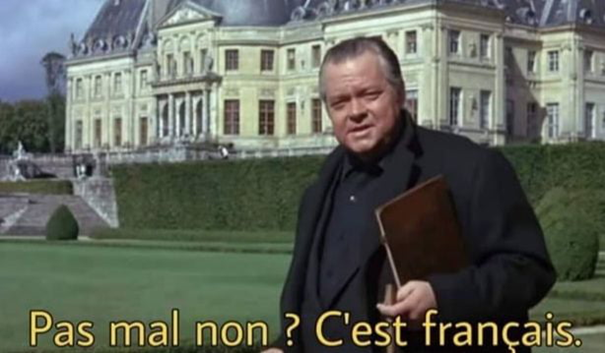

Dans une vidéo portant sur une certaine boisson caféinée, [Un Créatif](https://www.youtube.com/watch?v=n6k5qX8w718) se demande « Pourquoi on aime se mettre en danger ? ». Voici la réponse donnée par une psychologue :

> « C’est toute la question du hasard en fait \[…\] si on doit vulgariser, le comportement ordalique, c’est je vais aller à 250 \[km/h\] sur l’autoroute, si je ne meurs pas l’univers m’envoie un message que j’ai le droit d’exister, grosso modo. Cette question-là se retrouve, de manière peut-être atténuée, dans tout le rapport au hasard, dans les addictions au jeux, et c’est aussi présent dans la question du sport extrême. »

Ainsi rouler trop vite sur l’autoroute, jouer à des jeux de hasard, pratiquer un sport dit « extrême » (ce qui, il faut toujours le rappeler, n’est qu’une étiquette marketing) relèveraient tous d’un même phénomène : l’ordalie. Étant donné le contexte dans lequel la question est posée, on pourrait en venir à penser que boire une boisson à l’image sulfureuse en relève également. En fait, les pistes sont brouillées car plusieurs notions différentes sont ici mélangées : le hasard, le danger, le risque, le jeu, le sport, l’addiction, l’ordalie. Examinons comment le concept d’ordalie est venu à recouvrir des réalités si différentes les unes des autres, avant de critiquer plus précisément les problèmes que soulèvent son utilisation en anthropologie et en psychologie.

## Du moyen-âge à la psychologie de l’adolescence

En anglais le mot « ordeal » est utilisé (semi-)couramment, et signifie tout simplement « supplice ». En français, par contre, le terme « ordalie » est plutôt réservé aux spécialistes, et fait avant tout référence à des pratiques qui relèvent du registre religieux et juridique. L’ordalie consiste à juger de la culpabilité ou de l’innocence d’un individu en se remettant au jugement de Dieu. Une forme d’ordalie moyenâgeuse consistait à littéralement mettre la main du coupable au feu, puis observer la cicatrisation. Si la plaie cicatrise mal, l’accusé est coupable ; si la cicatrisation est bonne, l’accusé est innocent. Une autre forme d’ordalie, permettant de départager entre deux partis, consiste à faire un duel, le perdant étant considéré coupable. N'étant pas spécialiste, je ne puis dire dans quelle mesure ces pratiques étaient fréquentes. En tout cas, elles ne semblent pas avoir été encouragées par l’Eglise elle-même. Quoi qu’il en soit, on peut noter qu’il ne s’agit pas de se livrer au hasard. Seul un regard sécularisé permet d’affirmer cela. Il s’agit au contraire de se livrer à Dieu ou au Destin, ce qui par définition n’est justement pas le hasard.

Le "comportement ordalique" n'existe pas dans la littérature anglophone.

Comment est-on passé de ce concept médiéviste à son usage courant en psychologie du sport, de l’adolescence, et du risque ? De manière surprenante, il s’agit essentiellement d’une spécialité française. Les seules publications anglophones mobilisant ce concept ont été écrites par des chercheurs français. Cette particularité semble s’expliquer par l’ancrage du concept dans la psychanalyse. Le concept de comportement ordalique a en effet été développé dans les années ’80 par plusieurs collaborateurs de l’hôpital Marmottan à Paris, centre spécialisé dans les pratiques addictives. Pour autant que je puisse en juger, le concept est dû à Aimé Charles-Nicolas et Marc Valleur[^1]. Le comportement ordalique désigne alors le fait qu’une personne, et un toxicomane en particulier, risque régulièrement et volontairement sa vie, cherchant à redonner sens à son existence au travers de cette épreuve.

Le terme a ensuite fait un passage par l’anthropologie, étant mobilisé notamment par David Le Breton[^2] pour expliquer que les pratiques risquées sont une manière de remplir le vide de sens qui règnerait dans les sociétés modernes. Sans doute est-ce l’intérêt de Le Breton pour la thématique de l’adolescence qui a amené le concept jusqu’au domaine de la psychologie de l’adolescence. Ou peut-être que le passage s’est fait directement entre l’hôpital de Marmottan et la psychologie de l’adolescence, par le biais de la littérature sur les addictions.

Le concept de « comportement ordalique » est ainsi une relecture décontextualisée et sécularisée de l’ordalie médiévale. L’ordalie, à proprement parler, ne consiste pas nécessairement à « mettre sa vie en jeu » (il en existe différentes formes), ne vise pas à « donner sens à son existence » (mais à prouver innocence ou culpabilité), et ne relève pas tant du hasard que du destin divin. On peut penser aussi que l’ordalie n’est pas une pratique à laquelle on s’expose soi-même volontairement, mais plutôt auquel on est exposé au travers d’un processus relativement institutionnalisé d’accusation. En résumé, l’ordalie et le « comportement ordalique » sont deux espèces bien différentes.

## L'ordalie relève-t-elle du fantasme ?

Lorsque, dans un texte célèbre, l’anthropologue Clifford Geertz affirme que le combat de coq à Bali veut « dire quelque chose de quelque chose »[^3], il s’agit d’un présupposé et non d’un résultat d’enquête. Parce qu’il s’agit d’une institution pour lui exotique et énigmatique, Geertz cherche à en comprendre le sens, ce qu’elle veut dire. Geertz affirme que les combats de coqs sont un « commentaire méta-social » sur la société balinaise, mais lui-même note dans une interview que les balinais ont rejeté son interprétation[^4].

L’anthropologie, comme la psychanalyse par ailleurs, ont une certaine obsession pour le symbolique et la quête de sens. Mais les individus qui prennent part à ces pratiques partagent avec les chercheurs cette capacité à donner du sens, et ils ne les ont pas attendus pour le faire. Or, il faut se demander si le sens donné par les chercheurs et celui donné par les pratiquants (appelons-les ainsi pour faire court) convergent. Car bien souvent, les chercheurs produisent des interprétations qui sont en compétition avec les interprétations des pratiquants et tendent à les remplacer. Au lieu de montrer fidèlement ce qu’il en est du point de vue du pratiquant, le chercheur crée une fable qui peut pourtant paraître plausible et avoir du sens aux yeux de ses lecteurs. Le sens donné par Geertz aux combats de coq est crédible à nos yeux, mais n'est pas celui que les indigènes donnent à leur propre pratique.

Or, il n’y a pas besoin de voyager autant pour tomber sur des pratiques énigmatiques, dont il semble falloir en chercher le sens. C’est le cas des pratiques risquées, qui paraissent irrationnelles étant donné qu’elles semblent mettre en jeu l’intégrité corporelles des pratiquants. Les anthropologues et les psychologues ont la réponse : ces pratiques ont un sens, ce sens c’est l’ordalie, qui consiste à donner sens à la vie des individus qui s’y adonnent. Mais sur quoi repose cette hypothèse ? Est-ce que le chercheur, anthropologue ou psychologue, questionne systématiquement les acteurs sur le sens qu’ils donnent à leur pratique ? Et ceux-ci affirment-ils tous que ce qu’ils font relève bien d’une épreuve mortelle dont ils tirent un profit symbolique s’ils survivent ? Sont-ils écoutés lorsqu’ils affirment le contraire, ou des vues nuancées et ambigües ? Il s’agit là de questions essentielles, car si le sens pour le chercheur est indépendant du sens pour les acteurs, il n’est pas évident qu’il serve vraiment à nous éclairer. Et ces questions sont d'autant plus épineuses que lorsque l'on parle d'adolescents ou de pratiques présupposées irrationnelles, on ne part pas avec les bonnes dispositions pour prendre au sérieux leurs affirmations. De plus, pour des raisons parfois de compétences linguistiques, mais aussi parce qu'ils ne se posent pas les mêmes questions que le chercheur, les pratiquants peuvent laisser un vide de sens à combler par le chercheur.

Il n’y a qu’une seule manière d’utiliser l’expression « comportement ordalique » de manière crédible. Cela consiste pour une part de se tenir à une définition claire de cette expression, et d’autre part d’effectuer le travail empirique nécessaire au rejet de l’hypothèse ordalique. Il me semble que le comportement ordalique comporte différents éléments qui permettent d’exclure son application à tout va :

1. **L’exposition à un risque de mort.** Aucun rapport, donc, avec les jeux de hasard et d’argent mentionnés dans la vidéo citée en début d’article. Le «de manière peut-être atténuée » de la citation devrait d’ailleurs nous induire à la prudence : selon toute probabilité, une ordalie atténuée n’est tout simplement pas une ordalie.
2. **S’en remettre au hasard et au destin**. Lorsque les pratiquants font tout leur possible pour mitiger le risque, comme c’est généralement le cas en parkour, en plongée sous-marine ou en parachutisme, l’utilisation du concept d’ordalie semble très peu appropriée.
3. **L’exposition volontaire au risque _pour_ le risque**. Si les pratiquants sont inconscients du risque, ou pratiquent en dépit du risque et non pour lui, l’ordalie n’est pas le terme approprié.
4. **L’épreuve donnant sens à l’existence**. La plupart des pratiques dites « extrêmes » sont très bien routinisées. S’il y a « épreuve », c’est une exception, ce n’est pas la règle. Il existe sans doute des survivants d’accidents automobiles qui au travers de leur expérience traumatisante découvrent un nouveau sens à leur vie ; mais ce n’est évidemment pas ce à quoi s’attendent _tous_ les automobilistes _chaque fois_ qu’ils mettent le contact.

Il ne s’agit donc pas de nier que les _comportements_ ordaliques existent. Et n’étant pas spécialiste, je serais bien incapable de juger de leur prévalence parmi les toxicomanes ou les adolescents. Mais je pense qu’il faut affirmer qu’il n’existe pas de _pratique_ ordalique. Tout chercheur devrait être sensible aux différences contextuelles, aux différents modes d’engagements, aux diversités et à l’ambiguïté de sens que ces pratiques peuvent prendre, etc. Et pour le lecteur ou l’auditeur, il s’agit d’avoir d’autant plus de circonspection que la pratique en question nous parait énigmatique ou irrationnelle. Car dans une pratique familière, nous sommes bien plus sensibles à ces différences contextuelles et à la pluralité du sens qu’elle peut avoir.

## Beaucoup de pratiques, peu d’ordalie

Résumons : avant de coller à une pratique le terme fourre-tout de « comportement ordalique », il faudrait se demander si c’est bien le terme approprié. Est-ce que les pratiquants mettent effectivement leur vie en danger ? Le font-ils volontairement ? S’en remettent-ils au hasard ? S’engagent-ils dans la pratique pour donner sens à leur existence ? Est-ce que cela fonctionne ? Est-ce que c’est par le biais de la mise en danger qu’ils trouvent ce sens, ou par un autre biais ? Est-ce bien un discours que les pratiquants tiennent sur eux-mêmes ? Sinon quels autres indices viennent appuyer cette hypothèse ? Je soupçonne qu’au travers de ce crible, on ne trouvera pas si facilement de l’ordalie.

Et dans le cas où la catégorie ordalique est effectivement appropriée, peut-on nuancer et aller plus loin ? Est-ce que la pratique est toujours ordalique, ou seulement par moments ? Quels sont les autres modes d’engagement ? Quels autres sens sont donnés à la pratique ? Quelles catégories de pratiquants s’engagent particulièrement dans des modalités ordaliques ? etc. Bref, si l'utilisation du concept n'est pas appuyée empiriquement, l'ordalie n'est qu'une jolie histoire.

[^1]: Charles-Nicolas Aimé, Valleur Marc, « Les conduites ordaliques » in Olievenstein Claude (éd.), _La vie du toxicomane: séminaire de Marmottan 1980_, 1re éd, Paris, Presses universitaires de France, 1982. Les auteurs publient tous deux dans la revue freudienne Topique, et les méthodes de l’hopital Marmottan sot tirées pour partie de la psychanalyse.
[^2]: Le Breton David, _Passions du risque_, Paris, Métailié : Diffusion, Seuil, 1991 (Collection Traversées).
[^3]: Geertz Clifford, « Jeu d’enfer: Notes sur le combat de coqs balinais », _Le Debat_ n° 7 (7), 1980, p. 36.
[^4]: Micheelsen Arun, « “I don’t do systems”: An interview with Clifford Geertz », _Method & Theory in the Study of Religion_ 14 (1), 2002, pp. 2‑20.
