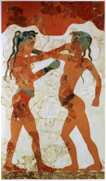
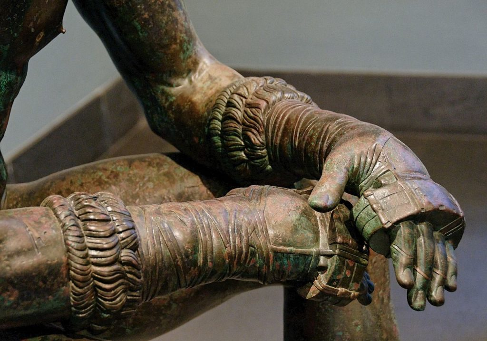
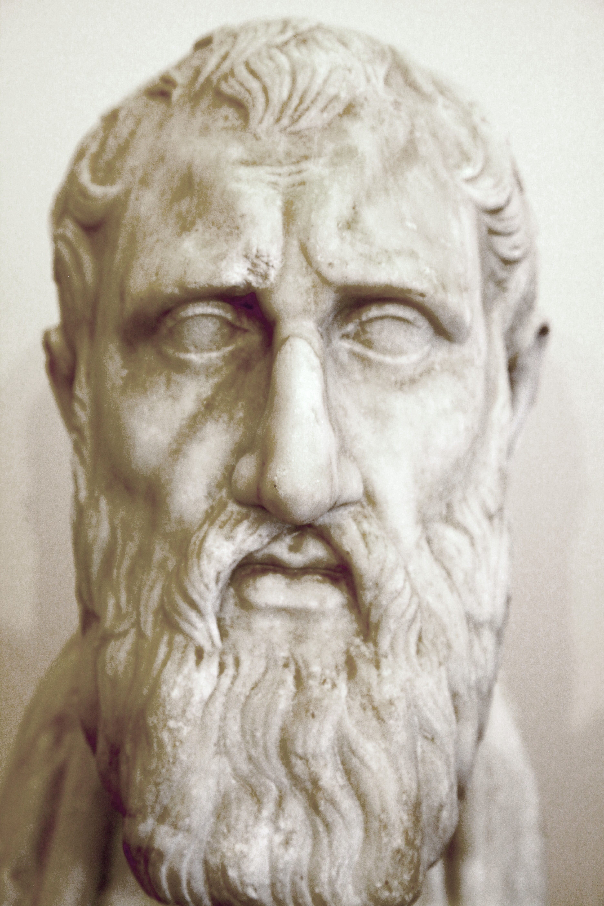
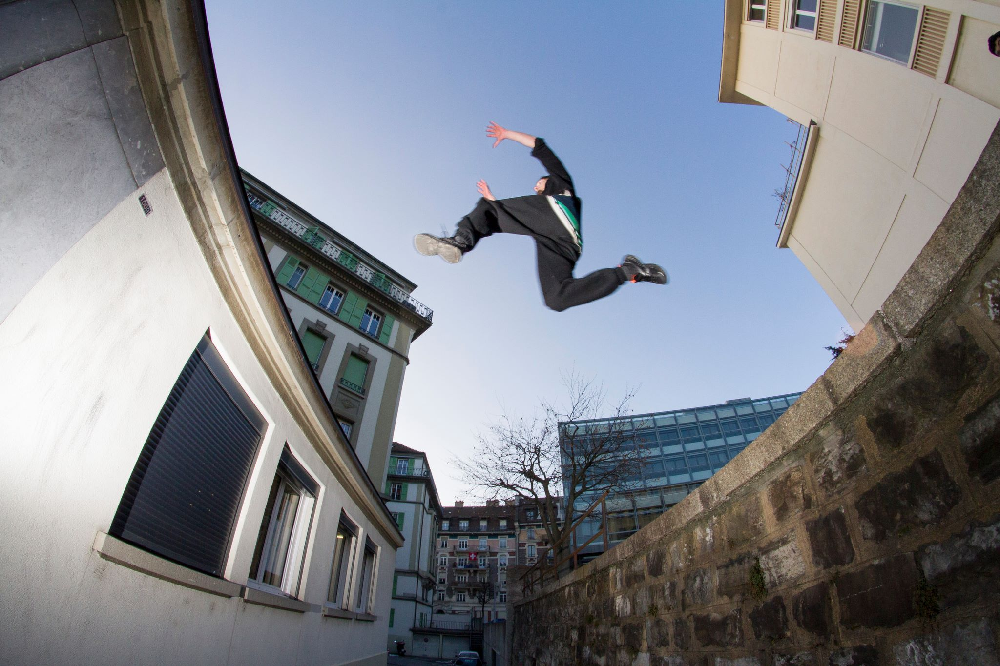

\[caption id="attachment\_2897" align="alignright" width="144"\] Fresque des jeunes boxeurs, Akrotiri, v. 1500 av. JC\[/caption\]

A la suite de Pierre Hadot et de Michel Foucault, la philosophie antique peut être conçue comme [exercice spirituel](https://biospraktikos.hypotheses.org/tag/exercices-spirituels), c’est-à-dire comme une “discipline dont l’enjeu est de transformer la manière de vivre, d’appréhender le monde”[^1]. Il s’agissait indissociablement d’un discours et d’une mise en œuvre pratique, y compris corporelle. Or le discours et la pratique, l’intellect et le corps sont aujourd’hui le plus souvent séparés et même régulièrement montés en opposition. Dans le milieu scolaire par exemple, le sport est souvent perçu comme une perte de temps, limitant les activités intellectuelles. On argumentera ici au contraire le besoin d’une unité. Or, il me semble que l’on peut s’inspirer de la philosophie antique pour penser une telle unité et concevoir un mode de vie philosophique (ou une philosophie comme art de vivre) adapté à notre époque. Comment doit-on alors y penser la place du sport ?

Dans le langage courant, le mot sport est utilisé de manière peu spécifique, regroupant les jeux antiques et modernes, les pratiques physiques, qu’elles soient hygiéniques, compétitives, ludiques ou d’entrainement. Ceci a pour conséquence que le terme recouvre de multiples modalités et finalités de pratique et qu’il implique donc des rapports à soi et à notre corps fort divers. La gymnastique destinée à l’entrainement des militaires n’est pas le vélo en salle de fitness, qui n’est pas le football joué par des enfants dans la rue, lui-même n’étant pas celui pratiqué par les professionnels. Pourtant toute activité physique n’est pas du sport : une dépense énergétique similaire à une pratique sportive légère peut être faite en jardinant. Nager pour sauver un enfant de la noyade ou courir après son bus ne sont habituellement pas considérés comme des pratiques sportives même si les gestes effectués sont identiques à des gestes sportifs. Et on ne peut non plus affirmer que tout sport est une activité physique puisque le bridge comme les échecs sont reconnus comme sports par le Comité International Olympique. On voit à quel point le terme est nébuleux puisque ces exemples ont tendance à s’opposer au sens commun : lorsque l’on demande à quelqu’un s’il est sportif, on ne s’attend pas à ce qu’il réponde qu’il joue régulièrement aux cartes.

\[caption id="" align="alignnone" width="782"\] La gymnastique est-elle un sport ?\[/caption\]

Ceci invite à la prudence lorsque l’on parle de sport, et cela pour deux raisons. Premièrement parce que l’on a tendance à penser le sport comme un phénomène universel et plus ou moins uniforme, et à assimiler les pratiques physiques de l’antiquité à notre expérience contemporaine du sport. Or le terme même de sport (dérivé de _desport_, « plaisir, divertissement »[^2] date du 19ème siècle, et c’est donc rétrospectivement qu’on l’applique aux pratiques antiques. Réunir des pratiques aussi distantes dans le temps dans une même catégorie peut masquer leurs profondes différences, peut-être au risque de tomber dans l’anachronisme. Ainsi de nombreux historiens et sociologues[^3] considèrent qu’il n’y a pas de continuité directe entre les jeux antiques et les sports modernes.

Parmi leurs différences, on peut relever que la vertu (_aretê_) guerrière n’est pas l’adresse sportive ; que les jeux antiques étaient extrêmement violents tandis que les sports modernes sont fortement régulés. Les notions de performance, de record ou d’égalité des chances entre les adversaires, fondamentales dans le sport moderne, ne peuvent pas être appliquées en tous temps et en tous lieux. Les jeux antiques étaient empreints de tradition religieuse (ils débutaient ainsi par des processions, prières et sacrifices), étaient calqués sur le calendrier des fêtes religieuses, et étaient dédiées aux dieux (les jeux Olympiques étant dédiés à Zeus). Ils servaient également à pacifier les rapports entre les Cités grecques, l’_agôn_ des jeux se substituant aux guerres de la même manière qu’ils servaient aux nobles, leur permettant de montrer leur valeur autrement que par le combat, ou à maintenir un savoir-faire guerrier en temps de paix. Si les sports modernes ne sont pas totalement exempts de religion, de politique ni de considérations militaires[^4], on peut affirmer que le sport a une certaine autonomie, fonctionnant selon sa propre logique. Le sport a son propre calendrier de compétitions, sans lien avec les fêtes religieuses ; les pratiquants sont sélectionnés sur leur mérite sportif et non pas selon leur appartenance à la noblesse ; les lanceurs de javelot ne s’entrainent pas pour chasser ou tuer mais pour la compétition sportive. L’athlète des Olympiades antiques n’est donc pas celui des J.O. modernes.

\[caption id="attachment\_617" align="alignnone" width="1024"\] Mains du « pugiliste des Thermes », entourées de lanières de cuir dures et tranchantes.\[/caption\]

Deuxièmement, les différentes formes sportives ne sont pas totalement interchangeables, toutes n’ont pas les mêmes qualités (ou défauts). Par ailleurs on ne peut en juger sans prendre en compte le contexte ainsi que les pratiquants eux-mêmes. On parlera ci-dessous de sport en général et au sens large, mais une observation au cas par cas reste nécessaire. De même, il ne faut pas oublier que les qualités qu’on prête au sport ne lui sont pas exclusives : elles peuvent être présentes pour des activités physiques non sportives, ou des activités qui ne reposent pas essentiellement sur la dépense d’énergie. On abordera donc maintenant une liste non exhaustive d’éléments que le sport peut apporter au philosophe, en gardant à l’esprit que le sport est un moyen parmi d’autres, et non pas une fin en soi, [comme le rappellent Platon, Aristote et les stoïciens](https://biospraktikos.hypotheses.org/2822).

Les apports du sport sont extrêmement variés. Il peut répondre au souci de soi (_epimeleia heautou_), qui exige de se maintenir en santé et d’avoir une certaine hygiène de vie. Il peut permettre de répondre au « connais-toi toi-même » (_gnothi seauton)_ : connaitre le soi psychologique, soumis à l’épreuve en même temps que le corps, mais également au soi somatique, qui nécessite une expérience vécue plus que des connaissances théoriques seules. Le sport est une rencontre avec soi-même, avec nos limites mais également nos potentialités.

Il peut également être vécu comme une méditation, permettant un certain rapport à soi, libérant la pensée et l’intellect. L’activité physique est ainsi recommandée à cet effet par Rousseau ou Nietzsche, ainsi que des philosophes contemporains tels que Jean-François Balaudé[^5] ou Frédéric Gros[^6]. Dans ce sens, l’activité physique ne devrait pas être opposée à l’activité intellectuelle. Il a été montré expérimentalement qu’ajouter des heures de sport à l’école permet d’améliorer les résultats scolaires des enfants, même lorsque cela demande de supprimer des heures aux autres disciplines[^7]. On sait également que l’activité physique permet de préserver les fonctions cognitives chez les adultes[^8].

\[caption id="" align="alignleft" width="207"\] Zénon de Citium, fondateur du stoïcisme.\[/caption\]

D’une certaine manière, le sport peut même répondre aux philosophes voulant se “libérer” de leur corps. La pratique sportive permet parfois d’entrer dans un état mental appelé en psychologie « expérience optimale », « zone », ou « _flow_ » en anglais. Cet état est caractérisé par une concentration et une absorption totale dans l’activité, une unité ou harmonie sujet/objet, corps/esprit, avec un corps rendu « léger », ses besoins passant en arrière-plan. Le sport est également un moyen ou une technique pour se développer, se transformer ou se dépasser, autant physiquement que psychologiquement, le soi transformé pouvant ainsi devenir un moindre fardeau.

Cela peut être mis au service de nombreux objectifs, dont l’_apatheia_, cet idéal du sage imperturbable :

> « \[…\] apprendre le sang-froid, la résistance, le sérieux, la présence d’esprit, la dignité, etc. La principale utilité que je vois à mon alpinisme d’autrefois fut cette éducation de mon sang-froid qui me permit de dormir debout sur le moindre replat au bord de l’abîme. »[^9] Marcel Mauss

Il s’agirait alors de se rendre indépendant des évènements extérieurs, en se mettant volontairement à l’épreuve. On peut considérer cela comme une préparation aux évènements qui peuvent survenir et pour lesquels il faut s’entrainer. Comme le dit Marc-Aurèle : « l’art de vivre est plus semblable à la lutte qu’à la danse : il faut se tenir en garde et prêt à parer les coups même imprévus »[^10]. Le contrôle, la discipline, la préparation, l’effort de l’esprit sur le corps sont la cible de multiples comparaisons entre athlètes et philosophes également chez Epictète ou Sénèque. De fait, les points communs entre l’athlète et l’idéal du sage antique sont nombreux : modifications du régime alimentaire ainsi que des habitudes sociales, transformations du rapport au travail, au sommeil, au corps…

Pour autant, la comparaison a ses limites et afin d’obtenir les bénéfices du sport sans en accumuler les risques, les extrêmes sont à éviter. Pour le pratiquant, l’idéal antique tout à fait applicable aujourd’hui est d’être soucieux de son corps sans anxiété, d’en jouir sans s’en faire l’esclave. En outre, Epictète a également un conseil pour le spectateur sportif, vous, par exemple, qui regardez en ce moment les Jeux Olympiques de Rio :

> « Quel est donc celui que je veux voir vainqueur? Celui qui le sera. De cette façon celui qui vaincra sera toujours celui que j’aurai voulu. — Mais je veux, dis-tu, que la couronne soit à Sophron! Fais célébrer alors dans ta maison tous les jeux que tu voudras, et proclame le vainqueur aux jeux Néméens, aux Pythiens, aux Isthmiques et aux Olympiques. Mais en public pas d’empiétements : ne t’arroge pas ce qui appartient à tous. Sinon, supporte les injures; car, lorsque tu agis comme la multitude, tu te mets toi-même à son niveau. »[^11]

Par ailleurs, de nombreux « excès » du sport (dopage, surentrainement, focalisation à outrance sur la performance…) sont sans doute mieux appréhendés comme des hyper-conformités à la logique sportive ou compétitive. Le sport n’est donc pas sans problèmes, et il convient de se pencher également sur ces activités physiques qui ne sont pas du sport _stricto-sensu_, ou qui gravitent aux marges du système sportif, parfois qualifiées de sports « alternatifs » ou de « post-sports ». Ces pratiques se proposent généralement de sortir du culte de la performance, et prônent des valeurs non compétitives, permettant de se centrer sur soi sans pour autant exclure la pratique en groupe. Elles substituent parfois la découverte, le soin ou le développement du corps (et de l’esprit) ainsi que le plaisir aux buts externes (temps, distances, scores…). Certaines revendiquent également un rapport plus étroit à la nature, se focalisant sur l’exploration de l’environnement, le « droit à la ville » ou l’utilisation des espaces verts plutôt que la création de lieux destinés spécifiquement au sport, et cela en partie en réaction au consumérisme sportif. Cela permet une pratique autonome, ne dépendant pas des horaires des clubs.

\[caption id="" align="alignnone" width="2048"\] Le parkour... vous connaissez.\[/caption\]

La diversité est aujourd’hui telle que chacun peut trouver une activité adaptée à ses désirs et besoins. Sans compter qu’éviter de prendre l’ascenseur peut être aussi bénéfique pour la santé que suer dans une salle de sport.

Sources: Arrien, [_Les entretiens d’Epictète_](http://remacle.org/bloodwolf/philosophes/epictete/table.htm), Traduction de V. Courdaveaux. Arrien, _Manuel d’Epictète_, Librairie générale française, 2000. Balaudé Jean-François, [“Le vélo prépare à la rêverie et libère la pensée”](http://www.terraeco.net/Le-velo-prepare-a-la-reverie-et,49020.html), _Terra eco_, 2013. Bancel Nicolas & Gayman Jean-Marc, _Du guerrier à l’athlète : Eléments d’histoire des pratiques corporelles_, PUF, 2002. Csikszentmihalyi Mihaly, _Optimal Experience: Psychological Studies of Flow in Consciousness_, Cambridge University Press, 1992. Hamer M. & Chida Y., [“Physical activity and risk of neurodegenerative disease: a systematic review of prospective evidence”](http://journals.cambridge.org/action/displayAbstract?fromPage=online&aid=2942856&fileId=S0033291708003681), _Psychological Medicine,_ (39:1), 2009, p.3-11. Marc-Aurèle, _[Pensées pour moi-même](https://fr.wikisource.org/wiki/Pens%C3%A9es_pour_moi-m%C3%AAme)_, Traduction de J. Barthélemy-Saint-Hilaire. Mauss Marcel, “Les techniques du corps”, in Andrieu, _Philosophie du corps_, Vrin, 2010. Pavie Xavier, [“Le corps, matière d’exercices spirituels”](https://www.cairn.info/revue-societes-2014-3-page-69.htm), _Sociétés_, 2014/3 (125). Pigliucci Massimo, [“What would a stoic do ? on entertainement”](https://howtobeastoic.wordpress.com/2015/10/15/what-would-a-stoic-do-on-entertainment/), _How to be a stoic_, 2015. Trudeau François, [“Physical education, school physical activity, school sports and academic performance”](http://ijbnpa.biomedcentral.com/articles/10.1186/1479-5868-5-10), _International Journal of Behavioral Nutrition and Physical Activity_ 5:10, 2008. Truong Nicolas, [“La marche est un authentique exercice spirituel”](http://www.lemonde.fr/idees/article/2011/06/24/frederic-gros-philosophe-la-marche-est-un-authentique-exercice-spirituel_1540510_3232.html), Le Monde, 2011.

[^1]: Pavie Xavier, [“Le corps, matière d’exercices spirituels”](https://www.cairn.info/revue-societes-2014-3-page-69.htm), _Sociétés_, 2014/3 (125).
[^2]: Elias Norbert & Dunning Eric, Sport et civilisation : la violence maîtrisée, Fayard, 1994, p.171-173.
[^3]: Notamment Richard Holt, George Vigarello, Nicolas Bancel, Norbert Elias, Patrick Clastres, Allen Guttmann, et bien d’autres.
[^4]: En Suisse, le sport est sous l’égide du Département fédéral de la défense, de la protection de la population et des sports (DDPS).
[^5]: Balaudé Jean-François, [“Le vélo prépare à la rêverie et libère la pensée”](http://www.terraeco.net/Le-velo-prepare-a-la-reverie-et,49020.html), _Terra eco_, 2013.
[^6] Truong Nicolas, [“La marche est un authentique exercice spirituel”](http://www.lemonde.fr/idees/article/2011/06/24/frederic-gros-philosophe-la-marche-est-un-authentique-exercice-spirituel_1540510_3232.html), Le Monde, 2011.
[^7]: Trudeau François, [“Physical education, school physical activity, school sports and academic performance”](http://ijbnpa.biomedcentral.com/articles/10.1186/1479-5868-5-10), _International Journal of Behavioral Nutrition and Physical Activity_ 5:10, 2008.
[^8]: Hamer M. & Chida Y., [“Physical activity and risk of neurodegenerative disease: a systematic review of prospective evidence”](http://journals.cambridge.org/action/displayAbstract?fromPage=online&aid=2942856&fileId=S0033291708003681), _Psychological Medicine,_ (39:1), 2009, p.3-11. [^9] Mauss Marcel, “Les techniques du corps”, in Andrieu, Philosophie du corps, Vrin, 2010 p.195
[^10]: Marc-Aurèle, _Pensées pour moi-même_, VII.XXI [^11]: Arrien, _Les entretiens d’Epictète_, III.IV

Crédits photographiques: [Fresque des jeunes boxeurs](https://de.wikipedia.org/wiki/Sport_im_antiken_Griechenland#/media/File:Young_boxers_fresco,_Akrotiri,_Greece.jpg), par Yann Forget, Domaine Public; [Gymnastique](https://en.wikipedia.org/wiki/Gymnastics#/media/File:Damgymnastik._Gymnastiska_centralinstitutet,_Hamngatan_19,_Norrmalm,_Stockholm_-_Nordiska_Museet_-_NMA.0034300.jpg), anonyme, Domaine Public; [Pugiliste](https://fr.wikipedia.org/wiki/Pugiliste_des_Thermes#/media/File:Thermae_boxer_Massimo_Inv1055_n7.jpg), [Marie-Lan Nguyen](https://commons.wikimedia.org/wiki/User:Jastrow), [Licence CC BY](https://creativecommons.org/licenses/by/2.5/); [Zénon](https://commons.wikimedia.org/wiki/File:Zeno_of_Citium_-_Museo_archeologico_nazionale_di_Napoli.jpg), [Jeremy Weate](http://www.flickr.com/people/73542590@N00), [Licence CC BY](https://creativecommons.org/licenses/by/2.0/deed.en); Parkour, copyright Pablo Delpédro.
