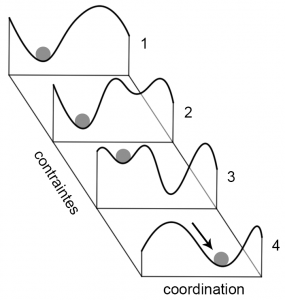
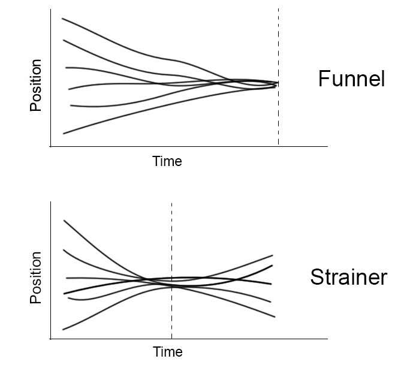

Les théories du contrôle moteur (à savoir, le contrôle des mouvements et des postures) devraient être à la base de toute réflexion sur l’enseignement et l’apprentissage de mouvements. Quoi de plus fondamental en effet pour un traceur ou un enseignant que de comprendre les processus qui se cachent derrière la capacité à contrôler finement nos gestes, à apprendre de nouvelles techniques et à les améliorer ?

Cependant, il me semble que c’est un sujet relativement peu discuté dans le monde du parkour. On préfère parler des méthodes d’entrainement de la force pour améliorer la détente, ou des caractéristiques techniques d’un bon saut de chat. Le contrôle moteur, qui évidemment sous-tends tout mouvement, est généralement laissé à l’état d’implicite. Cet article vise à mettre en avant la question du contrôle moteur, et en particulier s’attachera à proposer un modèle dynamique du contrôle moteur, avec des exemples pratiques pour l’apprentissage ou l’enseignement du parkour.

Dans la littérature scientifique, les théories sont grossièrement regroupées en deux courants, les approches prescriptives ou cognitives, et les approches dynamiques^[Les approches écologiques, inspirées de la psychologie de Jambes Gibson, sont généralement regroupées avec les approches dynamiques, mais ne seront pas abordées ici.].

## Les approches cognitives/prescriptives

Les approches cognitives/prescriptives sont certainement les plus intuitives. J’imagine que la plupart d’entre vous y retrouveront la manière dont ils comprennent habituellement le contrôle moteur. Ces approches se basent sur l’analogie de l’ordinateur. Comme le résume Didier Delignières, « le comportement du système moteur est prescrit \[écrit à l’avance\], déterminé de manière exhaustive par des représentations symboliques, comme les programmes moteurs. Le système nerveux central est supposé au cours de l'apprentissage construire et stocker des modèles de l'action, décrivant les commandes à adresser au système effecteur \[les muscles\]. Le comportement moteur, dans cette optique, ne constitue que le reflet fidèle des représentations construites au niveau cognitif »^[Delignières Didier, « L’approche dynamique du comportement moteur », in: La Rue J. et Ripoll H. (éds), _Manuel de Psychologie du Sport_, vol. 1, Paris, Revue EPS, 2004, pp. 65‑80.]. Autrement dit, ces théories envisagent le contrôle de l’action comme un processus de traitement, de stockage et d’utilisation de l’information. Ces modèles sont hiérarchiques (top-down), et le mouvement est piloté par une unité de contrôle centrale (cerveau, système nerveux central) qui stocke des connaissances, modèles et règles d’action. On retrouve la tendance assez intuitive à mettre l’accent sur le fait d’acquérir des connaissances, de comprendre, se représenter le mouvement à exécuter, le planifier, puis de tenter de mettre en exécution ces plans.

## Les approches dynamiques

Les approches dynamiques sont en bonne partie une réponse au problème des degrés de liberté soulevé par Bernstein^[Bernstein N., _The co-ordination and regulation of movements_, Oxford, Pergamon Press, 1967.]. Le nombre de degrés de liberté (c’est-à-dire de paramètres « susceptibles de varier indépendamment des autres »^[Delignières,« L’approche dynamique du comportement moteur », _art. cit._, 2004.]) du corps est pratiquement infini. Le corps contient des centaines d’articulations qui peuvent être mobilisées de différentes manières par des centaines de muscles, qui eux-mêmes peuvent se contracter indépendamment les uns des autres^[Sans compter que chaque muscle contient des unités motrices qui peuvent s’activer indépendamment les unes des autres, etc.]. Ceci est un véritable défi pour les théories prescriptives. Même une tâche en apparence très simple, comme tendre le bras pour saisir un objet, est trop complexe et coûteuse à gérer par une unité centrale de contrôle.

Pour pouvoir contrôler le mouvement, il faut réduire le nombre de variables pour diminuer la complexité de la tâche. La première étape de l’apprentissage serait donc un « gel » des degrés de liberté. Les segments a priori indépendants (p.ex. le bras gauche et le bras droit) sont regroupés en unités fonctionnelles plus larges (les deux bras font le même mouvement), réduisant le nombre d’éléments à contrôler. Cela expliquerait aussi pourquoi les débutants ont souvent l’air crispés. Au fil de l’expérience, certains degrés de liberté seront dégelés, afin d’obtenir des mouvements plus efficaces ou flexibles.

Il y a donc l’apparition d’une forme d’ordre qui n’est pas expliquée par l’application d’une planification ou d’un programme moteur. Tandis que les perspectives cognitives utilisent la métaphore de l’ordinateur, les théories dynamiques reposent sur la métaphore de la termitière. Il n’y a pas de termite architecte, qui donnerait des plans à appliquer par les autres termites. La termitière est le résultat émergent de toutes les actions et interactions des termites, sans planification préalable. Selon les théories dynamiques, l’organisation du mouvement émerge en fonction des contraintes qui pèsent sur l’action. Ces contraintes proviennent de l’environnement (le mur devant moi), de l’organisme (la force et la longueur de mes jambes) ainsi que de la tâche (je dois franchir ce mur en utilisant seulement les pieds et les mains).

 Fig.1: Paysage d'attracteurs. Adapté de Sheffer et al., Catastrophic shifts in ecosystems, Nature (413), 2001.

Les diverses solutions motrices à un problème donné seront plus ou moins stables selon les contraintes. Par exemple, à faible vitesse la coordination la plus stable est la marche. Si j’augmente la vitesse cependant, marcher exigera de plus en plus d’effort, de concentration, et d’énergie. Tôt ou tard, si je continue à accélérer, la course deviendra la solution la plus stable. Les solutions stables, préférentielles, faciles à mettre en place, exigeant moins d’effort, en bref vers lesquelles on est attiré naturellement sont appelées des attracteurs^[On pourrait effectuer un rapprochement entre attracteurs et affordances, afin de faire une synthèse des théories dynamiques et écologiques]. Les repoussoirs sont au contraire les solutions instables, difficiles à maintenir.

Les perspectives dynamiques invitent à concevoir la motricité comme un paysage d’attracteurs, qui peut être modélisé comme la figure 1. En fonction des contraintes, la coordination sera attirée vers une certaine solution motrice (1). Lorsque la situation et les contraintes se modifient, des attracteurs peuvent apparaitre ou disparaitre (2 et 3). Si la situation se modifie suffisamment, les attracteurs précédents pourront devenir des repoussoirs, et les repoussoirs précédents devenir des attracteurs. Le mode de coordination change alors brutalement (4).

## Un apprentissage non-linéaire

Le modèle dynamique permet de voir que l’apprentissage est non-linéaire. Des changements de contraintes, des modifications de la situation peuvent avoir des effets brutaux et immédiats sur la coordination. Et apprendre ne se résume pas à accumuler des connaissances. Apprendre, c’est transformer le paysage des attracteurs. Avec l’augmentation de la force, les adaptations du système nerveux, des changements d’intention et de confiance en soi (etc.), certains attracteurs vont se creuser, d’autres vont se combler. L’augmentation de la détente par exemple va permettre de rendre attractifs à vitesse lente des modes de coordination (p.ex. le saut de chat) qui auparavant nécessitaient une vitesse élevée. Cette conception permet également de comprendre qu’il ne s’agit autant de stabiliser des modes de coordination experts que de déstabiliser les modes de coordination débutants. Si un débutant a des « mauvais réflexes », comme le fait de commencer son saut de chat à pieds joints, ou qu’il passe l’obstacle de côté, c’est qu’il y a des raisons. S’il continue le faire tout en ayant compris son erreur, c’est qu’il est contraint par la situation. La question devient alors : comment transformer la situation pour rendre sa coordination débutante moins attractive, et la coordination experte plus attractive ? Dans certains cas, une consigne (contrainte de la tâche) peut suffire. Dans d’autres, il faudra modifier les contraintes externes (modifier la hauteur de l’obstacle) ou internes (entraînement de la force). Cela ne signifie pas nécessairement qu’il faille toujours simplifier la tâche. Dans certains cas, il est possible de déstabiliser les coordination débutantes en rendant la tâche plus « difficile ». P.ex. le saut de chat est une coordination plus attractive avec une vitesse élevée qu’au ralenti ; la précision d’un atterrissage augmentera lorsqu’il s’agit d’atterrir sur un mur plutôt que sur une ligne tracée au sol.

## Rôle de la variabilité

Delignières considère « généralement que l’apprentissage des habiletés complexes est avant tout affaire de pratique, et que l’intervention de processus représentatifs sophistiqués \[explications détaillées sur les principes qui sous-tendent le mouvement, démonstration sur la forme que le mouvement doit avoir, etc.\] tend en quelque sorte à ‘dénaturer’ leur mode spontané d’acquisition »^[Delignières Didier, Teulier Caroline et Nourrit Déborah, « Approche dynamique de l’apprentissage des coordinations motrices: un point sur les recherches actuelles », _Revue EPS_ (322), 2006, pp. 5‑12.]. Il ne faudrait pas guider trop fortement le mouvement, mais créer des situations qui permettent l’exploration active de différentes possibilités.

Les théories dynamiques parlent volontiers de « répétition sans répétition »^[Bernstein N, « On dexterity and its development », in: Latash Mark L. et Turvey Michael T. (éds), _Dexterity and its development_, Mahwah, N.J, L. Erlbaum Associates, 1996.], parce qu’en répétant une même tâche, chaque essai sera légèrement différent. Chaque fois que je répète un saut, la longueur de mes pas durant la course d’élan sera un peu différente. On pourrait considérer que cette variabilité^[La variabilité du mouvement peut être définie ici comme l’écart à la moyenne sur un ensemble d’essais. P.ex. si on mesure la longueur de pas d’une course d’élan, les passeront parfois plus courts, parfois plus longs. Le phénomène pourrait être montré au niveau articulaire également : les angles articulaires à la cheville, genou et hanches ne seront pas identiques à chaque pas. C’est la variabilité du mouvement : un même résultat (courir) sera atteint avec différentes combinaisons de mouvements.] du mouvement survient à cause d’un contrôle imparfait ou à cause d’erreurs: tant que je ne suis pas capable d’effectuer précisément le même geste à chaque tentative, c’est que je dois améliorer mon contrôle du mouvement. En fait, on est capable d’atteindre nos objectifs avec efficacité, précision et certitude tout en utilisant des mouvements variables. Forcer les apprenants à utiliser des patterns de mouvements stéréotypés, invariants, limite leur performance. Les théories dynamiques invitent alors plutôt à voir la variabilité du mouvement comme étant une stratégie optimale de contrôle.

 Fig.2: deux modèles de contrôle de la variabilité

La variabilité du mouvement lui permet d’être flexible et adaptable. A chaque fois que je prends mon élan pour un saut, mes muscles se contractent différemment,ma vitesse n’est pas identique. Si je garde la même longueur de pas à chaque essai, il me sera impossible d’être précis. Mon dernier pas sera parfois trop court, parfois trop long ; arriver juste relève du hasard. C’est le fait d’adapter la longueur des pas qui me permet d’être précis. On peut parler de variabilité compensatoire : pour pouvoir atteindre un résultat constant (précis, peu variable) à un point du mouvement, dans des conditions toujours légèrement différentes, il doit y avoir de la variabilité ailleurs dans le mouvement. On peut appeler cela le modèle de l’entonnoir^[Montagne Gilles, « Le contrôle des mouvements finalisés en sport », _Bulletin de psychologie_ Numéro 475 (1), 2005, pp. 7‑10.] (fig.2) : la relativement grande variabilité au début du mouvement (durant la course) permet d’atteindre un point terminal avec précision (le mur sur lequel je prends appui).

Vouloir corriger les déviations durant le mouvement (p.ex.une consigne spécifiant le mode de coordination à utiliser), revient à ajouter des sous-objectifs qui fonctionnent comme des contraintes sur le mouvement^[Liu Dan et Todorov Emanuel, « Evidence for the Flexible Sensorimotor Strategies Predicted by Optimal Feedback Control », _Journal of Neuroscience_ 27 (35), 2007, pp. 9354‑9368.]. Des ressources seront utilisées pour atteindre ce sous-objectifs, plutôt que de mettre toutes les ressources pour l’atteinte du but principal. La variabilité diminuera au niveau de ce sous-objectif, ce qui nécessite une variabilité compensatoire ailleurs, risquant de ce fait de limiter la précision dans des paramètres plus pertinents pour le succès de la tâche. C’est ce que j’appelle le modèle de la passoire (fig.2) : se focaliser sur une longueur de pas constante durant la course peut limiter la précision au moment de l’appel du saut.

Plutôt que de chercher à corriger la variabilité par rapport à des patterns de mouvement stéréotypés, il faut identifier les paramètres pertinents pour le succès de la tâche et ne corriger que ceux-ci. Par exemple un amorti a pour but principal de dissiper efficacement le choc de l’atterrissage. Il ne faudrait pas fixer de sous-but tel que « plies les jambes à 90° », mais focaliser l’apprenant sur le but principal. Ceci peut notamment être fait en focalisant sur le bruit de l’atterrissage :« essaies d’atterrir silencieusement ».

## Rôle des consignes et des intentions

Or cela rejoint la littérature scientifique qui affirme que la focalisation interne (sur le corps, le mouvement, la technique) est généralement moins bénéfique pour l’apprentissage et la performance que la focalisation externe (sur des indices perceptibles dans l’environnement)^[Hodges Nicola J. et Williams A. M. (éds), _Skill acquisition in sport: research, theory and practice_, London ; New York, Routledge, 2012.]. En se focalisant sur un but externe, le système s’organise automatiquement pour atteindre le résultat voulu de manière optimale. Se focaliser sur son propre corps ajoute des contraintes, limite l’optimisation, perturbe le contrôle automatique, nécessite plus d’attention. Des expériences comparant focalisation interne et externe montrent une augmentation de la force et une diminution de l’activité musculaire à la fois, suggérant un mouvement plus efficient, avec la focalisation externe^[Hodges Nicola J. et Williams A. M. (éds), _Skill acquisition in sport: research, theory and practice_, London ; New York, Routledge, 2012.]. D’autres ont montré une augmentation de la vitesse, de l’endurance, et une diminution de la consommation d’oxygène^[Hodges Nicola J. et Williams A. M. (éds), _Skill acquisition in sport: research, theory and practice_, London ; New York, Routledge, 2012.]. Pertinent pour les traceurs : des expériences ont également montré une augmentation de la hauteur des sauts verticaux^[Wulf Gabriele et Dufek Janet S., « Increased jump height with an external focus due to enhanced lower extremity joint kinetics », _Journal of Motor Behavior_ 41 (5), 2009, pp. 401‑409 ; Wulf Gabriele, Dufek Janet S., Lozano Leonardo _et al._, « Increased jump height and reduced EMG activity with an external focus », _Human Movement Science_ 29 (3), 2010, pp. 440‑448.]. La focalisation externe permet également de mieux maintenir la performance face au stress^[Ong Nicole T., Bowcock Alison et Hodges Nicola J., « Manipulations to the Timing and Type of Instructions to Examine Motor Skill Performance Under Pressure », _Frontiers in Psychology_ 1, 2010.]. A noter qu’il est toujours mieux de fixer des objectifs tangibles,potentiellement difficiles à atteindre (« essaies d’atterrir ici »plutôt que « sautes les plus loin possible »).

Les consignes sont des formes de contraintes douces : si elles interfèrent dans l’atteinte du but, elles ne seront pas appliquées strictement. Il semble donc plus efficace d’utiliser des consignes qui fixent des objectifs tangibles et focalisent les apprenants sur les paramètres externes pertinents, plutôt que d’offrir seulement des modèles de coordination à reproduire. On peut alors parler de consigne non spécifiante : p.ex.« atterris en silence » ne spécifie pas directement le mode de coordination à utiliser (plier les jambes à 90°), mais aura tout de même des effets sur la coordination utilisée. Cela revient à distinguer la finalité (la coordination qu’on peut observer chez des pratiquants experts) et les moyens à utiliser pour l’atteindre (cette coordination n’est pas atteinte simplement en appliquant la description des mouvements experts)^[Delignières, Teulier et Nourrit, « Approche dynamique de l’apprentissage des coordinations motrices: un point sur les recherches actuelles », _art. cit._,2006.].

La consignes et démonstrations spécifiant le mouvement ne sont pas totalement à jeter. Une consigne peut permettre de bifurquer entre plusieurs solutions, lorsque plusieurs attracteurs sont disponibles (p.ex.préciser qu’il faut passer le mur avec un saut de chat, alors que d’autres passements sont possibles). La consigne peut aller dans le sens de la coordination spontanée (convergence). Dans ce cas, elle permet de renforcer l’attracteur, de maintenir la coordination souhaitée face à l’instabilité (p.ex. pour continuer à faire un saut de chat même à faible vitesse). Elle peut au contraire s’opposer à la coordination spontanée (compétition). Dans ce cas, elle peut servir à déstabiliser la coordination naturelle et rendre plus attractive le mode de coordination à acquérir^[Delignières Didier, « A propos de la théorie des systèmes dynamiques: Quelques idées neuves sur l’apprentissage moteur », _Revue EPS_ (274), 1998,pp. 61‑66.].

## Conclusion

Résumons. Les théories dynamiques invitent à concevoir le comportement moteur comme émergeant en fonction des contraintes de la tâche, de l’organisme et de l’environnement. On peut modéliser la coordination par un paysage d’attracteurs, le comportement étant « attiré » dans certaines directions en fonction des contraintes. Pour modifier la coordination, on peut transformer la situation en changeant certaines de ces contraintes. En modifiant les contraintes internes, l’apprentissage transforme également le paysage d’attracteurs. Cette perspective permet de défocaliser l’apprentissage et l’enseignement de la tendance à vouloir présenter des modèles idéaux de mouvements à reproduire. Le mouvement ne doit pas être trop guidé, l’exploration active et la variabilité du mouvement doivent avoir une place importante. Les consignes servent avant tout à définir des buts et des objectifs, ainsi qu’à focaliser l’attention sur des indices pertinents et tangibles dans l’environnement. Finalement, les approches dynamiques permettent de mettre l’accent sur la construction matérielle des situations d’apprentissage. Il s’agit de modifier l’environnement (ou dans le cas de la pratique en extérieur, sélectionner l’environnement) pour encourager l’exploration du mouvement, potentiellement en le canalisant dans la direction souhaitée. On peut ainsi faciliter le passage à la coordination que l’on souhaite acquérir, ou au contraire rendre plus difficile les coordination que l’on souhaite décourager, en transformant la situation.

> "Toute chose change dans un environnement dynamique. Ce sont tes efforts pour rester ce que tu es qui te limitent."
> 
> Le Marionnettiste au Major Kusanagi, Ghost in the Shell, 1995. 

