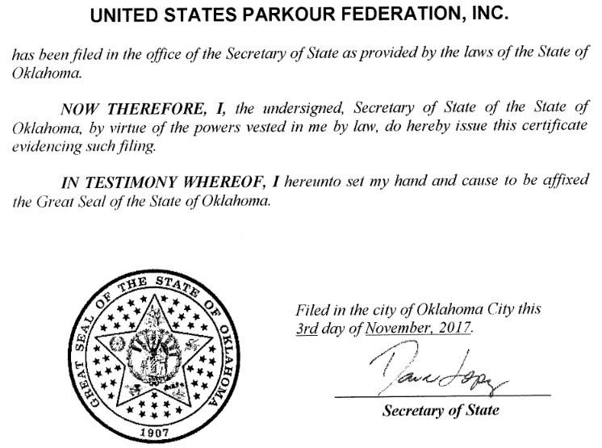
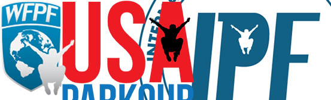

L’International Parkour Federation (IPF) n’a jamais été au-dessus de tout soupçon. On pouvait déjà évoquer de potentiels conflits d’intérêts entre IPF et la World Freerunning and Parkour Federation (WFPF). Mais récemment, IPF s’est entourée de plusieurs partenaires, en Suisse, Italie et Malte, leur donnant des certificats les reconnaissant comme étant les organes nationaux de gouvernance du parkour. Ceci a mis en évidence un certain nombre de bizarreries : du contenu de site web copié-collé ; des docteurs qui n’en sont pas ; des bâtiments qui n’existent pas ; des individus siégeant dans le comité de dizaines d’organisations sans activité apparente ; des certificats internationaux qui ne sont reconnus par personne… La liste est longue, va bien au-delà de ce qu’on pouvait soupçonner, et ne concerne pas seulement le parkour mais des dizaines de disciplines.

Cette enquête sera divisée en trois parties : une première contextualisant WFPF et IPF pour celleux qui ne connaissent pas ces organisations ; une seconde analysant le [curieux réseau qui se tisse autour de IPF](../iptc-et-les-organisations-fantomes-ii) ; une troisième se focalisant sur le cas particulier d’une de ces organisations, [FederSwiss](../le-cas-de-federswiss-iii). Si vous n’avez pas peur de douter de la réalité de toutes les institutions qui vous entourent, suivez-moi dans le monde étrange de IPF et WFPF.

## IPF, WFPF, USAP: des organisations interdépendantes

Tout commence avec la **World Freerunning and Parkour Federation (WFPF)**. Celle-ci est fondée en 2007 par _Ruff Magic Entertainment_, une société à responsabilité limitée (LLC) américaine détenue par Victor Bevine, David Thompson et Francis Lyons. Francis Lyons était le producteur de _Made_, une série diffusée sur MTV. Il n’est donc pas surprenant que l’acte inaugural de WFPF fut de créer _Ultimate Parkour Challenge_, un show télévisé de parkour diffusé en 2010 sur MTV, à la réception controversée^[L’émission était critiquée pour ses aspects compétitifs, ainsi que pour la spectacularisation des chutes et blessures encourues par les participants. Voir notamment [https://www.youtube.com/watch?v=WEqIn9RXKPY](https://www.youtube.com/watch?v=WEqIn9RXKPY).]. Malgré son nom, WFPF n’est pas une fédération : elle n’en a ni les activités, ni la structure. Il s’agit d’une LLC^[[https://www.njportal.com/DOR/BusinessNameSearch/Search/BusinessName](https://www.njportal.com/DOR/BusinessNameSearch/Search/BusinessName) 26.04.2020\[^2]et elle n’a pas pour membres des fédérations nationales. WFPF s’est ensuite entourée de deux autres organisations, USAP et et IPF.

USAP et USPF sont deux organisations différentes, enregistrées à des moments différents

**USA Parkour (USAP)** est enregistrée au New Jersey en 2012 comme LLC^[[https://www.njportal.com/DOR/BusinessNameSearch/Search/BusinessName](https://www.njportal.com/DOR/BusinessNameSearch/Search/BusinessName) 26.04.2020], et sert apparemment essentiellement comme entreprise pour vendre des assurances^[[https://www.usaparkour.org/](https://www.usaparkour.org/) 26.04.2020]. Cependant, la confusion est entretenue, car leur site présente également des statuts pour une organisation à but non lucratif enregistrée en Oklahoma en 2017, nommée **« United States Parkour Federation »**^[[https://www.usaparkour.org/USAP-Doc/USPFCertificateOfIncorporation.pdf](https://www.usaparkour.org/USAP-Doc/USPFCertificateOfIncorporation.pdf) 26.04.2020]. Leur site ne présente aucune information concernant les membres du comité actuel. On sait cependant que Victor Bevine était dans le comité initial^[[https://www.usaparkour.org/USAP-Doc/USPFCertificateOfIncorporation.pdf](https://www.usaparkour.org/USAP-Doc/USPFCertificateOfIncorporation.pdf) 26.04.2020]. A priori, il s’agit donc de deux organisations différentes, aux buts différents, alors que le site donne l’impression qu’il ne s’agit que d’une seule et même organisation.

**International Parkour Federation (IPF)** est enregistrée le 21 juillet 2014 au New Jersey^[[https://www.njportal.com/DOR/BusinessNameSearch/Search/BusinessName](https://www.njportal.com/DOR/BusinessNameSearch/Search/BusinessName) 26.04.2020], comme organisation à but non-lucratif. Etrangement, étant donné son nom, le document d’incorporation indique que IPF se donne pour but de régir le parkour au niveau national (« national governing body »). De plus, la création ne s’est pas faite en fédérant plusieurs organisations, mais bien par l’initiative de David Thompson et Victor Bevine. Le timing de la création n’est pas anodin, puisque quelques jours auparavant^[18-19 juillet 2014.], David Belle et Sébastien Foucan se rendaient au Comité International Olympique (CIO), rencontre qui conduira à la création de The Mouvement, et finalement au fiasco de la Fédération Internationale de Gymnastique (FIG). IPF est ensuite restée inactive et inconnue du public durant plusieurs années. Le site web et la page facebook de l’organisation ne commencent à être actifs qu’en 2017. Les statuts en sont également publiés à ce moment-là^[Le registre indique également en 2017 la mention « REINSTATED (ANNUAL REPORTS) ».]. Le timing, à nouveau, n’est pas inintéressant. En février 2017, la FIG annonçait son projet de développer une « nouvelle discipline » basée sur le parkour et les courses d’obstacles. Le 4 mai, APEX Movement annonce la première compétition en collaboration avec The Mouvement et la FIG. Le premier post facebook de IPF est publié le 18 mai 2017^[[https://www.facebook.com/theinternationalparkourfederation/photos/a.299457373813630/299457383813629/?type=3&theater](https://www.facebook.com/theinternationalparkourfederation/photos/a.299457373813630/299457383813629/?type=3&theater) 27.04.2020]. Le site de IPF indique également dans son historique^[[https://internationalparkourfederation.com/](https://internationalparkourfederation.com/) 27.04.2020] que l’organisation a été créée en anticipation d’une appropriation par la FIG. Etant donné qu’IPF et la FIG ont signé un accord en janvier 2018, leur relation actuelle n’est pas claire, mais il est évident qu’IPF n’a pas empêché une appropriation. On peut noter également que Ian Adamson, président de la Fédération Internationale de Sports d’Obstacles (FISO), figure dans le comité de IPF^[[https://web.archive.org/web/20180114124126/http://internationalparkourfederation.com:80/ipf-international-board-directors/](https://web.archive.org/web/20180114124126/http:/internationalparkourfederation.com:80/ipf-international-board-directors/) 09.05.2020]. Il semblerait qu’il n’y ait pas la place pour plusieurs disciplines basées sur des obstacles au sein du mouvement olympique, : c’est peut-être ce qui explique ces rapprochements entre parkour et course d’obstacles.

Nous sommes donc ici en face de trois, voire même quatre organisations différentes, qui semblent toutes être des fédérations nationales ou internationales, sans qu’elles le soient formellement. De plus, ces organisations ne sont pas indépendantes, et on peut suspecter des conflits d’intérêt^[A noter également que M. Salmanpour a été nommé secrétaire général de IPF le jour même de la publication de cet article. Or, M. Salmanpour est notamment à la tête de IPTC, qui émet les certificats de formation de WFPF.] Ainsi, IPF est considérée comme une branche ou division de WFPF^[[https://internationalparkourfederation.com/iraq-parkour-school/](https://internationalparkourfederation.com/iraq-parkour-school/) 26.04.2020], pas comme une organisation indépendante. Victor Bevine et David Thompson sont à ce jour encore à la tête de IPF, et les postes de vice-président et trésorier sont vacants^[[https://internationalparkourfederation.com/ipf-international-board-directors/](https://internationalparkourfederation.com/ipf-international-board-directors/) 26.04.2020]. Ce sont donc les mêmes personnes qui sont à l’origine de et siègent dans ces différentes organisations. _Ruff Magic Entertainment_, qui a fondé WFPF, a également déposé le logo de IPF^[[https://www3.wipo.int/branddb/en/](https://www3.wipo.int/branddb/en/)]. En fait, les logos des trois organisations utilisent la même silhouette de traceur. Il y également un certain nombre de cas où les deux organisations agissent comme si elles n’étaient qu’une seule, p.ex. dans leur correspondance avec la FIG^[Lettre à la FIG datée du 17.05.18]. De même, en novembre 2017 les pages Facebook de WFPF et IPF avaient annoncé de manière quasi identique que Parkour Earth comptait s’allier à la FIG, et dénonçaient une « trahison ». Ce ne fut évidemment pas le cas, et IPF/WFPF s’excuseront publiquement pour ces posts incendiaires.

Même les logos suggèrent l'interdépendance de ces trois organisations

Finalement, trois éléments doivent encore être cités pour comprendre qu’elles étaient mes soupçons lorsque j’ai commencé à m’intéresser aux partenaires de IPF. Ces trois éléments datent de 2017, lorsque IPF est entrée sur la scène publique. Tout d’abord, IPF revendiquait des « Athlètes ou Organizations » dans de nombreux pays, notamment la Suisse, sans que le détail soit donné, et sans que le terme « affilié » soit clarifié. Cela donnait l’impression que la fédération avait des membres dans ces pays, mais ce n’était probablement pas le cas ; du moins leur statut n’était pas clair. Le second élément est que IPF utilisait le nom et l’image des plusieurs traceuses sur leur page « Gender Equality in Parkour », sans leur consentement ni leur connaissance. Finalement, un des posts de la page facebook d’IPF, fraichement créée, avait été « liké » par plus de 5000 personnes (8100 actuellement)^[[https://www.facebook.com/theinternationalparkourfederation/posts/323178118108222?\_\_tn\_\_=-R](https://www.facebook.com/theinternationalparkourfederation/posts/323178118108222?__tn__=-R) 27.04.2020], essentiellement par des comptes indiens. Cela suggérait fortement que ces likes avaient été achetés. Victor Bevine a démenti, arguant qu’il s’agissait du résultat d’une campagne de pub ciblée. Quoi qu’il en soit, tous ces éléments pris ensemble suggèrent d’adopter une attitude attentive et précautionneuse envers IPF : l’organisation a tendance à se créer une façade en revendiquant plus que ce qu’elle ne devrait pouvoir, notamment en utilisant des personnes sans leur consentement ou en faisant des affirmations ambigües et parfois erronées.

Il ne faut pas voir tout cela comme un pamphlet contre IPF/WFPF; c'est plutôt le cheminement qui m'a fait adopter une attitude suspicieuse envers ces organisations. C’est l’attitude que j’avais lorsque l’on m’a présenté un certificat de IPF adressé à une organisation Suisse, et cette attitude a payé au centuple : j’étais soupçonneux, mais jamais je n’aurais soupçonné [ce que j’ai découvert ensuite](../iptc-et-les-organisations-fantomes-ii). Mon avis, tout à fait personnel, a toujours été que IPF et WFPF ne représentaient qu'un petit nombre de "businessmen" intéressés par le parkour. Je n'imaginais pas que cette enquête allait également concerner des dizaines de disciplines sportives, de la médecine alternative, et des sociétés écrans. Bien que l'enquête débute avec IPF, il faudra s'en décentrer.

